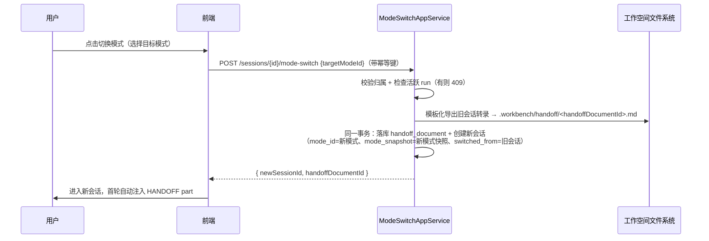

# 统一 Chat 与 Workbench 设计文档

> 状态：已实施（P1～P4 后端全量 + 前端主链落地，自测通过）
> 日期：2026-08-20
> 修订：2026-08-20 评审后调整——模式切换保留，交接由"总结轮 + 两阶段确认"降级为**服务端模板化转录导出（单步同步）**，AI 摘要留作后续可选增强（见 §5.3）
> 修订：2026-08-20 实施前复核——修正若干事实性漂移（§2.2/§4.3/§4.4/§5.3/§6.2），补齐 permission-mode 与 yml 全局默认的重复 flag 处理（§6.1 实施注记）与文件写入的事务边界表述（§5.3）
> 实施：2026-08-21 落地——模式模型/切换/CLI 下发/前端合链已实现；`transcript-tail` 默认 40 收口；模型覆盖回退（§6.1.1）未实现，见 §8.4
> 受众：本项目维护者/实施者
> 关联文档：[`workbench/td-11-dynamic-stages-global-context.md`](workbench/td-11-dynamic-stages-global-context.md)、[`agent-runtime-unification-design.md`](agent-runtime-unification-design.md)、[`domain-model.md`](domain-model.md)

## 1. 背景与目标

### 1.1 现状

系统当前存在两个独立的对话入口：

- **Chat**：`frontend/index.html` + `frontend/js/App.vue`，后端 `POST /api/chat/session`（`interfaces/ChatController.java:65`），会话实体 `ChatSession`（`session_kind = CHAT`）。
- **Workbench**：`frontend/workbench.html` + `frontend/js/pages/Workbench.vue`，后端 `/api/workbenches`（`interfaces/workbench/WorkbenchController.java:46`），按"冻结 Repository Scope + 动态 Stage + 每 Run 不可变 Snapshot"建模，Stage 会话 `session_kind = WORKBENCH_STAGE`。

后端实际上已统一了大半：两者共用同一张 `chat_session`/`chat_run` 表、同一个 `ChatRun` 聚合、同一个发射器 `RunOriginRoutingChatRunLauncher`（`app/chatrun/RunOriginRoutingChatRunLauncher.java:52`）与进程内核 `AgentProcessKernel`。残留差异集中在：

| 差异点 | Chat 侧 | Workbench 侧 |
|---|---|---|
| 执行计划 | `ChatExecutionPlanProvider` | `WorkbenchExecutionPlanProvider` |
| Prompt 组装 | `ChatRunPromptBuilder`（自由文本 + 斜杠命令展开） | `WorkbenchStageRunPromptComposer`（13 类 prompt part，每 run 冻结） |
| 能力下发 | 斜杠命令展开为 prompt 文本 | revision 冻结 command/skill/MCP，但仅 Codex 路径可落 CLI 参数 |
| 前端 | `index.html` MPA | `workbench.html` MPA，两个独立 `createApp` |

### 1.2 要解决的问题

1. **双入口认知与维护成本**：两套前端壳、两套计划/provider 路径，功能迭代需要双份实现。
2. **Claude Code 能力定制通道窄**：Claude 方言目前仅支持 yml 全局模板（其中已静态含 `--permission-mode acceptEdits`，见 §6.1）+ per-run `--resume`/`--model`/`--effort`（`infra/cli/ClaudeCliDialect.java:55`），无法 per-run 下发 MCP、系统提示词、permission mode；command/skill 只能展开成 prompt 文本。
3. **无通用会话间接力机制**：现有交接依赖 agent 自觉向 `.workbench/handoff/<stage>/` 目录写产物（`WorkbenchStageRunPromptComposer.java:200-211` 只做路径宣告），服务端不生成内容；普通 chat 会话之间没有任何交接能力。

### 1.3 目标

1. 统一 Chat 与 Workbench 为单一对话入口，**仅支持 Claude Code**。
2. 顶部可切换**模式（Mode）**，模式是原 Workbench Stage 的轻量化形态：一组用户可定制的能力配置（命令 / skills / MCP / 默认提示词 / permission mode）。
3. 对话中切换模式时，系统**自动导出旧会话转录作为交接文件**（服务端模板化生成，无 LLM 总结轮），开启绑定新模式的新会话并加载交接文件。
4. 工作空间选择维持 Chat 现状（白名单目录选择，不做 Scope 冻结、不做 worktree 隔离）。

### 1.4 非目标

- 不做阶段间自动流转 / Gate / 流水线编排（延续 TD-11 的立场，Stage 本无自动流转）。
- 不做 Repository Scope 冻结与 worktree 隔离（既有能力保留在表结构中，后续需要时可作为模式的扩展选项再接回）。
- 不物理删除 Codex 支持：下线其实现路径，保留 `AgentType` 路由接口作为扩展点。
- 不在本期实现 TD-11 规划中的 Global Context 在线化。
- 不做用户模式的版本化管理（见 3.4 取舍说明）。

## 2. 总体设计

### 2.1 核心概念

**模式（Mode）**：一组可被会话绑定的能力配置 + 展示元信息。

| 字段 | 说明 | 下发方式 |
|---|---|---|
| `identifier` / `displayName` / `description` | 标识与展示 | — |
| `defaultPrompt` | 默认提示词（角色、约束、输出要求） | `--append-system-prompt`（见 §6） |
| `permissionMode` | CLI 2.1.237 实测可选值：`acceptEdits` / `auto` / `bypassPermissions` / `manual` / `dontAsk` / `plan`（注意：**无 `default`**，缺省即不传该 flag） | `--permission-mode` per-run 覆盖 |
| `commands[]` | 斜杠命令集合 | `--plugin-dir` 物化（见 §6.3，已验证） |
| `skills[]` | Skill 集合 | `--plugin-dir` 物化（见 §6.3，已验证） |
| `mcpServers[]` | MCP server 配置（transport/secret 引用/tool 白名单） | `--mcp-config <file>`（见 §6.2） |
| `model` / `effort`（可选） | 覆盖运行时 profile 默认 | 既有 `--model` / `--effort` |

**会话（Session）**：统一的 `ChatSession`，新增 `mode_id` 绑定。无模式（`mode_id = NULL`）即原纯 Chat 行为，视为"默认模式"。

**交接记录（HandoffDocument）**：模式切换时由系统模板化导出的落库记录 + 工作空间交接文件，对用户只读可见（见 §5.3/§5.4）。

### 2.2 架构变化

```mermaid
flowchart LR
    subgraph 前端（单壳）
        A[App.vue + ModeSwitcher] --> B[components/conversation 复用]
    end
    subgraph 后端
        C[ChatController / ModeController] --> D[ChatAppService<br/>+ ModeSwitchAppService]
        D --> E[ChatRun.submit<br/>RunOrigin.CHAT]
        E --> F[ChatRunRuntimeLauncher]
        F --> G[ModeExecutionPlanProvider<br/>原 Chat/Workbench 两实现合并]
        G --> H[CliAgentRuntime / Claude]
        H --> I[AgentProcessKernel]
    end
    A --> C
```

要点：

1. **执行计划合并**：`ChatExecutionPlanProvider` 与 `WorkbenchExecutionPlanProvider` 合并为 `ModeExecutionPlanProvider`——输入统一为"会话 + 模式能力快照 + 工作目录"，原 workbench 的 scope/worktree 分支随 Scope 冻结下线而移除。
2. **Prompt 组装统一**：保留 `WorkbenchStageRunPromptComposer` 的 part 体系（`WorkbenchPromptPartType`），无模式会话只组装 `PLATFORM_SAFETY` / `ENVIRONMENT_GUARDRAIL` / `USER_INPUT` 等基础 part；模式会话追加 `MODE_DEFINITION`（由原 `STAGE_DEFINITION`/`STAGE_RULES` 演化）、`SELECTED_CAPABILITIES`；切换产生的新会话追加 `HANDOFF` part（见 §5.3）。`ChatRunPromptBuilder` 的斜杠命令展开能力并入 part 体系。
3. **事件流统一**：统一走 Chat 的 SSE 可恢复流（`ChatRunController.java:93`），下线 Workbench 事件分页路径。
4. **Codex 下线**：`RoutingAgentGateway` 保留 `AgentType` 路由接口；`RuntimeCommandFactory` 的 Codex 能力覆盖路径（`infra/runtime/RuntimeCommandFactory.java:50` 的 `create` 重载，TOML 片段以 `-c key=value` 内联参数下发，无 TOML 文件落盘）标记废弃，随 Workbench provider 一并移除。

### 2.3 工作空间

维持 Chat 现状：`agent.fs.roots` 白名单（`config/FsProperties.java`）+ 前端目录选择 + `WorkspacePathPolicy.requireExistingDirectory` 校验（`ChatAppServiceImpl.java:144`），进程 cwd = 所选目录（`AgentProcessKernel.java:215`）。

明确接受的损失：

- 放弃 Scope 冻结带来的可复现性（`repository_scope_hash`、per-run snapshot）。
- 放弃 worktree 隔离，agent 直接在用户所选目录工作（`acceptEdits` 下直接写盘）。模式间产物隔离依赖交接目录约定（§5.3）弥补。

## 3. 模式与治理模型

### 3.1 模式的三个来源

| 来源 | 说明 | 存储 |
|---|---|---|
| **默认模式** | `mode_id = NULL`，即原纯 Chat | 无记录 |
| **模板（Template）** | 管理员发布。直接复用现有 `workbench_stage_catalog` / `workbench_stage_definition` / `workbench_stage_definition_revision` 及 `definition_command/skill/mcp_server` 关联表（`schema.sql:574-676`），语义从"阶段定义"重解释为"模式模板" | 既有 catalog 表 |
| **用户自定义模式** | 全新创建，或从模板 fork（拷贝该 revision 冻结的能力清单） | 新表 `chat_mode` 系列（§4.2） |

### 3.2 fork 语义

从模板 fork 时，将 revision 冻结的 command/skill/MCP（含版本与 hash）**拷贝**为用户模式下的普通记录。此后用户修改自己的模式不影响模板，模板发布新 revision 也不回溯已 fork 的模式。fork 记录 `source_revision_id` 便于追溯来源。

### 3.3 冻结语义的取舍

现有 Workbench 在"模板层冻结（revision + hash）"之外，还在"每次 run"层做不可变 snapshot（`workbench_stage_run_snapshot`、`workbench_stage_run_prompt_payload`）。统一后：

- **模板层冻结保留**（catalog 治理能力不丢）。
- **run 层 snapshot 简化为会话级绑定**：会话创建时把模式能力快照复制进会话（`chat_session.mode_snapshot` JSON），模式后续被编辑不影响进行中的会话；新 run 读取会话快照而非模式当前值。这样保留"会话内能力稳定"这一核心不变量，省掉 per-run 冻结的整套机制。
- **已知损失**：无法精确复现"某次 run 用了哪版能力"（只能精确到会话）。审计粒度从 run 退化为 session，对本系统可接受。

### 3.4 用户模式不做版本化

自定义模式的编辑直接覆盖（配合 3.3 的会话快照，不影响进行中的会话）。若未来出现"多人协作编辑模式"需求，再引入模式版本表——当前按 YAGNI 处理。

### 3.5 Codex 相关治理数据的处理

catalog 中与 run_mode / SandboxMode 绑定的治理字段（`WorkbenchExecutionPlanProvider.java:252` 的映射）在 Claude-only 世界中由模式的 `permissionMode` 取代，原字段保留在模板表内不再消费。

## 4. 数据模型变更

### 4.1 `chat_session` 变更

| 变更 | 说明 |
|---|---|
| `+ mode_id` | 绑定模式，NULL = 默认模式 |
| `+ mode_snapshot` (JSON) | 会话创建时的能力快照（见 3.3） |
| `+ switched_from_session_id` | 切换血缘：本会话由哪个会话切换而来 |
| `+ handoff_document_id` | 本会话启动时加载的交接文档 |
| `session_kind` | 标记废弃：新会话统一写 `CHAT`，`WORKBENCH_STAGE` 仅为历史数据保留 |

`chat_run` 无变更（切换不引入总结轮；`chat_run` 现有列为 `run_origin`，本期不新增 `run_purpose` 之类的列，见 §5.3）。

### 4.2 新增表

**`chat_mode`**（用户自定义模式）：`id` / `user_id` / `identifier` / `display_name` / `description` / `default_prompt` / `permission_mode` / `model` / `effort` / `source_revision_id`（fork 来源，可空）/ 审计字段。

**`chat_mode_command` / `chat_mode_skill` / `chat_mode_mcp_server`**：能力关联表，结构镜像既有 `workbench_stage_definition_command/skill/mcp_server`（名称、版本或内容引用、排序位）。MCP 的 secret 沿用现有"只存引用不存明文"的约束（对照 `RuntimeCommandFactory.java:148-204` 的 secret 引用模型）。

**`handoff_document`**（切换血缘记录，无状态机）：`id` / `from_session_id` / `to_session_id` / `from_mode_id` / `to_mode_id` / `file_path` / `idempotency_key`（与 `from_session_id` 联合唯一，防重复提交，模式同 `chat_run.idempotency_key`）/ `created_at`。未来若加"AI 智能摘要"增强，再引入 `generation_type` / `status` / `edited_by_user`（见 §5.3 后路）。

### 4.3 既有 Workbench 表

- `workbench` / `workbench_repository_scope` / `workbench_stage` / `workbench_stage_conversation` / `workbench_stage_run_snapshot` / `workbench_stage_run_prompt_payload`（`schema.sql:678-905`）：**保留只读**（历史数据可查询），统一上线后不再写入。
- catalog 系列表：按 §3.1 重解释为模式模板库，继续读写。

### 4.4 迁移

- 存量 `CHAT` 会话：`mode_id = NULL`，行为不变。
- 存量 Workbench 会话：保留只读入口（历史查看），不提供"迁移为新模型"——Workbench 实例语义（冻结 Scope）在新模型中无对应物。
- DDL 变更按项目既有模式落地：`schema.sql` 追加新表/新列定义（全部 `CREATE TABLE IF NOT EXISTS` / 可空列），存量库由 `SqliteInitializer` 启动期 `try/catch ALTER TABLE` 补列（项目无 Flyway/Liquibase），不改动既有列含义。

## 5. 核心流程设计

### 5.1 模式创建与选择

1. 顶部模式切换器展示：默认模式 + 我的模式 + 模板库（分组展示）。
2. 从模板 fork：一键复制为"我的模式"，可改名后直接使用。
3. 自定义模式：表单编辑五类配置（默认提示词、permission mode、命令、skills、MCP）。

### 5.2 会话启动

`POST /api/chat/session` 请求体扩展 `modeId`（可选）。服务端：校验目录白名单 → 加载模式 → 复制能力快照入会话 → 落库。后续流程与现状一致。

### 5.3 模式切换与交接导出（核心）

采用**单步同步**设计：切换 = 导出旧会话转录 + 创建新会话，一次请求内完成。无草稿态、无确认流水线、无 LLM 总结轮。



关键设计点：

1. **活跃 run 处理**：`chat_run` 有单会话单活跃约束（`schema.sql:74`）。切换发起时若存在活跃 run 返回 409，前端弹确认"取消当前 run 并切换"，用户确认后先走既有取消路径再重新发起。未经确认不自动取消。
2. **交接内容 = 服务端模板化转录导出**（无 LLM 总结轮）：首轮用户目标 + 尾部 N 条消息（N 可配，`agent.mode-switch.transcript-tail`，默认值**待确认**）+ 从 `chat_run_event` 提取的产出/修改文件清单。零额外模型调用，切换延迟 ≈ 一次文件写。
3. **交接文件位置**：沿用 `.workbench/handoff/` 目录约定（目录常量见 `FileSystemWorkspaceHandoffGuard.java:28`），文件名 `<handoffDocumentId>.md`（服务端生成 id 并写文件，无时序问题）。注意：既有 guard 只在 Workbench RepositoryScope 物化时把该目录写入 `.gitignore`，Chat 工作目录从未调用——实现需将该 guard 的 `.gitignore` 保障扩展到 Chat 会话工作目录。目录更名为 `.agent/handoff/` 列为后续清理项，不在本期。
4. **新会话不 `--resume` 旧会话**：模式间上下文隔离是本方案的目标之一；上下文传递只通过交接文件。旧 `resume_id` 保留在旧会话记录中，用户回到旧会话可继续原对话。
5. **HANDOFF part**：新会话首轮 prompt 追加 `HANDOFF` part：交接文件全文的引用路径 + 内容注入，并指示"先阅读交接文件再继续"。`WorkbenchPromptPartType` 枚举新增 `HANDOFF`。
6. **连续切换**：允许。血缘链通过 `switched_from_session_id` 可追溯；交接目录下按文档 id 区分，互不覆盖。
7. **幂等与事务**：请求携带客户端生成的幂等键（`Idempotency-Key`），`handoff_document` 上以 `(from_session_id, idempotency_key)` 唯一索引兜底重复提交，命中时直接返回已创建的会话。事务边界：**文件系统非事务资源**，导出文件（以预生成的 handoff id 命名）先于数据库事务写入，`handoff_document` 落库 + 新会话创建在同一数据库事务内；事务失败时补偿删除已写文件，杜绝"记录在库、文件缺失"的半成品，反向孤儿文件（库回滚前已删）无害。
8. **鉴权**：mode-switch 与 handoff-documents 接口均校验当前用户拥有源会话（家规授权风险触发项）。

**后续增强（不在本期）**：若转录交接在实践中信息密度不足，在切换交互中加"AI 智能摘要"可选项——届时引入总结轮（`chat_run.run_purpose`）、`DRAFT/CONFIRMED` 状态与预览编辑，本节的转录导出降级为其兜底路径。评审已闭合其时序与状态机设计要点（id 预生成、confirm 幂等、过期校验、状态迁移守卫下沉聚合），实施时照此执行。

### 5.4 交接记录可见、只读

交接文件与记录对用户只读可见：转录是事实全集，无需编辑；用户要补充上下文，在新会话首轮直接说明即可。与旧 Workbench"agent 自觉写、服务端不管"模式的本质区别在于：**服务端保证每次切换必产出一份确定性交接文件**，且血缘经 `switched_from_session_id` 与 `handoff_document` 双向可追溯（见 §8 风险 #4）。

### 5.5 历史查看

旧 Workbench 实例提供只读视图（不再可提交 run）；入口收敛到"历史"菜单。

## 6. Claude Code 能力下发方案

这是本方案的主要新增技术工作。现状：`BuildContext`（`infra/cli/BuildContext.java:11`）仅携带 config/userMessage/resumeId/workingDir/model/endpoint/reasoningEffort；`ClaudeCliDialect.buildCommand()`（`infra/cli/ClaudeCliDialect.java:55`）只做 yml 模板渲染 + `--resume/--model/--effort` 追加。

### 6.1 `BuildContext` 与方言扩展

`BuildContext` 新增字段（均由会话的模式快照填充，无模式时为默认）：

| 字段 | 生成 CLI 参数 | 说明 |
|---|---|---|
| `appendSystemPrompt` | `--append-system-prompt <text>` | 模式的 `defaultPrompt`，承载角色定义、输出要求等模式职责；平台安全类约束不迁移，继续以 prompt part（`PLATFORM_SAFETY` 等）注入 |
| `permissionMode` | `--permission-mode <mode>` | per-run 覆盖 yml 全局 `acceptEdits`（`application.yml:184`）。**实施注记**：yml 模板参数与 per-run 追加若同时出现会产生重复 flag，CLI 行为未定义；落地时把 `--permission-mode` 从 yml `agent.cli.claude.args` 移除，改由 `ClaudeCliDialect` 依据 `BuildContext.permissionMode` 统一追加（无模式时默认 `acceptEdits`，命令行等价、行为零变化） |
| `mcpConfigPath` | `--mcp-config <file>` | §6.2 |
| `capabilityDir` | `--plugin-dir <dir>` | 命令/skills 物化目录（见 §6.3） |

### 6.1.1 P1 spike 验证结论（2026-08-20，本机 CLI 2.1.237）

已对上述 flag 与生产参数模板（`--print --output-format stream-json --verbose --include-partial-messages` + stdin 输入）做真机组合验证，全部通过：

| 验证项 | 方法 | 结果 |
|---|---|---|
| `--append-system-prompt` | 注入"每句回复以 PINEAPPLE 开头"，stdin 发送普通提问 | ✅ 输出 `PINEAPPLE Hello`，附加提示词生效 |
| `--permission-mode plan` | print 模式下发 plan | ✅ 正常返回，init 报文回显 `permissionMode: "plan"`（可作为服务端校验依据） |
| `--mcp-config` + `--strict-mcp-config` | 加载本地 stdio MCP server | ✅ init 报文 `mcp_servers: [{spike, connected}]`，工具注册为 `mcp__spike__*` |
| 三 flag + 全量模板参数同发 | 组合验证 | ✅ 三者同时生效，互不干扰 |

注意事项：

- **`--model` 传值需容忍 endpoint 拒绝**：本机 CLI 走代理 endpoint，传 `--model haiku` 直接 400（"Model is not supported by composite groups"），不传则用 endpoint 默认模型。模式的 `model`/`effort` 覆盖必须做"失败回退到不传"的容错。
- `--strict-mcp-config` 可隔离用户本机已配 MCP server（本次验证用它排除了用户自装的 chrome-devtools），生产上建议模式会话默认带此 flag，避免能力清单被本机配置污染。

### 6.2 MCP 下发

复用并泛化 `RuntimeCapabilityMaterializer`（`infra/runtime/RuntimeCapabilityMaterializer.java:62` 的 `materialize`）：会话启动/run 准备时将会话快照中的 MCP 配置物化为临时 JSON 文件（进程级临时目录，run 结束回收），路径经 `mcpConfigPath` 传入。secret 沿用引用模型（现有实现存环境变量名引用如 `env_vars` / `bearer_token_env_var`，不存明文）：物化文件中以环境变量占位（`${VAR}` 形式），实际值由 `AgentProcessKernel` 的进程 env 注入机制（`AgentProcessKernel.java:222-247`）在启动时注入、run 结束回收，**任何环节不落盘明文**。

### 6.3 命令 / Skills 下发 —— 已定案：`--plugin-dir` 物化

P1 spike 验证了三个候选方案：

| 方案 | 结论 |
|---|---|
| A. 物化到工作目录 `.claude/commands`、`.claude/skills` | ❌ 不采用：污染用户仓库，与用户自有配置冲突 |
| B. ~~`--settings`~~ → 实测改为 **`--plugin-dir <dir>`** | ✅ **采用**：物化为 plugin 目录结构（`.claude-plugin/plugin.json` + `commands/*.md` + `skills/*/SKILL.md`），CLI 原生发现，零污染 |
| C. 物化到独立目录 + prompt 宣告路径 | 降级为兜底：仅在 plugin 机制未来出现兼容性问题时启用 |

spike 实测（CLI 2.1.237）：plugin 中的命令以 `<plugin名>:<命令名>` 命名空间注册为真实斜杠命令（`spike-plugin:spike-cmd`），stdin 发送 `/spike-plugin:spike-cmd` 可正常执行；skill 同时出现在 init 报文的 `skills` 与 `slash_commands` 清单中。

落地要点：

- 每个会话快照在进程级临时目录物化一个 plugin 目录（`RuntimeCapabilityMaterializer` 扩展），run 结束回收；plugin 名固定（如 `agent-mode`），使命令命名空间稳定可预期。
- 模式编辑器中命令/skill 以原名展示，物化时做名称合法性校验与冲突检测（与用户本机命令重名时命名空间天然隔离，无需额外处理）。

### 6.4 `RuntimeCommandFactory` 处理

Codex TOML 路径整体废弃删除；其中 MCP/secret/工具白名单的解析逻辑抽离为 Claude 路径复用（§6.2）。

## 7. 接口与前端改造

### 7.1 API 草案

| 方法 | 路径 | 说明 |
|---|---|---|
| GET | `/api/modes?scope=mine\|templates` | 我的模式 / 模板库列表 |
| POST | `/api/modes` | 创建自定义模式 |
| PUT / DELETE | `/api/modes/{id}` | 编辑 / 删除（仅自有模式） |
| POST | `/api/modes/fork` `{ revisionId }` | 从模板 fork |
| POST | `/api/chat/session` | 扩展 `modeId`（可选） |
| POST | `/api/chat/session/{id}/mode-switch` `{ targetModeId }` | 单步同步切换 → `{ newSessionId, handoffDocumentId }`；有活跃 run 返回 409；`Idempotency-Key` 防重复提交 |
| GET | `/api/handoff-documents/{id}` | 交接记录 / 文件内容查看（只读，校验归属） |

既有 `/api/workbenches*` 系列接口转为只读（仅 GET 保留），写路径下线。

### 7.2 前端改造

1. **合壳**：`workbench.html` 下线（保留重定向到 `index.html` 历史视图），`App.vue` 吸收 Workbench 页的阶段导航能力（重表达为"会话历史 + 血缘链"）。对话渲染沿用共享组件 `frontend/js/components/conversation/`。
2. **ModeSwitcher 组件**：顶部常驻，展示当前模式，下拉分"默认 / 我的模式 / 模板库"三组；会话进行中切换为单步动作，仅在存在活跃 run 时弹"取消并切换"确认。
3. **模式管理页**：模式 CRUD 表单（五类配置），从模板 fork 入口。
4. **状态壳统一**：`useWorkbenchShell.ts` 与 `useWorkbenchRunStream.ts`（Workbench 可恢复 SSE 编排实际在此文件）下线，其会话恢复、事件流逻辑并入 chat 侧 composables。

## 8. 风险与实施计划

### 8.1 风险清单（按优先级）

| # | 风险 | 缓解 |
|---|---|---|
| 1 | ~~命令/skills 物化污染仓库~~ | ✅ 已收口：`--plugin-dir` 物化验证通过（§6.3），零污染、原生发现 |
| 2 | 转录导出信息密度低（长会话交接文件偏大） | 尾部 N 条截断 + 文件清单提取；不足时按 §5.3 后路引入可选 AI 摘要 |
| 3 | 治理回退：per-run snapshot 冻结取消 | 会话级能力快照保留核心不变量（3.3）；审计粒度退化已在文档明示 |
| 4 | 切换血缘断裂，会话来源不可追溯 | `switched_from_session_id` + `handoff_document` 双向引用 |
| 5 | ~~新 flag 与 print 模式组合行为未知~~ | ✅ 已收口：spike 全部通过（§6.1.1）；遗留 `model` 覆盖需容错回退 |
| 6 | 存量 Workbench 用户数据访问 | 只读保留 + 历史入口，不做模型迁移（4.4） |

### 8.2 实施分期

| 期 | 内容 | 出口标准 |
|---|---|---|
| **P1 能力下发** | `BuildContext`/`ClaudeCliDialect` 扩展 4 个 flag；MCP 物化；命令/skills `--plugin-dir` 物化 | ✅ flag 行为 spike 已通过（§6.1.1/§6.3）；剩余：dialect 参数构建单测、物化回收逻辑 |
| **P2 模式模型** | `chat_mode` 系列表 + 模式 CRUD API + `chat_session` 扩展列 + catalog 重解释为模板库 + fork | 模式 CRUD 全通；会话绑定快照生效（编辑模式不影响进行中的会话） |
| **P3 模式切换** | ModeSwitchAppService 单步切换 + 转录导出 + HANDOFF part + 血缘落库 + 幂等 | 切换全链路集成测试（含活跃 run 409、重复提交幂等、连续切换） |
| **P4 前端合页** | ModeSwitcher + 模式管理页 + 切换弹窗 + workbench.html 下线重定向 | 手工验收主链路；workbench 写接口下线 |

### 8.3 兼容性策略

- 无模式会话（`mode_id = NULL`）行为与现网 Chat 完全一致：无新增 flag、无交接能力（除非切到某模式）。
- 新 flag 全部来源于模式快照，保证"无模式 = 零行为变化"。
- 数据库变更纯追加（新表 + 新列可空），无破坏性变更。

### 8.4 待确认清单

| # | 事项 | 收口时点 |
|---|---|---|
| 1 | ~~命令/skills 下发方案~~ → **已定案 `--plugin-dir`**（§6.3，2026-08-20 spike 验证） | ✅ 已收口 |
| 2 | ~~新 flag 与 print/stream-json/stdin 组合行为~~ → **全部生效**（§6.1.1，2026-08-20 spike 验证） | ✅ 已收口 |
| 3 | ~~转录导出尾部条数 N~~ → **默认 40**（`agent.mode-switch.transcript-tail`，`ModeSwitchProperties`） | ✅ 实施收口 |
| 4 | 交接目录是否/何时从 `.workbench/handoff/` 更名 | P4 之后 |
| 5 | Codex 相关表（profile 中 Codex 配置等）的物理清理时点 | 统一上线稳定后 |
| 6 | 模式的 `model`/`effort` 覆盖在 endpoint 拒绝时的回退策略细节（静默忽略 or 提示用户） | P1 实现时；**当前实现为"模式值直接进 RuntimeSelection"，endpoint 拒绝时 CLI 报错，未做自动回退** |
