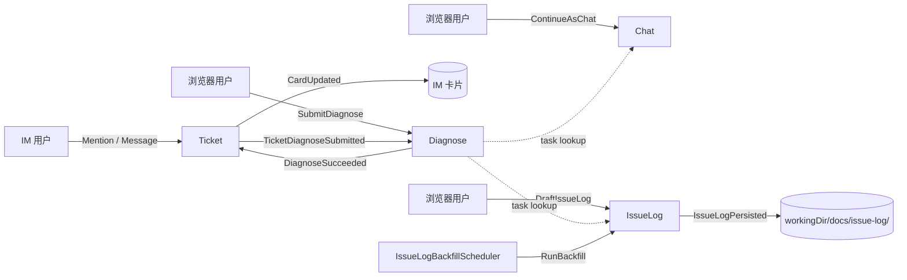

# Event Storming — agent-web（反向梳理）

> 生成日期：2026-05-24
> 范围：基于现有代码反向梳理，仅描述当前形态，不含重构建议
> 来源：`domain/` + `app/` + `interfaces/` 包扫描

## 限界上下文总览

| 上下文 | 责任 | 主聚合 |
|---|---|---|
| **Chat** | 浏览器对话 ↔ CLI Agent ↔ SSE 推流 | `ChatSession` |
| **Diagnose** | 远端委托诊断 / 异步任务 / 事件回放 | `DiagnoseTask` |
| **Ticket** | IM 消息建单、诊断、复核、通知与反馈闭环 | `Ticket` |
| **IssueLog** | 诊断结论沉淀 issue-log 文件 / Backfill 审批 | `IssueLogEntry`, `IssueLogCandidate` |

---

## Chat Context

**Actors**：浏览器用户

**Commands**：StartSession · SendMessage · StreamMessage · StopSession · TruncateMessages · DeleteSession · SummarizeSession · SubmitFeedback

**Events**（隐式，当前为同步方法调用 / SSE 推送）：SessionStarted · MessageAppended · MessageStreamed · MessageCompleted · SessionTruncated · SessionStopped · SessionDeleted · SummaryGenerated · FeedbackRecorded

**Aggregate**：`ChatSession`（id, agentType, workingDir, messages[], resumeId, env, feedback）

**Read Models**：SessionSummaryList（分页） · MessageList · SlashCommandList · EnvList

---

## Diagnose Context

**Actors**：API Key 调用方（Ticket / 外部脚本）→ REST；浏览器 → SSE 订阅

**Commands**：SubmitDiagnose（带 `Idempotency-Key`） · StreamDiagnose（带 `Last-Event-ID` 续推） · CancelDiagnose · ContinueAsChat

**Events**（**唯一显式建模**，见 `domain/diagnose/DiagnoseEvent`）：
- `STATUS`：DiagnoseStatusChanged（`PENDING → RUNNING → SUCCESS / FAILED / CANCELLED / TIMEOUT`，持久化）
- `PROGRESS`：DiagnoseProgressUpdated（持久化）
- `CHUNK`：ChunkEmitted（不持久化、断线不重放）
- `HEARTBEAT`：HeartbeatTick（不持久化）
- `RESULT`：DiagnoseSucceeded（持久化）
- `ERROR`：DiagnoseFailed（持久化）
- *隐式*：DiagnoseResultExpired（`retentionMinutes` 到期后 result 视为过期）

**Aggregate**：`DiagnoseTask`（状态机封装在聚合内，迁移方法 `start/succeed/fail/cancel/timeout`）

**Read Models**：DiagnoseHistoryList · DiagnoseTaskDetail · DiagnoseEventReplay

---

## Ticket Context

**Actors**：IM 用户、当值人员、`InboundEventWorker`、`TicketDiagnoseSubscriber`

**Commands**：RegisterTicket · SubmitDiagnose · RetrySubmit · SupplementTicket · DeliverTicket · ApplyFeedback · CloseTicket · ReopenTicket

**Events**（隐式）：
- ImEventReceived（IM 事件先写 inbox）
- TicketRegistered / TicketQueued
- **TicketDiagnoseSubmitted**（跨上下文：Ticket → Diagnose）
- TicketDiagnosed / TicketDelivered
- NotificationSent / FeedbackRecorded / TicketClosed

**Aggregate**：`Ticket`（状态迁移、重试、补充、复核与反馈规则）

**Read Models**：TicketList · TicketDetail · TicketChainMetrics

---

## IssueLog Context

**Actors**：浏览器用户（诊断详情抽屉 / 审批页）、`IssueLogBackfillScheduler`

**Commands**：DraftIssueLog · SaveIssueLog · RunBackfill · ApproveCandidate · RejectCandidate

**Events**（隐式）：
- DraftRefined（LLM 精炼成 7 字段 JSON 成功）
- DraftFallback（LLM 失败 → 启发式 `DraftBuilder` 兜底）
- **IssueLogPersisted**（写 `<workingDir>/docs/issue-log/issue/I-xxx-*.md` + 追加 `INDEX.md`，不自动 git commit）
- CandidateMatched（Backfill 命中 dedup）
- CandidateApproved / CandidateRejected

**Aggregates**：`IssueLogEntry`（id `I-\d+`，draft + filePath + createdAt） · `IssueLogCandidate`

**Read Models**：CandidateList · IndexMetadata

---

## 跨上下文事件流

## 关键观察（描述）

- **3 处显式跨上下文协作**：`Ticket → Diagnose`（提交诊断）、`Diagnose → Chat`（continue-as-chat）、`Diagnose → IssueLog`（draftFromTask 读取诊断结论）
- **长期后台任务**：IM inbox worker、Ticket 重试/告警 worker、`IssueLogBackfillScheduler`
- **唯一显式事件值对象**：`DiagnoseEvent`（SSE 推流 + `Last-Event-ID` 续推 + 持久化到 `diagnose_event` 表）；其他上下文的"事件"全部是隐式（同步方法调用或副作用）
- **持久化分层**：SQLite 存 `ChatSession` / `DiagnoseTask` / `Ticket` / `DiagnoseEvent` / IM inbox；文件系统存 issue-log + upload_pic；内存存 `SessionCache` + `DiagnoseEventBus` 订阅
