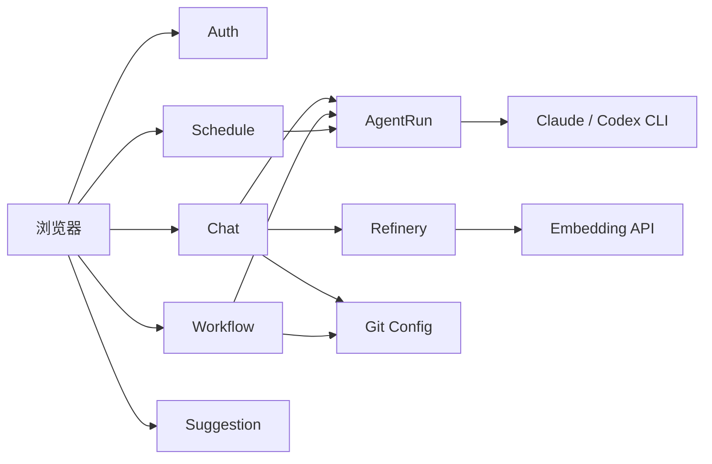

# Event Storming — agent-web

> 本文只描述当前仍有生产入口的命令、事件和跨上下文协作。最后更新：2026-07-22。

## 上下文总览

## Chat Context

**Actors**：登录用户、定时任务、管理员只读查询。

**Commands**：StartSession · SendMessage · StreamMessage · ResumeSession · TruncateSession · DeleteSession · ShareSession · SubmitFeedback。

**Events / Outcomes**：SessionStarted · UserMessageAdded · AssistantChunkReceived · AssistantMessageCompleted · SessionFailed · SessionTruncated · FeedbackRecorded · ShareCreated。

**Aggregate**：`ChatSession`。

**Policies**：

- 普通用户只能读取和删除自己的会话；
- 分享只暴露只读投影；
- CLI 输出大小、运行时长和进程环境受基础设施上限约束；
- 流输出先归一化，再同时写入会话并推送 SSE。

## Auth Context

**Commands**：Login · Logout · ChangePassword · BootstrapAdminPassword。

**Events / Outcomes**：LoginSucceeded · LoginRejected · SessionIssued · SessionRevoked · PasswordChanged。

**Aggregates**：`UserAccount`、`ManualSession`。

**Policies**：密码只保存 BCrypt 哈希；会话令牌随机生成且持久化哈希；登录失败按来源和用户名限流；管理接口在普通会话认证后追加角色校验。

## Workflow Context

**Commands**：CreateWorkflow · UpdateWorkflow · DeleteWorkflow · RunWorkflow · QueryExecution。

**Events / Outcomes**：WorkflowSaved · ExecutionStarted · StepStarted · StepSucceeded · StepFailed · ExecutionSucceeded · ExecutionFailed。

**Aggregates**：`Workflow`、`WorkflowExecution`。

**Policy**：步骤按顺序执行；任一步失败即停止余下步骤并结束本次 execution。每一步通过 AgentRun 组装 prompt 后驱动 CLI。

## Schedule Context

**Commands**：CreateTask · UpdateTask · EnableTask · DisableTask · RunTaskNow · DeleteTask。

**Events / Outcomes**：TaskScheduled · TaskTriggered · SessionStarted · TaskDisabled。

定时任务触发后创建独立聊天会话，不复用浏览器当前会话状态。

## Refinery Context

**Commands**：FindSilentSessions · RefineConversation · EmbedChunk · Recall · ArchiveExpired · RebuildChunk。

**Events / Outcomes**：ConversationScored · ChunkDiscarded · ChunkStored · RecallAttempted · ChunkInjected · ChunkArchived。

**Aggregate**：`RagChunk`。

**Policies**：低于评分阈值不进入向量库；召回先过向量相似度硬闸，再融合信号重排；过期数据软归档；外部评分或 embedding 失败不阻断聊天主链。

## Git / Worktree Context

**Commands**：SaveGitConfig · ResolveGitEnvironment · ListBranches · SwitchWorktree · UpdateWorktrees。

**Events / Outcomes**：GitConfigSaved · CliEnvironmentPrepared · WorktreeSelected · WorktreesUpdated。

**Aggregates / Policies**：`UserGitConfig` 约束 identity 与凭据状态；`WorkspacePathPolicy` 约束可访问的真实路径。凭据密文持久化，明文仅用于当前子进程。

## Suggestion Context

**Commands**：SubmitSuggestion · TriageSuggestion · UpdateSuggestionStatus。

**Events / Outcomes**：SuggestionSubmitted · SuggestionTriaged · SuggestionResolved。

提交端只允许当前用户创建和查看自己的记录；管理端接口由 `ADMIN` 角色保护。

## 跨上下文协作

- Chat / Workflow / Schedule → AgentRun：统一 prompt 组装与 CLI 调用。
- Chat → Refinery：静默会话进入异步评分和向量化；召回结果在发送消息前贡献上下文。
- Auth → 所有 Web 上下文：过滤器绑定 `LoginUser`，领域策略和查询服务按用户隔离数据。
- Git → CLI Infrastructure：当前用户的 identity 和可选凭据注入子进程环境。
- Worktree → Chat：当前工作目录改变后，前端清空活动会话标识并重新加载命令与分支信息。

持久化采用 SQLite 写侧仓储和 CQRS 查询服务；文件浏览、上传、图片和 issue-log 使用受白名单保护的文件系统；SSE 订阅和活跃会话缓存保留在内存中。
