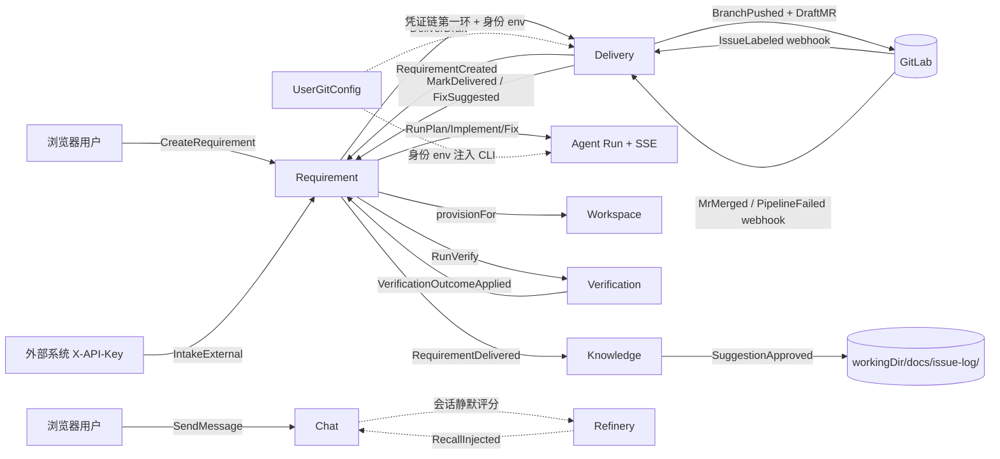

# Event Storming — agent-web（反向梳理）

> 更新日期：2026-07-22（限界上下文重构后重梳）
> 范围：基于现有代码反向梳理，仅描述当前形态，不含重构建议
> 来源：`domain/` + `app/` + `interfaces/` + `adapter/` 包扫描
>
> **背景**：诊断（Diagnose）与飞书 IM 工单（Ticket）两个上下文已整体移除；平台核心转为**需求交付流水线**。领域细节见 [`domain-model.md`](domain-model.md)。

## 限界上下文总览

| 上下文 | 责任 | 主聚合 |
|---|---|---|
| **Chat** | 浏览器对话 ↔ CLI Agent ↔ SSE 推流 | `ChatSession` |
| **Requirement** | 需求 9 态流水线 + plan/implement/fix/verify run 编排 | `Requirement` |
| **Workflow** | 管理台可复用多步 agent workflow 串行执行 | `Workflow` / `WorkflowExecution` |
| **Verification** | 验证 run 终态防腐 + 轮次熔断 | `VerificationRound` |
| **Workspace** | git worktree 隔离的需求工作区生命周期 | `RequirementWorkspace` |
| **Delivery** | push 分支 + 草稿 MR + SCM webhook 入站 | `DeliveryPolicy` / `MergeRequestRef` |
| **Git** | 单用户 git 身份/凭证注入 | `UserGitConfig` |
| **Knowledge** | 关单收割 + 审批收件箱 → issue-log 落盘 | `KnowledgeSuggestion` |
| **Suggestion** | 用户对系统的建议工单 + admin 处理 | `UserSuggestion` |
| **Refinery** | 会话向量召回（评分→embed→召回注入） | `RagChunk` |

---

## Chat Context

**Actors**：浏览器用户

**Commands**：StartSession · SendMessage · StreamMessage · StopSession · TruncateMessages · DeleteSession · SubmitFeedback · ShareSession

**Events**（隐式，当前为同步方法调用 / SSE 推送）：SessionStarted · MessageAppended · MessageStreamed（含 recall 命中帧）· MessageCompleted · SessionTruncated · SessionStopped · SessionDeleted · FeedbackRecorded · SessionShared

**Aggregate**：`ChatSession`（id, agentType, workingDir, messages[], resumeId, env, feedback, userId）

**Read Models**：SessionSummaryList（分页）· MessageList · SharedView · SlashCommandList · EnvList（读侧走 `ChatSessionQueryService`）

---

## Requirement Context（核心新增）

**Actors**：浏览器用户（看板）、外部系统（`X-API-Key`）、GitLab（issue webhook）、run 编排器（Plan/Implement/Fix/Verify RunService）、`ScmWebhookAppService`

**Commands**：CreateRequirement · IntakeExternal（带 `Idempotency-Key`）· AttachPlan · ApprovePlan · RejectPlan · StartImplement · StartVerify · RequestChanges · MarkDelivered · Suspend · Resume · Archive · RunPlan · RunImplement · RunFix · RunVerify · DeliverDraft · StreamRun（SSE）

**Events**（append-only，落 `requirement_event` 审计表）：
- RequirementCreated（source = BOARD / REST_API / GITLAB_ISSUE）
- PlanAttached / PlanReplaced / PlanRejected / **PlanApproved**（仅人工）
- WorkspaceAttached（`system`）· ImplementStarted · FixRunStarted · VerifyStarted
- **VerificationOutcomeApplied**（VERIFIED→REVIEW / BLOCKED·DEPLOY_FAILED→SUSPENDED）
- MrDrafted · **RequirementDelivered**（`system:webhook` 或人工）· ChangesRequested · FixSuggested
- Suspended / Resumed / Archived

**Aggregate**：`Requirement`（9 态状态机 `RequirementTransitions` T1–T15，终态 DELIVERED/ARCHIVED；事件外发箱 `pendingEvents`）

**Read Models**：RequirementBoard · RequirementDetail · RequirementEventTimeline · VerificationRoundList · MergeRequestList

**长期后台任务**：`WorkspaceCleanupService`（TTL 清理 + webhook 去重清扫）· `WorkspaceDiskMonitor`（磁盘水位）

---

## Delivery Context

**Actors**：`RequirementRunController`（deliver-draft）、GitLab（webhook 回调）

**Commands**：DeliverDraft · HandleWebhook

**Events**（隐式）：
- BranchPushed（`req/<id>` 白名单校验通过）· DraftMrCreated · MrRefRecorded
- WebhookReceived（UUID 幂等）→ 分发：**MrMerged→MarkDelivered** · PipelineFailed/MrNoteAdded→**FixSuggested（只建议不自动触发）** · IssueLabeled→**RequirementCreated（GITLAB_ISSUE）**

**Value Objects**：`ScmWebhookEvent`（sealed，5 record）· `MergeRequestRef` · `ScmCredential`（打码，禁落库）

**关键规则**：凭证链（个人 git 配置 → 系统默认账号 → 拒绝）· push ref 白名单 · webhook secret fail-closed（未配置→503）

---

## Knowledge Context

**Actors**：`RequirementAppService`（交付触发收割）、浏览器用户（审批收件箱）

**Commands**：HarvestOnDelivered · ListInbox · ReviseDraft · ApproveSuggestion · RejectSuggestion

**Events**（隐式）：
- KnowledgeHarvested（需求 DELIVERED → 建 PENDING 候选，每需求幂等 ≤1）
- SuggestionRevised / **SuggestionApproved**（→ 写 `docs/issue-log`，回填 issueId/issuePath）/ SuggestionRejected（理由必填）
- **IssueLogPersisted**（`FileSystemIssueLogRepository.save`，落需求 worktree，不自动 git commit → 随 MR 走 review）

**Aggregate**：`KnowledgeSuggestion`（PENDING → APPROVED/REJECTED，审批不变量收口聚合）

**下游**：issuelog（`IssueLogEntry` / `IssueLogDraft`）——knowledge 是 issuelog 写入的**唯一活跃驱动**

---

## Workflow / Suggestion / Refinery（简）

- **Workflow**：Commands = CreateWorkflow · UpdateWorkflow · DeleteWorkflow · RunWorkflow；Events = WorkflowExecutionStarted · StepSucceeded/StepFailed · ExecutionSucceeded/Failed（串行、`invokeSync`、无 SSE、fire-and-forget）。Aggregate `Workflow` / `WorkflowExecution`（RUNNING/SUCCEEDED/FAILED）。
- **Suggestion**：Commands = SubmitSuggestion · ListMine · TriageByAdmin；Events = SuggestionSubmitted · SuggestionReplied（PENDING+reply 隐式转 REPLIED）· SuggestionClosed。Aggregate `UserSuggestion`（copy-on-write）。
- **Refinery**：Commands（后台）= RefineSession · IngestChunk · RecallForChat · ArchiveExpired；Events = SessionRefined / RefineDiscarded（score<阈值）· ChunkIngested · ChunkArchived · RecallInjected（`[历史参考]` 注入 chat）。Aggregate `RagChunk`。触发器 `ChatRefineryTrigger`（`scheduleWithFixedDelay`）。诊断上游已摘除，现仅消费 chat。

---

## 跨上下文事件流

## 关键观察（描述）

- **Requirement 是编排枢纽**：一条需求把 workspace（挂 worktree）、agentrun（prompt 组装）、verification（验证熔断）、delivery（push+MR）、knowledge（关单收割）串成流水线；所有状态迁移落 `requirement_event` 审计表（本仓事件建模最完整处）。
- **3 处显式跨上下文写协作**：`Verification → Requirement`（applyVerificationOutcome）、`Delivery → Requirement`（markDelivered / recordFixSuggestion / createWithRef）、`Requirement → Knowledge`（交付收割）。
- **webhook 是唯一外部入站事件源**：`ScmWebhookEvent`（sealed，UUID 幂等，鉴权后恒 2xx，单事件失败只记日志防重试风暴）。
- **持久化分层**：SQLite 存 `ChatSession` / `Requirement`(+event) / `RequirementWorkspace` / `verification_round` / `merge_request_ref` / `processed_webhook` / `workflow_*` / `knowledge_suggestion` / `user_suggestion` / `chat_rag_chunk` / `chat_recall_*` / `user_git_config`；文件系统存 issue-log + upload_pic；内存存 `SessionCache` + `RunEventBus` SSE 订阅。
- **诊断/工单遗留**：`RunForm.DIAGNOSE`、`SourceType.DIAGNOSE`、`RequirementSource.TICKET_DERIVED` 为存量兼容枚举，无活跃生产者。
