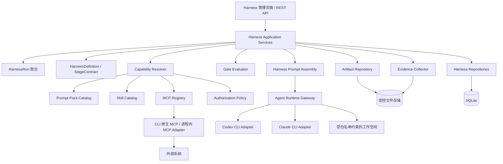
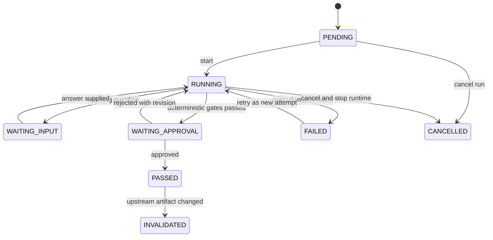

# 研发交付 Harness 目标架构

> 状态：目标态设计草案
> 最后更新：2026-07-22
> 关联文档：[首版能力范围](02-mvp-capabilities.md) · [建设阶段与里程碑](03-milestones.md)

## 1. 文档结论

`agent-web` 最终要提供的 Harness，不是一个固定的四步 Workflow，也不是一组拼接 Prompt 的脚本，而是一套面向软件需求交付的、可恢复和可审计的执行控制面。它以“需求分析 → 方案设计 → 代码编写 → 部署验证”为主流程，负责：

- 固化每个阶段的输入、输出、权限和退出门禁；
- 按阶段动态装配 Prompt Pack、Skills 和 MCP 能力；
- 驱动 Claude CLI、Codex CLI 等运行时完成受控任务；
- 保存阶段产物、命令证据、审批和状态变更；
- 建立需求—设计—代码—测试—部署验证的追踪关系；
- 在失败、中断、重启和人工补充信息后安全恢复；
- 对写文件、执行命令、部署、回滚等高风险动作实行最小权限和人工审批。

目标态的核心表达是：

```text
Harness = Stage State Machine
        + Stage Contract
        + Capability Resolver(Prompt + Skill + MCP + Tool Policy)
        + Agent Runtime Adapter
        + Artifact/Evidence Store
        + Gate/Approval Engine
        + Audit/Recovery
```

## 2. 目标与非目标

### 2.1 目标

1. **可重复**：相同的需求版本、Prompt、Skill、MCP 配置和代码基线能够形成可对比的执行记录。
2. **可恢复**：应用重启、CLI 中断或等待人工输入后，可以从最近的安全检查点继续。
3. **可审计**：能够回答谁在何时，以什么权限、使用哪些能力、修改了什么、执行了什么命令，以及结果如何。
4. **可治理**：阶段不能凭 Agent 自我声明完成；必须由确定性检查、测试证据或人工审批通过门禁。
5. **可扩展**：Prompt、Skill、MCP 和 Agent Runtime 均通过稳定端口扩展，不把 Claude/Codex 的私有格式泄漏到领域模型。
6. **符合当前架构**：Interface 负责边界，Application 负责用例编排，Domain 承载状态迁移和门禁规则，Infrastructure 负责 SQLite、文件、CLI 和 MCP 配置适配。
7. **面向真实交付**：最终结果不是一段聊天回复，而是经过需求、设计、测试和部署证据闭环验证的交付记录。

### 2.2 非目标

- 不把 Harness 做成任意 DAG、CI/CD、项目管理和通用 Agent 平台的全集；四阶段交付是核心用例。
- 不允许 Agent 从网络任意下载并执行未经信任的 Skill 或 MCP Server。
- 不让 Skill、MCP 或工作区文档自行提升权限。
- 不以模型自评替代测试、确定性检查、环境探针或人工审批。
- 不在 Domain 中依赖 Spring、SQLite、CLI 参数、MCP SDK 或文件系统。
- 不要求 `agent-web` 第一阶段就实现完整的进程内 MCP Client；目标态保留该能力，但优先采用 CLI 原生 MCP 运行能力。
- 不默认自动提交代码、推送远端、合并分支或部署生产环境；这些动作必须由独立策略授权。

### 2.3 已确认的首版决策

以下决策已于 2026-07-22 确认，用于约束 MVP，不改变本文的长期目标态：

- MVP 只打通一个 Agent Runtime，固定优先使用 Codex；Claude Runtime 放到后续里程碑。
- MVP 部署验证只在本机执行，不接入测试服务器或生产环境。
- M0—M3 使用可重复的 Fixture、Fake MCP 和受控样例验证 Harness 自身能力，不要求现在提供真实业务需求。
- 四阶段能力建设完成后，再选择真实需求执行最终纵向验收；没有真实需求验收结果时不能宣称 MVP 正式完成。

## 3. 术语

| 术语 | 含义 |
| --- | --- |
| Harness Definition | 一套四阶段定义、默认能力、门禁与策略的版本化模板 |
| Harness Run | 针对一个具体需求的一次端到端执行 |
| Stage | `ANALYSIS`、`DESIGN`、`IMPLEMENTATION`、`DEPLOYMENT` 中的一个阶段 |
| Stage Contract | 某阶段的输入、输出、能力、禁止事项和退出门禁 |
| Prompt Pack | 可版本化的阶段 Prompt 资源集合，不是单个任意字符串 |
| Skill | 供 Agent 使用的专业工作说明、参考资源和可选脚本包 |
| MCP Capability | 通过可信 MCP Server 暴露的工具、资源或 Prompt 能力 |
| Capability Snapshot | 某阶段实际解析并授权后的 Prompt、Skill、MCP、工具和权限不可变快照 |
| Artifact | 需求、设计、测试计划、实现摘要、部署记录等阶段正式产物 |
| Evidence | 命令、退出码、测试结果、日志摘要、制品版本、健康检查等可验证事实 |
| Gate | 判断阶段是否可通过的规则集合 |
| Approval | 人工对阶段产物或高风险动作的显式批准/拒绝记录 |
| Runtime Adapter | 把统一执行规格转换为 Claude CLI、Codex CLI 等具体运行方式的适配器 |

## 4. 当前基线与差距

以下结论基于 2026-07-22 当前源码，不把规划中的能力描述为现有能力。

| 当前能力 | 可复用点 | 与目标 Harness 的差距 |
| --- | --- | --- |
| `Workflow` 多步串行执行 | 已有定义、执行、步骤输出和 SQLite 持久化 | 状态仅 `RUNNING/SUCCEEDED/FAILED`；没有阶段契约、人工门禁、回退、恢复、权限和证据模型 |
| `AgentRun` Prompt 管线 | 已有 Contributor 顺序、上下文装配和 SHA-256 Prompt Hash | 面向一般 Agent Run；没有阶段 Prompt Pack、Skill/MCP 能力快照及 Harness 产物输入 |
| Slash Command/Skill 扫描 | 能发现工作区与用户目录下的 `SKILL.md` | 当前把 Skill 解析成 Slash Command；没有版本、依赖、阶段适用性、信任、授权和包级 Hash |
| Claude/Codex CLI 适配 | 已有 CLI 方言、进程执行、超时、输出限制和事件归一化 | 没有 Harness 统一执行规格、隔离的阶段配置和 MCP 能力装配接口 |
| SQLite 与文件能力 | 已有持久化基础和路径白名单策略 | 没有 Harness Run、Stage、Artifact、Capability Snapshot、Gate 和 Approval 表达 |

代码依据：

- [`WorkflowRunner`](../../src/main/java/com/example/agentweb/app/workflow/WorkflowRunner.java) 顺序执行所有步骤，步骤失败后结束整个执行。
- [`WorkflowStatus`](../../src/main/java/com/example/agentweb/domain/workflow/WorkflowStatus.java) 当前只有三个状态。
- [`PromptAssemblyService`](../../src/main/java/com/example/agentweb/app/agentrun/PromptAssemblyService.java) 当前固定装配六类 Contributor 并计算 Prompt Hash。
- [`FileSlashCommandScanner`](../../src/main/java/com/example/agentweb/infra/FileSlashCommandScanner.java) 当前扫描 `SKILL.md` 并转换为 Slash Command。
- 当前源码检索不到一等的 MCP 注册表、阶段授权或 MCP 生命周期模型。

### 4.1 复用边界

- Harness 可以复用 AgentRun 的“结构化 Prompt Part + 固定装配顺序 + Hash”思想，但不能把研发阶段状态塞进 `AgentRunContext` 后就宣称完成 Harness。
- Harness 可以复用现有 CLI 执行和事件归一化基础，但新用例应通过出站端口依赖 Runtime，不在 Application 新增对 `infra` 具体类的直接依赖。
- Harness 不应直接扩充现有 `Workflow` 聚合。Workflow 的业务语义是“可编辑的串行 Prompt 步骤”；Harness 的语义是“有门禁、审批、权限、产物和回退的交付生命周期”，二者变化原因不同。
- 当前 Slash Command 展示能力继续存在；新的 Skill Catalog 负责 Harness 的发现、信任、选择和快照，不能用 `boolean skill` 承担完整语义。

## 5. 总体架构



架构分为四个平面：

1. **控制平面**：Run 状态、阶段流转、门禁、审批、重试和取消。
2. **能力平面**：Prompt、Skill、MCP、命令和文件权限的发现、解析和授权。
3. **执行平面**：Agent Runtime、工作空间、命令、测试、部署和回滚适配。
4. **证据平面**：Artifact、Evidence、Hash、事件和追踪矩阵。

## 6. DDD 限界上下文与分层

### 6.1 Harness 限界上下文

Harness 应建立独立限界上下文，而不是成为 Workflow 的一种特殊配置。

核心模型建议如下：

| 模型 | 类型 | 核心职责 |
| --- | --- | --- |
| `HarnessDefinition` | 聚合根 | 管理版本化阶段定义、顺序和默认策略 |
| `HarnessRun` | 聚合根 | 管理一次交付运行的阶段状态、流转、不变量和终态 |
| `StageExecution` | 聚合内实体 | 管理阶段尝试、状态、输入输出引用和失败原因 |
| `StageContract` | 值对象 | 定义阶段必需输入、产物、能力请求和门禁 |
| `CapabilitySnapshot` | 值对象/独立记录 | 保存实际授权后的能力及 Hash；创建后不可变 |
| `GateResult` | 值对象 | 表达规则、结论、证据引用和阻断原因 |
| `Approval` | 实体或独立聚合 | 保存批准对象、决策人、理由、时点和策略版本 |
| `ArtifactDescriptor` | 值对象 | 保存 Artifact 类型、版本、位置、Hash 和生产阶段 |

主要不变量必须位于 Domain：

- 阶段只能按合同允许的转换流转；
- 上一阶段未通过时，下一阶段不能启动；
- 处于 `WAITING_APPROVAL` 时不得继续执行受保护动作；
- 阶段已开始后，所使用的 Capability Snapshot 不得被原地修改；
- 已批准的产物若内容 Hash 改变，原批准自动失效；
- Run 完成前四阶段必须满足定义要求，不能由 Application 拼接 getter 判断；
- 回退到早期阶段后，所有依赖旧产物的后续通过结果必须失效；
- `CANCELLED`、`COMPLETED` 等终态不能再执行普通阶段动作。

### 6.2 四层落点

| 层 | 职责 | 禁止事项 |
| --- | --- | --- |
| Interface | REST/SSE、DTO、参数校验、鉴权上下文、管理页面 | 直接操作 Repository、判断阶段业务合法性 |
| Application | 创建 Run、开始阶段、解析能力、调用 Runtime、收集证据、事务编排 | 根据状态字符串自行决定转换；遍历 Artifact 重组门禁规则 |
| Domain | 生命周期、阶段转换、不变量、Gate/Approval 策略、失效传播 | 依赖 Spring、SQLite、CLI、MCP SDK、文件系统 |
| Infrastructure | SQLite Repository、Artifact 文件存储、Prompt/Skill 文件 Catalog、CLI/MCP/部署适配 | 承载“什么状态允许部署”等业务规则 |

### 6.3 关键端口

建议端口名称表达业务意图，具体命名在实施设计阶段确认：

- `HarnessRunRepository`：Run 聚合生命周期，接口位于 Domain。
- `HarnessDefinitionRepository`：定义生命周期，接口位于 Domain。
- `HarnessRunQueryService`：列表、详情、时间线等 CQRS 投影，位于 Application 或 Domain，Infrastructure 实现。
- `ArtifactRepository`：保存、读取和校验正式产物；接口使用领域描述符，不泄漏文件实现。
- `PromptPackCatalog`、`SkillCatalog`、`McpServerCatalog`：发现已注册能力。
- `AgentRuntimeGateway`：启动、恢复、取消 Agent 执行；不暴露具体 CLI 参数。
- `CommandExecutionGateway`：执行已经过策略批准的确定性命令，并返回结构化证据。
- `DeploymentGateway`：部署、状态查询和回滚；生产与测试环境可由不同适配器实现。
- `CredentialReferenceResolver`：运行时解析凭据引用，绝不把明文保存到 Capability Snapshot。

## 7. 四阶段运行合同

四阶段顺序固定，但阶段内部允许多次 Attempt。后续版本可在不破坏领域语义的前提下增加可选子步骤。

### 7.1 需求分析 `ANALYSIS`

输入：

- 原始需求及附件；
- 工作空间、Agent 类型和目标环境；
- 当前仓库基线摘要；
- 经授权的需求系统、知识库等只读 MCP 结果。

允许能力：

- 只读代码检索、文件读取和 Git 基线检查；
- 需求分析、影响分析相关 Skills；
- 只读 MCP；
- 写入 Harness Artifact Store。

禁止能力：

- 修改业务代码；
- 修改数据库或外部工单；
- 构建、启停、部署、提交和推送。

必需产物：

- `requirement.md`；
- `acceptance-criteria.md`；
- `impact-analysis.md`；
- `open-questions.md`；
- 机器可读的 Requirement/Acceptance Criteria 索引。

退出门禁：

- 每条范围内需求有稳定编号；
- 验收条件可执行、可观察；
- 范围内、范围外和关键风险明确；
- 没有会改变总体方案的阻断问题；
- 影响分析引用了真实代码或配置证据；
- 人工批准需求基线。

### 7.2 方案设计 `DESIGN`

输入：

- 已批准的需求基线及 Hash；
- 影响分析；
- 当前架构规则和相关源码；
- 已授权的架构、API、数据库文档 MCP。

允许能力：

- 只读检索和聚焦的静态分析；
- DDD、API、数据库、测试策略相关 Skills；
- 写入设计 Artifact。

禁止能力：

- 修改生产代码或 Schema；
- 执行部署；
- 用尚未验证的实现细节静默改变需求。

必需产物：

- `solution.md`；
- `domain-model.md`；
- `change-plan.md`；
- `test-strategy.md`；
- `deployment-plan.md`；
- `rollback-plan.md`；
- 必要的 API/Data Contract 和 ADR。

退出门禁：

- 每条需求映射到设计项和测试策略；
- 分层和聚合边界通过架构检查；
- 数据兼容、部署验证和回滚路径明确；
- 新增抽象已检索现有能力，避免重复建设；
- 人工批准设计基线。

### 7.3 代码编写 `IMPLEMENTATION`

输入：

- 已批准的需求与设计 Hash；
- 变更计划和测试策略；
- 工作空间 Git 基线；
- 阶段 Capability Snapshot。

允许能力：

- 在白名单工作空间修改范围内文件；
- 执行批准的聚焦测试和静态检查；
- 使用 TDD、Java/DDD、前端测试等 Skills；
- 使用与实现直接相关且已授权的 MCP。

禁止能力：

- 跳过业务规则归属检查后直接在 Application/Infrastructure 加分支；
- 调用真实外部依赖的普通测试；
- 修改本地凭据、非任务数据库或超出范围的项目；
- 默认提交、推送或部署。

必需产物与证据：

- 变更文件清单与 Git Diff Hash；
- 需求—设计—代码—测试追踪矩阵；
- TDD 红灯与绿灯证据；
- 聚焦测试、必要回归和静态检查结果；
- 实现摘要、已知限制和残余风险。

退出门禁：

- 所有范围内需求均有实现和测试覆盖，或有经批准的例外；
- 业务逻辑变更具备先红后绿证据；
- 分层和架构约束通过；
- 选定的最低成本测试集通过；
- Diff 审查通过且没有越权或无关修改；
- 人工批准待部署版本及其 Git 基线。

### 7.4 部署验证 `DEPLOYMENT`

输入：

- 已批准的实现版本与 Git Diff/Commit Hash；
- 部署计划、回滚计划和验收用例；
- 目标环境快照；
- 部署阶段独立授权。

允许能力：

- 构建制品；
- 对明确目标环境执行部署、启停、探针和业务验收；
- 读取日志、指标和制品信息；
- 在部署失败时按批准的方案回滚。

禁止能力：

- 把测试环境授权扩大到生产环境；
- 在没有 Approval 的情况下执行生产写操作；
- 将健康检查成功等同于业务验收成功；
- 在日志和 Artifact 中保存凭据明文。

必需产物与证据：

- Preflight 记录；
- 构建命令、退出码和制品 Hash；
- 部署目标、版本、时间和执行结果；
- 技术健康检查；
- 按 Requirement ID 执行的业务验收结果；
- 日志/指标摘要；
- 发生失败时的回滚记录。

退出门禁：

- 部署版本与批准版本一致；
- 技术探针通过；
- 所有必需验收条件通过；
- 没有未处理的严重回归；
- 失败时已经回滚到已知安全版本，或 Run 明确停在阻断态；
- 最终交付报告和审计时间线完整。

## 8. 状态机、回退与失效传播

### 8.1 Run 状态

建议 Run 使用粗粒度状态表达整体生命周期：

```text
DRAFT
ACTIVE
WAITING_INPUT
WAITING_APPROVAL
FAILED
ROLLING_BACK
ROLLED_BACK
COMPLETED
CANCELLED
```

当前阶段和阶段状态由 `StageExecution` 表达，不把所有组合展开成几十个 Run 枚举。

### 8.2 Stage 状态

```text
PENDING
RUNNING
WAITING_INPUT
WAITING_APPROVAL
PASSED
FAILED
INVALIDATED
CANCELLED
```

### 8.3 典型转换



关键规则：

- Retry 创建新的 Attempt，不覆盖旧证据。
- 回到需求或设计阶段时，后续 Stage 标记为 `INVALIDATED`，保留历史但不能作为当前完成依据。
- Artifact 修改产生新版本和新 Hash，依赖旧 Hash 的 Approval、GateResult 和 Capability Snapshot 不得静默复用。
- 应用重启后，`RUNNING` 的外部执行必须通过 Runtime Execution ID 对账；无法确认时进入可诊断失败态，不能重复执行有副作用操作。

## 9. 能力动态装配

### 9.1 总原则

能力生命周期必须分为：

```text
Discoverable → Trusted → Selected → Authorized → Snapshotted → Activated
```

发现不代表信任，信任不代表选择，选择不代表授权，授权后还必须固化快照。最终权限是以下集合的交集：

```text
Effective Capability
  = User Grant
  ∩ Platform Policy
  ∩ Workspace Policy
  ∩ Stage Contract
  ∩ Environment Policy
  ∩ Runtime Enforceability
```

任何一层无法确认时默认拒绝，尤其是部署、外部写操作和凭据访问。

### 9.2 Prompt Pack

Prompt Pack 是版本化资源集合，至少包含：

```text
prompt-packs/<pack-id>/<version>/
├── manifest.yml
├── system.md
├── task.md
├── output-contract.md
└── gate-hints.md
```

推荐装配顺序：

1. 平台安全与不可覆盖约束；
2. 环境 Guardrail；
3. 当前 Stage Contract；
4. 当前阶段 Prompt Pack；
5. 已授权 Skill 的调用说明；
6. 已批准的上游 Artifact；
7. 当前需求或阶段输入；
8. 输出契约。

工作区文档、MCP 返回和用户需求属于上下文或数据，不能覆盖平台规则与权限。CLI 原生加载的 `AGENTS.md`、`CLAUDE.md` 等规则继续由具体 CLI 负责；`agent-web` 默认不重复发现或注入，避免与当前 AgentRun 行为冲突。

每次组装保存：

- Prompt Pack ID、版本和资源 Hash；
- 实际 Prompt Parts 及顺序；
- 最终 Prompt Hash；
- 被省略或降级的可选部分及原因；
- Prompt 中引用的 Artifact ID/Version/Hash。

安全、阶段合同、输出契约属于必需 Contributor，失败必须阻断；只有知识召回等明确标记为可选的 Contributor 才能降级为空。

### 9.3 Skill Catalog

目标 Skill Manifest 至少表达：

```yaml
id: java-tdd
version: 1.0.0
source: local-trusted
stages: [IMPLEMENTATION]
triggers: [java, business-branch]
entrypoint: SKILL.md
resources:
  - references/**
  - templates/**
scripts:
  - scripts/select-tests.sh
requires:
  capabilities:
    - filesystem.read
    - command.test
trust:
  level: WORKSPACE_APPROVED
```

目标能力：

- 支持平台、用户和工作区 Catalog，但有明确优先级和信任边界；
- 对 Skill 包而非只对 `SKILL.md` 计算 Hash；
- 解析版本、依赖、冲突、适用阶段和运行时兼容性；
- 区分 CLI 原生 Skill 与 Inline Skill；
- 脚本能力单独授权，不能因为选择 Skill 自动允许执行其脚本；
- Run 中记录“为什么选择”和“为什么拒绝”某 Skill；
- 不允许正在运行的 Stage 静默切换到同名 Skill 的新版本。

### 9.4 MCP Registry

MCP Manifest 不保存凭据明文，只保存引用：

```yaml
id: issue-tracker
version: 1.0.0
transport: stdio
runtimeCompatibility: [CODEX, CLAUDE]
credentialRefs:
  - ISSUE_TRACKER_TOKEN
capabilities:
  - id: issue.read
    mode: READ
    stages: [ANALYSIS, DESIGN, IMPLEMENTATION]
  - id: issue.update
    mode: WRITE
    stages: [DEPLOYMENT]
timeouts:
  startupSeconds: 10
  callSeconds: 30
```

目标能力：

- 注册、启停、健康检查、版本和兼容性校验；
- 按阶段选择 Server 和 Tool/Resource，而不是把全部 Server 注入全部 Run；
- 对 READ、WRITE、DEPLOY、SECRET 等风险分类；
- 在 Runtime 支持 Tool Allowlist 时下发精确权限；
- Runtime 无法执行精确限制时，对敏感 Server 采取整服不挂载的 fail-closed 策略；
- 使用隔离的临时 Runtime 配置，结束后清理；
- 保存配置 Hash、Server 版本和暴露能力清单，不保存 Secret；
- MCP 失败按合同决定阻断或降级，需求源、部署等必需能力不得静默降级。

### 9.5 Capability Snapshot

一个 Stage Attempt 只能对应一个不可变 Snapshot：

```json
{
  "stage": "DESIGN",
  "promptPacks": [{"id": "design", "version": "1.0.0", "hash": "sha256:..."}],
  "skills": [{"id": "java-ddd-design", "version": "1.0.0", "hash": "sha256:..."}],
  "mcpServers": [{"id": "issue-tracker", "version": "1.0.0", "capabilities": ["issue.read"]}],
  "filesystem": {"read": ["workspace/**"], "write": ["artifact-store/**"]},
  "commands": ["rg", "git.status", "git.diff"],
  "policyVersion": "harness-policy-1",
  "snapshotHash": "sha256:..."
}
```

这只是表达形态，不是最终 API Schema。Snapshot 中必须使用规范化后的稳定序列化计算 Hash。

## 10. Runtime Adapter 与执行规格

Harness 生成与具体 CLI 无关的 `AgentExecutionSpec`，内容包括：

- Run、Stage、Attempt 和幂等 ID；
- Agent 类型、工作目录和环境；
- 最终 Prompt 与 Hash；
- Skill/MCP Capability Snapshot；
- 文件和命令权限；
- 超时、空闲超时、最大输出和取消策略；
- 需要收集的输出契约和证据类型。

Runtime Adapter 负责：

- 将统一规格转换为 Codex/Claude 的参数、环境或隔离配置；
- 启动、观察、取消并归一化执行事件；
- 返回稳定 Runtime Execution ID；
- 报告哪些权限能够被 Runtime 真正强制；
- 在配置不兼容时启动前失败，而不是带着过宽权限继续；
- 隔离并清理临时 MCP/Skill 配置。

目标态支持两种 MCP 路径：

1. **CLI Native，默认**：Harness 管理注册和授权，Runtime Adapter 生成具体 CLI 配置，CLI 执行 MCP。
2. **In-process Adapter，可选**：仅当需要统一协议治理且收益明确时，由 `agent-web` 进程管理 MCP 会话。

具体 Codex 每次运行如何引用临时 MCP/Skill 配置，需要在建设里程碑 M0/M3 用当前 CLI 版本做兼容性 Spike；未验证前不在本设计中假定具体参数。Claude 的等价适配在后续里程碑验证。

## 11. Artifact、Evidence 与追踪矩阵

### 11.1 双存储模型

- SQLite 保存 Run、Stage、Attempt、Artifact 元数据、Hash、状态、Approval、GateResult 和事件。
- 可配置的受控文件存储保存正文、日志和大型证据，默认位于源码工作区之外。
- Artifact 通过 Repository 访问，Domain 不感知物理路径。
- 将批准的需求/设计文档发布到业务仓库是显式动作，不应成为默认副作用。

### 11.2 Artifact 版本规则

每个 Artifact 至少包含：

- `artifactId`、类型、版本；
- 生产 Run/Stage/Attempt；
- Content Type、大小和 SHA-256；
- 创建者、创建时间；
- 来源 Artifact 引用；
- 敏感级别和保留策略。

Artifact 不原地覆盖。更新生成新版本；审批和下游引用绑定到特定版本及 Hash。

### 11.3 Evidence 结构

命令证据至少包含：

- 逻辑命令类型和实际命令的脱敏表示；
- 工作目录、开始/结束时间、退出码；
- stdout/stderr Artifact 引用；
- 执行前 Git 基线和执行后 Diff Hash；
- 对应 Requirement/Test/Acceptance ID；
- 是否包含外部副作用；
- Runtime、Prompt、Skill、MCP Snapshot Hash。

### 11.4 追踪矩阵

最终交付至少可查询：

| 需求 | 验收条件 | 设计 | 代码变更 | 测试 | 部署验证 | 结果 |
| --- | --- | --- | --- | --- | --- | --- |
| `REQ-001` | `AC-001` | `DES-001` | Diff/Commit | `TEST-001` | `VAL-001` | PASS/FAIL |

门禁检查必须基于机器可读 ID，Markdown 只作为人类视图。

## 12. Gate 与 Approval

Gate 分三类：

1. **确定性 Gate**：Schema 完整性、必需 Artifact、Hash、追踪覆盖率、测试退出码、架构测试、部署版本一致性。
2. **策略 Gate**：阶段能力是否越权、目标环境是否允许、Approval 是否匹配当前 Artifact Hash、失败重试是否安全。
3. **人工 Gate**：需求、设计、待部署版本、生产部署和例外批准。

模型可以辅助生成审查意见，但不能是唯一确定性 Gate。

Approval 必须绑定：

- Run、Stage 或 Action；
- Artifact/Snapshot/Version Hash；
- 批准人及其角色；
- 决策、理由、时间；
- 适用环境和过期条件。

代码、设计、Capability Snapshot 或目标环境改变后，旧 Approval 不再有效。

## 13. 幂等、并发、取消与恢复

- 创建 Run、启动 Stage、执行部署动作均要求幂等键。
- 同一 Run 同时只能有一个可写 Stage Attempt；只读审查可以并发，但产物合并需显式动作。
- 工作空间写操作使用 Run/Workspace 级租约或锁，避免多个实现阶段互相覆盖。
- 取消先持久化取消意图，再调用 Runtime 停止；回调到达后由 Domain 决定最终状态。
- Runtime 回调、SSE 重连和重复事件通过 Execution ID + Sequence 去重。
- 应用启动时对非终态 Run 做 Reconciliation，不盲目重放部署或外部写操作。
- 自动重试仅适用于声明为幂等的只读或无副作用操作；部署、回滚、写 MCP 默认需要人工确认。

## 14. 安全模型

### 14.1 默认拒绝

- 工作目录必须通过现有真实路径和白名单策略。
- Prompt/Skill/MCP Catalog 根目录由管理员配置，工作区内容不能自动成为可信能力。
- Skill 脚本和 MCP Server 启动命令必须来自可信注册，不接受需求正文直接提供的命令。
- Secret 只以引用存在；日志、Prompt、Artifact 和 API 响应禁止保存明文。
- Agent 输出中的“请启用某工具/请部署”等文本不构成授权。

### 14.2 风险分级

| 等级 | 示例 | 默认策略 |
| --- | --- | --- |
| R0 | 读取已批准 Artifact | 自动允许 |
| R1 | 读取工作区、`rg`、`git status` | 按阶段允许并审计 |
| R2 | 修改工作区、运行聚焦测试 | 实现阶段允许，受路径和命令白名单约束 |
| R3 | 外部写 MCP、构建、服务启停 | 独立 Approval |
| R4 | 生产部署、数据库不可逆变更、回滚 | 双重确认或组织策略审批，默认拒绝 |

### 14.3 Prompt Injection 防护

内容按来源标记：

- `INSTRUCTION_TRUSTED`：平台和阶段合同；
- `INSTRUCTION_APPROVED`：可信 Skill；
- `CONTEXT_APPROVED`：已批准 Artifact；
- `DATA_UNTRUSTED`：需求正文、代码注释、MCP 返回、日志、网页和知识召回。

装配器保持边界标记；不可信数据不能覆盖工具策略，也不能通过文本指令获得更多权限。

## 15. 接口与用户体验目标

目标页面需要支持：

- 创建 Run：需求、工作目录、Agent、环境、Definition 版本；
- 查看四阶段进度、当前 Attempt、阻断原因和下一步；
- 查看实际 Prompt/Skill/MCP Snapshot 及选择理由，但隐藏 Secret；
- 预览、编辑和批准阶段 Artifact；
- 回答阻断问题并恢复；
- 查看实时 Agent 事件、命令证据、Git Diff 和测试结果；
- 对部署/回滚动作单独批准；
- 查看最终追踪矩阵和交付报告。

REST 资源建议围绕业务语义，而不是暴露内部表：

```text
POST   /api/harness/runs
GET    /api/harness/runs/{runId}
POST   /api/harness/runs/{runId}/stages/{stage}/start
POST   /api/harness/runs/{runId}/questions/{questionId}/answer
POST   /api/harness/runs/{runId}/approvals
POST   /api/harness/runs/{runId}/cancel
GET    /api/harness/runs/{runId}/events
GET    /api/harness/runs/{runId}/artifacts
GET    /api/harness/runs/{runId}/traceability
```

具体 URI 在 Interface 设计阶段确认；生产部署动作应使用更明确的 action resource 与幂等键。

## 16. 持久化概念模型

目标态至少需要以下逻辑表或等价存储：

```text
harness_definition
harness_definition_version
harness_run
harness_stage_execution
harness_stage_attempt
harness_capability_snapshot
harness_artifact
harness_artifact_dependency
harness_gate_result
harness_approval
harness_runtime_execution
harness_evidence
harness_event
harness_trace_link
prompt_pack_registration
skill_registration
mcp_server_registration
```

Repository 写侧返回完整聚合；管理台列表、时间线、追踪矩阵和证据汇总走 QueryService 投影，不用半截聚合承载读模型。

## 17. 可观测性与运维

结构化日志至少包含：

- `runId`、`stage`、`attempt`、`runtimeExecutionId`；
- Definition、Prompt、Skill、MCP 和 Policy Hash；
- 状态转换、Gate、Approval 和失败分类；
- Token/耗时/输出大小等运行指标；
- Artifact/Evidence ID，不记录敏感正文。

核心指标：

- 各阶段成功率和耗时分布；
- 等待人工输入/审批时长；
- 重试、回退和失效次数；
- Skill/MCP 选择、拒绝和失败次数；
- Runtime 取消成功率和孤儿执行数；
- 测试失败率、部署失败率和回滚率；
- Requirement 到 Acceptance 的覆盖率。

告警关注：

- Stage 长时间 `RUNNING` 无事件；
- 应用重启后无法对账的 Runtime；
- 生产部署版本与批准 Hash 不一致；
- Secret Redaction 命中；
- Capability 策略拒绝或运行时无法强制权限；
- 回滚失败。

## 18. 测试策略

### 18.1 Domain

不 Mock Domain，覆盖：

- 所有 Stage/Run 合法和非法状态转换；
- 上游变更导致下游失效；
- Approval 与 Artifact Hash 绑定；
- Capability Snapshot 不可变；
- Gate 组合规则；
- 终态、取消、重试和回滚不变量。

### 18.2 Application

Mockito Mock Domain Repository、Runtime Gateway、Artifact Repository、Capability Catalog，覆盖：

- 四阶段编排顺序；
- Snapshot 先持久化再执行；
- Runtime 成功/失败/超时/取消；
- Artifact 保存、Gate 评估和 Approval 等待；
- 应用重启后的对账编排。

Application 测试只验证编排，不把状态判断锁在应用层。

### 18.3 Infrastructure

- 真实 SQLite 验证 Repository 和幂等迁移；
- `@TempDir` 验证 Prompt/Skill Catalog、Artifact Store 和路径逃逸防护；
- CLI Stub 验证 Codex/Claude Runtime Adapter 和隔离配置；
- MCP Stub 验证握手、超时、能力列表、失败关闭和 Secret Redaction；
- 部署 Stub 验证命令白名单、证据采集和回滚调用。

### 18.4 Interface 与 E2E

- Controller 测试覆盖鉴权、参数校验、状态码、幂等键和 DTO；
- Playwright 覆盖创建 Run、阶段流转、Artifact 审批、失败重试、部署批准和最终报告；
- 真实外部 CLI/MCP 测试必须使用显式慢测试或 `live` 分组，默认测试集不能调用外部服务。

## 19. 发布与兼容策略

- 所有 Harness 入口由 Feature Flag 控制，默认关闭后不影响现有 Chat、Workflow 和 Diagnose。
- 新表使用幂等迁移；初期只增表，不改现有 Workflow 数据语义。
- Prompt Pack、Definition、Skill 和 MCP Manifest 都有显式版本。
- Runtime Adapter 维护 CLI 兼容矩阵；检测到不支持的版本时 fail-fast。
- 先支持测试环境验证，再开放生产部署；生产权限与测试权限物理或逻辑隔离。
- Harness 自身升级不能改变正在运行 Attempt 的 Capability Snapshot。

## 20. 最终验收标准

达到目标态至少满足：

1. 用户可从 Web/API 创建一个四阶段 Harness Run，并在服务重启后继续。
2. 每个阶段使用独立合同和动态 Capability Snapshot，能够解释能力选择、拒绝和授权原因。
3. Prompt、Skill、MCP、Policy、Artifact、Git 基线和部署制品均有版本或 Hash。
4. Codex 和 Claude Runtime 均通过统一端口执行，私有配置不进入 Domain/Application。
5. 需求、设计、实现和部署阶段均有确定性 Gate 与人工 Gate。
6. 需求—设计—代码—测试—部署验证的追踪矩阵完整。
7. Agent 或外部内容不能通过 Prompt 自行提升文件、命令、MCP 或部署权限。
8. 取消、失败、重试、回退、上游修订和应用重启均有确定行为，不丢历史证据。
9. 测试环境部署验证可自动执行；生产部署必须通过独立 Approval，并能在失败时回滚或安全停住。
10. 默认快速测试不访问真实外部 CLI/MCP/部署系统，关键行为具有对应层级测试。

## 21. M0 结论与延期决策

M0 已于 2026-07-22 完成，详细证据见 [`m0/README.md`](m0/README.md)：

- Codex 0.145.0 已验证临时 Skill/MCP 配置、Tool allow/deny、失败关闭、超时、取消和结构化输出；
- MVP 固定使用 Codex CLI Native Runtime，Claude 延后；
- Artifact 采用 SQLite 控制面元数据与受控文件正文的混合存储；
- MCP/Skill 采用预注册、按阶段选择、不可变快照和失败关闭；
- M1 先交付领域内核和管理 API，最小管理页面在 M4 纵向集成前完成；
- 本机部署复用受控的 `scripts/service.sh` 命令模板，但只在 M4 独立 Approval 后执行；
- 当前在线 Codex API Key 返回 401，不阻塞 M1—M3，但必须在 M4 真实需求验收前修复。

延期到后续里程碑决策：

- 生产审批采用单人、双人还是外部发布系统；
- Harness Artifact 的长期保留、合规导出和删除周期；
- Claude Runtime 的 Skill/MCP 隔离方式；
- 测试服务器和生产环境 Deployment Adapter。
