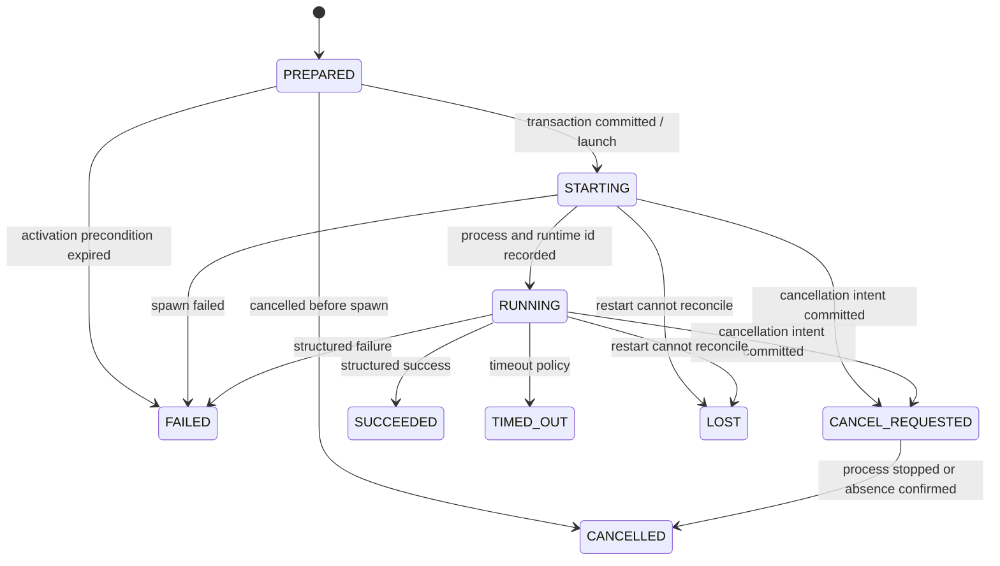
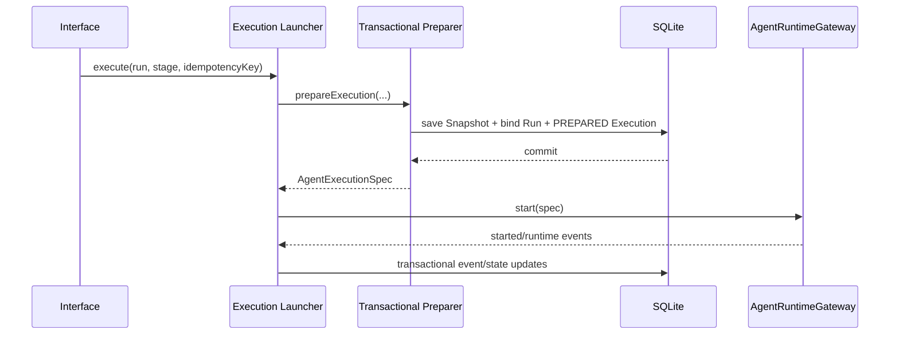

# Harness M3 详细设计：MCP 与 Runtime 执行平面

> 状态：Implemented and Verified；M3 完成性审计后的修订设计与退出门禁已全部落地
> 更新日期：2026-07-23
> 上位文档：[目标架构](01-target-harness-architecture.md) · [MVP 能力范围](02-mvp-capabilities.md) · [建设里程碑](03-milestones.md)
> 决策依据：[Codex Runtime ADR](m0/adr/ADR-001-codex-runtime.md) · [MCP/Skill 安全 ADR](m0/adr/ADR-003-mcp-skill-security.md)
> 当前证据：[M3 实现记录](m3/README.md) · [M3 自测报告](m3/test-report.md)

## 1. 结论

上一阶段的 DDD 重构没有改变“只读 MCP + Codex Runtime Adapter”的里程碑目标，但改变了后续方案的落点和完成判据。M3 完成性审计确认：领域聚合、事务边界、取消状态机和增量持久化可以保留；Runtime Adapter 需要补齐 M0 已接受的单次 CLI 覆盖、工作区旁路防护、实际版本/进程标识和资源级幂等语义。上述修订现已全部实现并通过退出门禁，后续可以进入 M4。

保留的分层边界如下：

- `HarnessRun` 管理交付阶段、Attempt、Gate、Approval 和取消业务语义；
- 新的 `RuntimeExecution` 聚合管理一次外部进程执行的准备、启动、事件、超时、取消和终态；
- `CapabilitySnapshot` 在 Runtime 启动前一次性固化 Prompt、Skill、MCP 和 Runtime Enforcement，不允许运行时旁路补能力；
- Runtime 出站端口位于 `app/harness/port`，Codex 私有参数、JSONL、临时目录和 Secret 明文只存在于 Infrastructure；
- 外部进程只能在 Snapshot 与 `PREPARED` Execution 所在事务提交后启动；
- M3.0 已先修复 HarnessRun 全量删除/重插子表导致 Snapshot 被外键级联删除的问题。

本次设计修订新增四条硬约束：

1. Snapshot 中每一项 MCP/Skill 能力必须能确定性映射为本次 `codex` 命令的 `-c` 覆盖，不能依赖被 `--ignore-user-config` 忽略的 `CODEX_HOME/config.toml`。
2. `required`、Tool allow/deny、启动/调用超时、Repo Skill 禁用清单和工作区能力清单必须在启动前固化并参与 Hash；Infrastructure 只能翻译，不能补业务规则。
3. Preflight 必须探测并校验实际 Codex 版本，阻断项目 `.codex/config.toml` 和未注册 Repo Skill；启动时再次校验工作区指纹，关闭 Snapshot 固化后的 TOCTOU 窗口。
4. 幂等命中必须返回原 Execution 的真实 Stage、Attempt、Location 和当前状态；同一键复用于不同请求语义时返回冲突。

M3 不直接复用聊天语义的 `AgentGateway` 或同步文本语义的 `AgentCliInvoker`。允许复用经边界拆分后的进程树终止、Watchdog、有限输出读取和 Codex 原始 JSONL 解码等 Infrastructure 技术组件。

## 2. 统一语言与业务事件

### 2.1 关键概念

| 概念 | 定义 |
| --- | --- |
| Stage Attempt | 一次使用固定输入基线和固定 Capability Snapshot 的阶段尝试 |
| Capability Snapshot | Attempt 实际获准的 Prompt、Skill、MCP、文件、命令及 Runtime 强制能力的不可变事实 |
| Runtime Execution | Runtime 对一个 Attempt 的一次受控外部执行；MVP 一个 Attempt 最多绑定一个 |
| Execution Permit | `HarnessRun` 在 Domain 内确认 Attempt、Snapshot 和当前状态后签发的执行许可值对象 |
| Runtime Enforcement Profile | 当前 Runtime 版本能够真实强制的 Sandbox、Tool allowlist、配置隔离和取消能力 |
| MCP Server Definition | 管理员 Catalog 中的可信 Server 定义，不含 Secret 明文 |
| Secret Reference | 指向环境变量或受控 Secret Provider 的逻辑引用；不是 Secret 值 |
| Cancellation Intent | 已持久化的取消业务事实；必须先于进程终止副作用发生 |

### 2.2 命令与事件

| 命令 | 发起者 | 领域结果/事件 |
| --- | --- | --- |
| `ResolveStageCapabilities` | ADMIN | `CapabilitySnapshotCreated` 或确定性拒绝 |
| `PrepareRuntimeExecution` | ADMIN/Application | `RuntimeExecutionPrepared` |
| `LaunchRuntimeExecution` | Application | `RuntimeExecutionStarted` 或 `RuntimeStartFailed` |
| `RecordRuntimeEvent` | Runtime Adapter | 追加幂等 Runtime Event |
| `CompleteRuntimeExecution` | Runtime Adapter | `RuntimeExecutionSucceeded/Failed/TimedOut` |
| `RequestRunCancellation` | ADMIN | `RunCancellationRequested` |
| `ConfirmRuntimeCancellation` | Runtime Adapter/对账任务 | `RuntimeExecutionCancelled`、`RunCancelled` |
| `ReconcileRuntimeExecution`（M5） | 恢复任务 | `RuntimeExecutionLost` 或待 M5 定义的人工恢复记录 |

Runtime 成功只代表 Agent 执行结束，不代表 Stage 通过。Stage 仍需产生 Artifact、通过确定性 Gate 并完成人工 Approval。

## 3. 聚合边界

### 3.1 `HarnessRun` 聚合

负责：

- 固定四阶段顺序；
- 当前 Stage 和唯一活动 Attempt；
- Attempt 与 Snapshot/Execution 引用的绑定；
- Artifact、Gate、Approval、Retry、失效传播；
- 取消请求是否允许、取消期间禁止哪些普通动作；
- Runtime 终态对 Stage/Run 业务状态的影响。

新增或调整的领域行为：

```text
authorizeExecution(stage, snapshotReference) -> ExecutionPermit
bindExecution(executionReference)
requestCancellation(actor, reason, now)
confirmCancellation(executionReference, now)
recordExecutionFailure(executionReference, reason, now)
```

Application 禁止遍历 Stage/Attempt 或比较状态字符串来重组上述规则。

### 3.2 `CapabilitySnapshot`

继续作为独立、不可覆盖的写侧模型，主身份为：

```text
runId + stage + attemptNumber
```

M3 扩展后至少包含：

- Snapshot Schema Version；
- Prompt Pack、资源 Hash、Prompt Parts、Prompt Hash；
- Selected/Rejected Skill 及 Package Hash；
- Selected/Rejected MCP Server；
- 每个已选 MCP Server 的 `required`、精确 `enabledTools/disabledTools`、启动超时、Tool 调用超时和配置 Hash；
- 工作区 `.codex/config.toml` 扫描结论、Repo Skill 的 ID/规范相对入口路径/`SKILL.md` Entry Hash 及稳定 Inventory Hash；运行时禁用路径由该清单确定性派生；
- 每个 MCP Server 声明的 Tool/Resource、READ/WRITE 分类及其授权/拒绝原因；
- 文件/命令授权结果；
- Runtime Enforcement Profile 版本和求交结果；
- Capability Policy Version；
- Secret Reference 的逻辑标识或非敏感指纹，不含 Secret 值；
- Snapshot Hash。

旧 M2 Snapshot 按“无 MCP、旧 Schema Version”读取，原 Hash 不重算、不回写。完成性审计前生成、缺少上述安全字段的临时 M3 Snapshot 也只允许读取审计，不允许启动 Runtime；新实现固定使用 `schemaVersion=M3.1`（代码常量 `SCHEMA_M3_1`）重新固化。已经固化的旧 Attempt 不允许原地补字段或重算 Hash；需要执行时创建新 Attempt。

### 3.3 `RuntimeExecution` 聚合

已实现状态：

```text
PREPARED
STARTING
RUNNING
CANCEL_REQUESTED
SUCCEEDED
FAILED
TIMED_OUT
CANCELLED
LOST
```

核心字段：

- 平台 `executionId` 和幂等键；
- `runId`、`stage`、`attemptNumber`；
- `snapshotHash`、`promptHash`；
- Runtime 类型、Adapter 版本、已验证兼容基线和实际 CLI 版本；
- Codex thread/runtime ID；
- PID/进程组等不透明 Runtime Handle；
- 最后事件 Sequence；
- 终止原因、退出码和失败分类；
- `preparedAt/startedAt/cancelRequestedAt/finishedAt`；
- 临时配置非敏感 Hash 和清理结果；
- JSONL、最终输出和错误摘要的 Evidence Reference。

核心不变量：

1. 一个 Attempt 最多绑定一个 RuntimeExecution。
2. Execution 必须绑定同一 Attempt 的 Snapshot Hash 和 Prompt Hash。
3. Snapshot 未固化、已失效或不属于当前 Attempt 时不能创建 Execution。
4. 终态 Execution 不能重新启动或覆盖历史证据。
5. `CANCEL_REQUESTED` 后即使进程退出码为 0，领域结果仍按取消处理。
6. 已启动但终态不明的 Execution 只能对账，不能自动创建第二次外部执行。
7. Runtime Event 以 `executionId + sequence` 幂等，重复回调不重复迁移状态。

MVP 若因补充输入或 Approval 拒绝需要再次调用 Agent，必须创建新 Attempt 和新 Snapshot/Execution，不能在原 Attempt 下挂第二个执行。M3 只实现首个受控执行；`WAITING_INPUT` 和拒绝后的自动续跑在 M4 按该规则对齐，当前 M1 的同 Attempt 手工修订行为不扩展为第二次 Runtime 调用。

### 3.4 MCP 领域模型

MCP 不塞入只有 `kind/access/resource` 的通用字符串分支。M3 使用专门模型表达 Server、Tool、阶段、Runtime、风险和超时：

```text
McpServerDefinition
McpCapability
McpSelectionRequest
McpSelection
SelectedMcpServer
RejectedMcpServer
McpAuthorizationPolicy
RuntimeEnforcementProfile
```

有效 MCP 能力为：

```text
管理员可信 Catalog
∩ Stage Contract
∩ Run 显式 Grant
∩ 环境策略
∩ Runtime 实际可强制能力
```

任一维度未知即拒绝。MVP 只允许 `READ`；若 Runtime 不能强制 Tool allowlist，整个 Server 不挂载。

本次修订后，领域对象还必须表达以下事实，不能留给 Adapter 从 getter 结果推断：

```text
McpServerDefinition
  startupTimeoutSeconds
  toolTimeoutSeconds
  declaredCapabilities

SelectedMcpServer
  required
  enabledToolNames
  disabledToolNames
  startupTimeoutSeconds
  toolTimeoutSeconds
```

MCP Manifest 使用两个独立字段 `startupTimeoutSeconds` 与 `toolTimeoutSeconds`；二者和能力风险分类都进入 Catalog `configurationHash`。`required` 不是 Server 的全局属性，而是某次 Stage Attempt 的请求/合同事实，因此只在 `McpSelectionRequest` 和 `SelectedMcpServer` 中出现。

授权粒度规则：

- `required` 来自本次 `McpSelectionRequest`，选中时由 `McpAuthorizationPolicy` 固化到 `SelectedMcpServer`，不能只保留在请求对象中；
- Server 先与 Stage/Grant/Environment/Runtime 求交；Server 获准后，Catalog 声明的全部 READ Tool 进入 `enabledToolNames`，全部 WRITE Tool 进入 `disabledToolNames`；M3 不在 Adapter 内增加第二套 Tool Grant 规则，两者均以稳定顺序参与 Snapshot Hash；
- 已选 Server 必须至少有一个获准能力；无法精确执行 Tool allow/deny 时整服拒绝；
- 当前兼容矩阵只证明 Tool allow/deny。MCP Resource 若不能被当前 Runtime 独立限制，MVP 默认拒绝，不因其标注 READ 自动放行；
- 即使 `disabledToolNames` 为空，Adapter 也必须显式下发 `disabled_tools=[]`；
- required Server 在启动/初始化失败时必须通过 `required=true` fail-closed，optional Server 才允许按合同降级；
- 旧字段只有一个 `timeoutSeconds` 时可在读取层映射为两个有界超时用于展示，但该旧 Snapshot 不具备新的执行资格。

`RuntimeEnforcementProfile` 至少固化 `profileVersion`、`adapterVersion`、代表实际 CLI 的 `runtimeVersion`、`compatibilityMatrixVersion`、`sandboxMode`，以及 `singleRunOverridesEnforced/toolAllowDenyEnforced/userConfigIsolated/projectConfigAbsent/repoSkillIsolationEnforced/processTreeCancellationEnforced`。这些稳定事实参与 Snapshot Hash；探测时间可以作为审计元数据保存，但不能因时间变化破坏相同输入的 Hash 稳定性。任一被当前 Snapshot 能力所要求的布尔事实为 false 或未知时，Domain 拒绝签发 Execution Permit。

### 3.5 工作区 Runtime 能力清单

工作区文件扫描不能成为 Infrastructure 内部不可审计的临时判断。修订后引入以下边界数据：

```text
RuntimePreflightReport              // Application Port DTO
  RuntimeEnforcementProfile         // Domain Value Object
  WorkspaceRuntimeInventory         // Domain Value Object

WorkspaceRuntimeInventory
  boundaryKind                   // GIT_ROOT 或 APPROVED_ROOT
  projectConfigAbsent
  repoSkills[]
    id
    relativeEntryPath
    entryHash                    // SKILL.md 原始字节的 SHA-256
  inventoryHash
```

- Infrastructure 使用真实路径、仓库/批准根和文件系统生成清单；Domain 对象只保存规范化相对路径和 Hash，不依赖 `Path`/`File`。
- `WorkspaceSkillTrustPolicy` 负责按 `id + entryHash` 判断 Repo Skill 是否已注册且入口内容匹配可信 Catalog；Application 只把 Preflight 事实交给 Policy。已选 Harness Skill 的完整 Package Hash 仍由既有 `SkillSelectionPolicy` 管理，两种 Hash 语义不得混用。
- Snapshot 保存完整非敏感清单和 `inventoryHash`；`disabledRepoSkillPaths` 由 `relativeEntryPath` 稳定排序后确定性派生，不重复保存第二份可漂移状态；`AgentExecutionSpec` 只携带已固化清单，不在启动时发现或合并新能力。
- Adapter 启动前允许重新扫描用于“相等性校验”，但只能判定一致或失败，不能把新文件合并进 Snapshot。

## 4. 状态机调整

### 4.1 Run、Stage 与 Attempt

有活动 Runtime 时，取消不再从 `RUNNING` 直接跳到 `CANCELLED`。新增显式中间态：

```text
Run:     ACTIVE -> CANCELLING -> CANCELLED
Stage:   RUNNING -> CANCELLING -> CANCELLED
Attempt: RUNNING -> CANCELLING -> CANCELLED
```

没有活动 Runtime 的 DRAFT/PENDING Run 可以直接取消。

`CANCELLING` 仍占用 Run 的唯一活动 Attempt，防止并发启动其他 Stage，但不允许继续注册 Artifact、运行 Gate 或请求 Approval。实现时应拆开“占用活动 Attempt”和“允许业务写入”两个语义，不能继续由一个 `isWritable()` 同时承担。

### 4.2 RuntimeExecution



`SUCCEEDED` 不自动把 Stage 置为 `PASSED`。`FAILED/TIMED_OUT/LOST` 由 `HarnessRun` 的领域行为决定 Stage 是否失败；`CANCELLED` 在已有取消意图时确认 Run 取消。

MCP `tool_timeout_sec` 产生的单次 `mcp_tool_call status=failed` 是 Runtime Event 和 Evidence，不自动把整个 `RuntimeExecution` 迁移为 `TIMED_OUT`；Codex Turn 仍可能完成。只有整体 Runtime 的绝对/空闲超时进入 `TIMED_OUT`。最终 Stage 是否接受缺少 MCP 结果的输出仍由 Artifact Schema 和确定性 Gate 判断，Application/Adapter 不根据错误文本代替 Gate。

## 5. 四层落点与依赖方向

```text
interfaces/harness
    -> app/harness
        -> domain/harness

infra/harness
    -> app/harness/port
    -> domain/harness Repository/Catalog
```

| 层 | M3 责任 | 禁止事项 |
| --- | --- | --- |
| Interface | Command/DTO 转换、ADMIN 校验、状态码、SSE/查询入口 | 注入 Repository、判断能否启动/取消 |
| Application | 事务编排、调用 Domain、提交后调用 Runtime Port、回调去重入口 | 解析 Codex JSONL、比较领域状态、拼权限规则 |
| Domain | MCP 授权、Execution 生命周期、取消语义、Run/Attempt/Snapshot 绑定 | 依赖 Spring、JDBC、Path、Process、Codex 参数 |
| Infrastructure | 文件 Catalog、SQLite、Secret 解析、临时配置、Codex 进程和 JSONL | 决定某 Stage 是否允许写 MCP、把 Secret 明文上送 |

关键端口：

- Domain：`HarnessRunRepository`、`CapabilitySnapshotRepository`、`RuntimeExecutionRepository`、`McpServerCatalog`；
- Application：`app/harness/port/AgentRuntimeGateway` 及其 `RuntimePreflightReport`、`AgentExecutionSpec`、`RuntimeEvent`、`RuntimeTermination`；
- CQRS：`RuntimeExecutionQueryService` 位于 Application，Infrastructure 直接投影视图；
- Secret 解析和 Redaction 只被 Infrastructure Runtime Adapter 使用，不向 Domain/Application 返回 Secret 值。

配置类型统一位于 `config/harness`。原 `infra/harness/HarnessProperties` 已在 M3.0 迁移并按 Catalog、Runtime、Security 责任拆分，Application 不依赖具体 Properties；Runtime 监控线程由 Spring 托管的有界 `ThreadPoolTaskExecutor` 执行并负责关闭。

## 6. 执行事务边界

### 6.1 正常启动



要求：

1. `startStage` 只打开 Attempt，不偷换成“已经启动 Agent”；M3 新增独立执行命令。
2. `HarnessExecutionPreparer` 是事务组件；`HarnessExecutionLauncher` 是非事务外壳。
3. Snapshot、Run 绑定和 `PREPARED` Execution 必须在同一事务提交。
4. `AgentRuntimeGateway.start()` 只能在提交返回之后调用。
5. 平台 `executionId` 在启动前生成并写库，用于关联启动早期事件。
6. Gateway 启动失败后，以新事务把 Execution 标记为 `FAILED`，保留 Preflight/错误证据。

仅用 Mockito 验证 `save()` 早于 `start()` 不能证明数据库已经提交；必须增加带真实事务的纵向测试或使用明确的事务外壳结构证明提交边界。

### 6.2 Execution 幂等语义

启动 Execution 的幂等范围固定为：

```text
(runId, operation=start-execution, idempotencyKey)
requestFingerprint = canonical(stage)
```

处理规则：

1. 首次请求创建 Execution，并由数据库唯一约束处理并发竞争。
2. 相同 key、相同 Stage 再次请求时返回原 Execution；无论原资源处于 `PREPARED`、活动态还是终态，都不能创建第二个资源。
3. 原 Execution 仍为 `PREPARED` 时，同 key 重试可以继续激活该资源；已进入 `STARTING` 及其后状态时禁止再次调用 Gateway。
4. 相同 key 被复用于不同 Stage 时返回 `409 Conflict`，不能把旧 Execution 包装成新 Stage 的结果。
5. 响应的 `Location` 必须使用原 Execution 持久化的 Stage/Attempt 构造，不能使用本次请求路径中的 Stage 猜测。
6. 响应状态来自持久化后的 `RuntimeExecution`，不得固定返回 `STARTING`。Gateway 同步启动失败已落为 `FAILED` 时，Body 必须返回 `FAILED`；保留 `202 Accepted` 只表示启动命令已被受理，不表示进程仍在启动。

Application 负责“查已有资源、调用聚合、保存、提交后触发副作用”的技术编排；请求指纹是否匹配、Execution 是否允许再次激活属于 Domain 语义，不能由 Controller 比较字符串。

### 6.3 故障窗口

| 故障窗口 | 恢复规则 |
| --- | --- |
| `PREPARED` 已提交、尚未启动 | 可用同一幂等键启动该 Execution |
| 已 spawn、尚未回写 Runtime ID | 通过平台 Execution ID、PID/进程组和 JSONL 对账；不能创建第二个 Execution |
| Runtime 已终态、回调未落库 | 重放幂等终态事件 |
| 重启后无法确认活动进程 | 标记 `LOST` 并阻断自动副作用重放 |

M3 已实现 `LOST` 状态、持久化和“终态不可重启”规则，但没有实现自动扫描/对账任务；该任务按里程碑在 M5 完成。M3 期间服务重启不会自动重放外部执行，需人工确认后记录 `LOST`。

### 6.4 取消

```text
Domain requestCancellation
→ 同一事务保存 Run/Stage/Attempt CANCELLING
  与 RuntimeExecution CANCEL_REQUESTED
→ commit
→ AgentRuntimeGateway.cancel(executionId)
→ 终止回调或恢复对账
→ Domain confirmCancellation
→ 保存 CANCELLED 与清理证据
```

如果取消意图已提交且对账确认进程不存在，可以确认 `CANCELLED`；没有取消意图且无法确认原执行是否结束时，只能进入 `LOST/FAILED`，不得自动重跑。

## 7. 持久化设计与 M3.0 修复结论

### 7.1 已复现的问题

M3.0 红测确认旧 `SqliteHarnessRunRepository.update()` 会删除并重插 Stage/Attempt 子表；`harness_capability_snapshot` 又通过 `ON DELETE CASCADE` 引用 Attempt。启用 SQLite 外键后，任何后续 Run 更新都可能删除已经固化的 Snapshot。

这违反 Snapshot 不可覆盖和审计留痕。实现已改为增量持久化，且没有把旧策略复制到 RuntimeExecution。

### 7.2 修复原则

- `harness_stage_execution` 按主键更新状态；
- `harness_stage_attempt` 已有行只更新状态字段，新 Attempt 追加插入；
- Artifact、GateResult、Approval、Event 按业务主键增量插入/更新，不先全删；
- Snapshot、RuntimeExecution、RuntimeEvent 和 Evidence 只追加或按领域状态机更新；
- 只有删除整个 Run 时才允许外键级联清理；
- 乐观锁仍由 `harness_run.version` 保护；
- Repository 只做持久化映射，不在 SQL/Mapper 中补业务判断。

真实 SQLite 回归必须直接覆盖：

```text
create Run
→ start Attempt
→ save M3.1 Snapshot
→ bind and save RuntimeExecution
→ 分别执行 register Artifact / record Gate / Approval / cancel 等 Run 更新
→ reload Snapshot、RuntimeExecution 和 Attempt
→ Snapshot 与 Execution 行仍存在
→ Snapshot Hash、Attempt.snapshot_hash 与 Attempt.execution_id 均不变
```

Snapshot 保留测试不能替代 Execution 保留测试；每种状态合法性不同的 Run 更新可拆成独立场景，但必须使用真实 SQLite 和开启的外键约束。

### 7.3 M3 表和迁移

新增概念表：

```text
harness_runtime_execution
harness_runtime_event
```

`harness_runtime_execution` 对 `(run_id, stage, attempt_number)` 建唯一约束，落实 MVP 一个 Attempt 最多一个 Execution。它可以外键引用 Attempt，但 Repository 更新不得再删除 Attempt。

`harness_runtime_event` 使用 `(execution_id, sequence)` 主键，保存稳定事件类型、时间、非敏感摘要和 Evidence Reference。大 JSONL 正文进入受控 Artifact Store，不挤入 SQLite。

Capability Snapshot 已增加 Schema Version、扩展后的 MCP/Runtime Enforcement JSON 和工作区 Runtime Inventory JSON。老库迁移不只依赖 `CREATE TABLE IF NOT EXISTS`：`SqliteInitializer` 可重复执行，旧行默认原 Schema，原 Snapshot Hash 不变。M2 和缺少安全字段的临时 M3 Snapshot 只读，不具备新 Execution 资格；新 Snapshot 固定使用 `M3.1`。

## 8. Capability Snapshot 与 Runtime 激活

完整顺序调整为：

```text
发现 Catalog
→ Runtime Preflight 产出版本、Enforcement 与工作区清单
→ 校验 Catalog/Repo Skill 信任
→ 选择 Prompt/Skill/MCP
→ 解析最小依赖
→ Stage/Grant/Environment 求交
→ Domain 授权
→ 固化完整 Snapshot
→ Domain 签发 Execution Permit
→ 保存 PREPARED Execution
→ 提交后激活 Runtime
```

Runtime Preflight 的事实采集由 Infrastructure 完成，例如：

- Runtime 类型是否为首版支持的 Codex；
- 以最小环境、有界超时和有界输出执行 `<codexCommand> --version`，解析实际 CLI 版本；
- 实际版本是否命中已验证兼容清单；MVP 默认只接受 `codex-cli 0.145.0`，未知、超时、解析失败或未验证版本均 fail-closed；
- 工作目录是否为白名单内可用目录；从其真实路径向上扫描到最近的 `.git` 文件/目录所标识的仓库根（包含两端），没有仓库标识时扫描到批准根，任一路径存在 `.codex/config.toml` 即阻断；
- 按兼容矩阵精确扫描 `.agents/skills/*/SKILL.md`，规范化入口路径并计算文件原始字节的 Entry Hash；当前不把未经验证的递归层级或 `.codex/skills` 路径擅自当作 Codex 0.145.0 合同；
- 临时根是否可创建并收紧权限；
- 当前实际版本能否强制 Sandbox、Tool allow/deny、单次 CLI 覆盖、Repo Skill 禁用、用户配置隔离和进程树取消。

Repo Skill 的安全闭环为：

```text
Infrastructure 扫描工作区 Repo Skill 并产出 ID/入口路径/Entry Hash
→ Domain `WorkspaceSkillTrustPolicy` 与可信 Skill Catalog 的同一入口 Hash 求交
→ 发现未注册或 Entry Hash 不匹配的 Repo Skill 时阻断 Snapshot
→ Snapshot 固化工作区清单指纹和 skills.config 禁用清单
→ Adapter 启动前重算指纹
→ 变化则启动失败并要求新 Attempt
```

M3 已选 Skill 的内容由 Prompt Assembly 固化到最终 Prompt，不依赖 Codex 自动发现。因此本版对扫描到的所有 Repo Skill（包含已选项）都通过 `skills.config` 显式禁用自动加载，避免重复注入或 Snapshot 外加载；未注册项仍必须在 Domain 阶段阻断，不能以“运行时禁用”代替信任校验。当前 Entry Hash 合同只适用于“所有 Repo Skill 均禁用自动加载”的 M3 路径；未来若改为 CLI-native Skill，必须校验完整 Package Hash，新增兼容性 ADR 和 Snapshot 映射，不能在 Adapter 内特判。

MCP 是否允许进入 Snapshot 由 Domain `McpAuthorizationPolicy` 根据这些事实完成五维求交；Attempt/Snapshot 是否允许生成 Execution 则由 `HarnessRun.authorizeExecution(...)` 决定。Infrastructure 同时保留 Tool allowlist 和配置隔离的 fail-closed 二次防线，但不能自行放宽 Domain 拒绝结果。

## 9. Codex Runtime Adapter

### 9.1 Harness 专用命令合同

MVP 基线：

```text
codex --ask-for-approval never exec
  --ignore-user-config
  --ignore-rules
  --ephemeral
  --json
  --sandbox <stage-policy>
  -C <approved-working-dir>
  -c 'skills.config=[{path="<repo-skill-path>",enabled=false},...]'
  -c 'mcp_servers.<id>.command="<snapshot-command>"'
  -c 'mcp_servers.<id>.args=["<snapshot-arg>",...]'
  -c 'mcp_servers.<id>.env_vars=["<approved-env-name>",...]'
  -c 'mcp_servers.<id>.required=<true|false>'
  -c 'mcp_servers.<id>.startup_timeout_sec=<seconds>'
  -c 'mcp_servers.<id>.tool_timeout_sec=<seconds>'
  -c 'mcp_servers.<id>.enabled_tools=["<allowed-tool>",...]'
  -c 'mcp_servers.<id>.disabled_tools=["<denied-tool>",...]'
  -c 'mcp_servers.<id>.default_tools_approval_mode="writes"'
  -
```

MCP 与 Repo Skill 配置必须只从 Snapshot 生成上述单次 `-c` 覆盖。隔离 `CODEX_HOME` 仍用于 Session、日志和运行期文件隔离，但 Adapter 不再依赖其 `config.toml` 提供能力，因为同一命令同时使用 `--ignore-user-config`。命令行不接受调用方追加任意参数。

Adapter 必须使用专用 TOML 字面量编码器，对 ID、路径、命令、参数和 Tool 名称做长度、字符集及转义校验；禁止用字符串拼接让 Catalog 值逃逸为新的 `-c` 键。Server 的 `required`、allow/deny 与两个 timeout 均来自 Snapshot。Infrastructure 可以因技术格式不合法而 fail-closed，但不能自行增加 Tool、把 required 降级为 optional 或扩大超时。

Harness Adapter 不读取聊天全局的 `sandbox-bypass`，不复用真实用户 `CODEX_HOME`，不把工作区未注册 Skill/MCP 自动带入执行。CLI Stub 必须断言实际参数数组中的所有 `-c` 覆盖，而不是只读取临时 `config.toml`；真实 Codex 契约继续由显式 `live`/手工测试验证。

### 9.2 实际版本与 Runtime Handle

- Preflight 保存实际 `codex --version` 结果中的规范版本，并与 Adapter 版本分字段记录；`codex-harness-adapter@1` 不能冒充 CLI 版本。
- 版本探测默认上限为 5 秒/4096 bytes，使用与正式运行同源的最小环境；默认兼容清单只含 `0.145.0`。新增版本必须先更新 M0 兼容矩阵并通过契约测试，配置项不能作为任意放行开关。
- 启动前再次核对可执行文件/版本与 Snapshot 中的 Enforcement Profile 一致；不一致时在 spawn 前失败。
- Runtime 进程必须由 Infrastructure 进程树控制器放入可整体终止的独立进程组/平台等价容器；目标平台无法证明子进程可整体取消时，Preflight 的 cancellation enforcement 为 false 并拒绝执行。
- 进程成功创建后，STARTED 信号至少携带不透明 `pid:<pid>` Handle，并在平台支持时携带进程组/Job 标识。
- Handle 持久化到 `RuntimeExecution` 供取消和对账使用，但查询 API 不直接暴露 PID/进程组。
- 版本探测、工作区扫描和进程标识均使用 Stub/Fixture 覆盖；默认测试不调用真实 Codex。

### 9.3 可复用与不可复用边界

允许复用：

- `StreamProcessWatchdog` 的超时机制；
- 进程树终止和有界等待的技术实现；
- 输出大小限制；
- 无前端语义的 Codex 原始 JSONL 解码；
- 测试 Fixture 和 CLI Stub 基础设施。

禁止直接复用：

- 面向 `sessionId/resumeId` 的聊天 `AgentGateway` 合同；
- 返回纯文本且按退出码判定的同步 `AgentCliInvoker`；
- 会继承真实 HOME/CODEX_HOME 的通用进程环境；
- 把 Codex JSONL 转成前端 Claude 兼容事件后再作为 Harness 审计事实。

如抽取共享技术组件，应位于 Infrastructure，按职责命名，避免创建隐藏业务语义的通用 `Manager/Processor/Handler`。

## 10. Secret、临时配置与清理

Secret 明文生命周期限定在 Infrastructure Runtime Adapter 内：

```text
Secret Reference
→ 启动前解析
→ 只注入目标进程环境
→ 不写 Snapshot/Prompt/API/普通日志
→ 终态后释放引用
```

Harness 使用专用最小环境构造器：

- 从允许列表构造环境，不直接继承服务进程全部变量；
- `HOME`、`CODEX_HOME`、`XDG_CONFIG_HOME` 指向 Execution 临时目录；
- 不读取或复制 `~/.codex`、`~/.claude`；
- 只注入 Registry 声明且当前 Snapshot 授权的 Secret Reference；
- 普通日志不记录完整命令、进程环境或 Secret；
- 临时文件权限满足目录 `700`、敏感文件 `600`；
- 成功、失败、启动失败、超时、取消均执行幂等清理；
- 清理失败写入 Execution 证据和告警，不把业务成功伪装成清理成功。

## 11. Application 主流程

Application 只表达编排：

```text
prepare
→ commit
→ launch
→ receive event
→ load aggregates
→ invoke domain behavior
→ persist
→ publish/query
```

允许的条件分支仅限技术编排，例如 Repository 幂等命中、Gateway 调用异常转换。以下判断必须在 Domain：

- 当前 Stage/Attempt 是否允许执行；
- Snapshot 是否属于当前 Attempt；
- MCP 是否可用；
- Runtime Enforcement 是否足够；
- 取消/终态事件是否合法；
- Retry 是否可能重复未确认副作用。

## 12. API 与查询模型

保留 `startStage`“创建/打开 Attempt”的现有语义，新增独立执行资源，避免一个接口同时承担状态迁移、能力解析和外部副作用：

```text
POST /api/harness/runs/{runId}/stages/{stage}/capability-snapshot
POST /api/harness/runs/{runId}/stages/{stage}/executions
GET  /api/harness/runs/{runId}/stages/{stage}/attempts/{attempt}/execution
POST /api/harness/runs/{runId}/cancel
GET  /api/harness/runs/{runId}/events
```

写请求继续要求 ADMIN 与幂等键。RuntimeExecution 查询返回：

- Execution ID、状态、Runtime 类型/版本；
- Snapshot/Prompt Hash；
- 开始、取消请求、结束时间；
- 稳定终止原因和 Evidence Reference；
- MCP ID、版本、能力和配置 Hash；
- 临时配置是否清理。

查询不返回 Secret 值、Secret 所在物理路径、完整进程环境或未脱敏原始日志。

Execution POST 的响应语义固定如下：

- 始终返回原/新 Execution 的稳定 `executionId`、持久化当前状态、`duplicated` 和真实 `attemptNumber`；
- `Location` 由返回资源自身的 `runId/stage/attemptNumber` 构造；
- 同 key、同 Stage 命中终态资源时返回该终态，不伪造 `STARTING`；
- 同 key、不同 Stage 映射 `409 Conflict`；
- 查询接口按 Location 可立即读取同一资源，即使 Gateway 同步启动失败后资源已经是 `FAILED`。

## 13. TDD 顺序

已有测试作为领域状态机、提交边界、取消和清理的回归基线；本次修订对新增/变化的条件分支按以下顺序完成了“先红、最小实现、转绿、重构保绿”：

1. **Domain MCP**：先为 required 固化、READ Tool 选择、WRITE Tool deny、Resource fail-closed、双 timeout 和稳定排序补红测，再调整领域模型；禁止在 Adapter 计算授权差集。
2. **Snapshot Schema/Codec**：先验证 required、allow/deny、双 timeout、Repo Skill 清单和实际 Runtime 版本参与 Hash；旧 M2/临时 M3 行不重算且不可执行。
3. **Infrastructure Preflight**：用 `@TempDir` 和 CLI Stub 先覆盖版本成功/超时/失败/超大输出/不兼容版本、祖先 `.codex/config.toml`、Repo Skill 清单/未注册项和符号链接边界。
4. **Infrastructure CLI Contract**：Stub 直接断言每个 `-c` 参数，覆盖 required、allow/deny、双 timeout、`skills.config`、TOML 转义、禁止任意追加参数以及不依赖 `CODEX_HOME/config.toml`。
5. **Infrastructure Launch**：先验证启动前版本/工作区指纹复核和真实 `pid:<pid>` Handle；再保绿 JSONL、输出上限、超时、取消、Evidence 和全部清理路径。
6. **Application 幂等**：先覆盖同 key 同 Stage 的 PREPARED/活动/终态命中、同 key 不同 Stage 冲突、同步启动失败返回真实状态和 canonical Location。
7. **SQLite 退出证据**：真实 SQLite 绑定 Snapshot 与 Execution 后分别执行 Artifact/Gate/Approval/取消更新，直接断言两行及 Attempt 外键引用不变。
8. **M3 Spring 纵向 Stub**：Stub 检查真实命令数组并验证 Snapshot → Execution → Runtime → Evidence；不能通过读取一个真实 Codex 会忽略的配置文件代替合同。
9. **回归**：聚焦测试、默认快速集、串行 `spring-flow`、ArchitectureTest、PMD 和 `git diff --check`。
10. **Live/Manual**：真实 Codex Prompt/Skill/MCP/取消兼容性验证不进入默认快速测试集，但必须在 M4 真实试点前执行。

## 14. M3 退出门禁

以下门禁均已有直接证据，详见 [M3 自测报告](m3/test-report.md)：

- [x] 真实 SQLite 证明 Artifact、Gate、Approval、取消等 Run 更新后，Snapshot、RuntimeExecution、Attempt.snapshot_hash 和 Attempt.execution_id 都存在且不变。
- [x] Domain/Application/Interface 与现有 Workflow 保持分离，Application 无 Infrastructure import。
- [x] `M3.1` Domain/Codec 已能一次性保存 Prompt、Skill、Repo Skill 清单、MCP required/allow/deny/双 timeout 和 Runtime Enforcement，并有稳定 Hash/旧 Schema 兼容测试；实际 CLI 事实由 Preflight 固化并在启动前复核。
- [x] Runtime 启动发生在 Snapshot 和 `PREPARED` Execution 事务提交之后。
- [x] CLI Stub 直接证明能力通过本次 `-c` 覆盖传入；Adapter 不依赖被 `--ignore-user-config` 忽略的 `CODEX_HOME/config.toml`。
- [x] Preflight 阻断祖先链 `.codex/config.toml`、未注册/Hash 不匹配 Repo Skill，并由 `skills.config` 禁用所有自动发现 Repo Skill。
- [x] 实际 Codex 版本经有界探测且不兼容版本 fail-closed；Execution 保存实际 `pid:<pid>`/进程组 Handle。
- [x] required MCP 初始化失败关闭，`enabled_tools` 与 `disabled_tools` 同时下发，启动和 Tool timeout 分开生效。
- [x] 同 key 同 Stage 返回原资源真实状态和 canonical Location；同 key 不同 Stage 稳定返回冲突。
- [x] 禁止阶段及 Snapshot 外的工作区配置/Skill/MCP 不会进入实际 Runtime 命令合同。
- [x] Domain Policy 在 Enforcement 不足、Server 仅含 WRITE Tool 或含当前不可隔离 Resource 时 fail-closed。
- [x] Infrastructure Preflight 如实证明单次覆盖、Tool allow/deny、项目配置隔离、Repo Skill 隔离和进程树取消；未知或实际不支持时在启动前失败。
- [x] Secret 扫描覆盖 Snapshot、Prompt、API、Runtime Event、Artifact 和临时配置摘要。
- [x] 取消意图先提交，再终止进程；退出码 0 不覆盖取消语义。
- [x] 已启动但终态不明的 Execution 不会自动重放。
- [x] 成功、启动失败、运行失败、超时、取消后临时目录均完成清理或留下明确失败状态。
- [x] 默认测试只使用 Stub/Fake；真实 Codex/MCP 仅在 `live` 或手工验证中运行。

## 15. 设计审计结果

### 15.1 变化点收敛

| 变化来源 | 收敛点 | M3 约束 |
| --- | --- | --- |
| Codex 版本与参数变化 | `RuntimeEnforcementProfile`、M0 兼容矩阵、Codex Adapter | 版本未知或合同未验证即拒绝，不在 Application 增加版本分支 |
| MCP 风险、required 与超时 | `McpAuthorizationPolicy`、`SelectedMcpServer` | Domain 产出完整授权结果，Adapter 只做 TOML/CLI 翻译 |
| 工作区自动发现能力 | `WorkspaceRuntimeInventory`、`WorkspaceSkillTrustPolicy` | 文件系统负责发现，Domain 负责信任，Snapshot 后只允许相等性复核 |
| 外部进程生命周期 | `RuntimeExecution`、`AgentRuntimeGateway` | 进程技术事件与 Stage 业务通过解耦，取消意图先提交 |
| 幂等重试与故障窗口 | `RuntimeExecution` 资源身份、Execution Permit | 同语义返回原资源，不同 Stage 冲突，终态不自动重放 |
| SQLite 聚合保存策略 | Domain Repository + Infrastructure 增量映射 | 不以删除/重插保存历史子实体，退出测试直接验证外键引用 |

### 15.2 建模评分

| 维度 | 评分 | 依据 |
| --- | ---: | --- |
| 聚合边界是否清晰 | 3/3 | `HarnessRun` 管业务流程，`RuntimeExecution` 管进程生命周期，Snapshot 作为不可变执行事实 |
| 变化是否被收敛 | 2/3 | Codex/MCP/工作区变化点已有明确策略与端口；第二 Runtime 要等 M6 的真实变化再抽象 |
| 不变量是否可被模型守护 | 3/3 | Attempt/Snapshot/Execution 绑定、授权求交、取消优先和旧 Snapshot 不可执行均由 Domain 表达 |
| 行为是否与模型一致 | 3/3 | Domain/Snapshot、Runtime Adapter、幂等接口和完整 SQLite 证据已经对齐 |
| 是否支持下一轮需求变化 | 3/3 | 已具备承接 M4 四阶段集成的稳定边界；自动对账和多 Runtime 已明确延期 |

本轮没有需要用户补充才能冻结的业务问题。第 14 节直接测试已经完成；后续按明确延期边界演进，不为尚未出现的第二 Runtime 提前扩张抽象。

## 16. 明确延期

- 多 Runtime 通用抽象和 Claude Adapter；
- 写 MCP、OAuth、生产 Secret Broker；
- Java 进程内 MCP Client；
- 同一 Attempt 多个 RuntimeExecution 或并行执行；
- 自动重放已启动但终态不明的 Execution；
- Worktree Git 基线、Diff 和部署命令治理，继续属于 M4；
- 生产部署和自动回滚。
