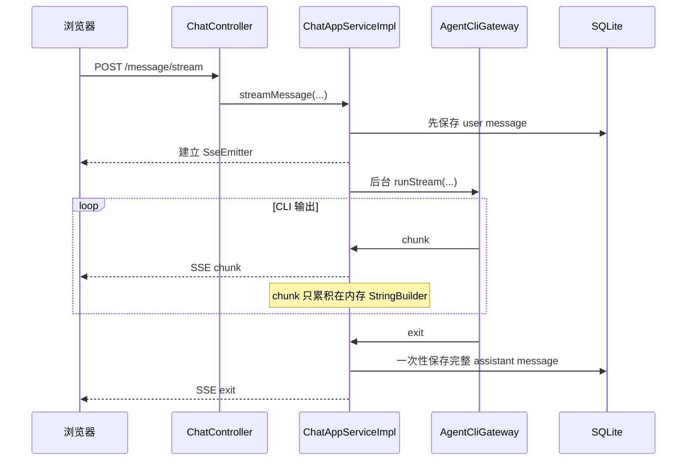
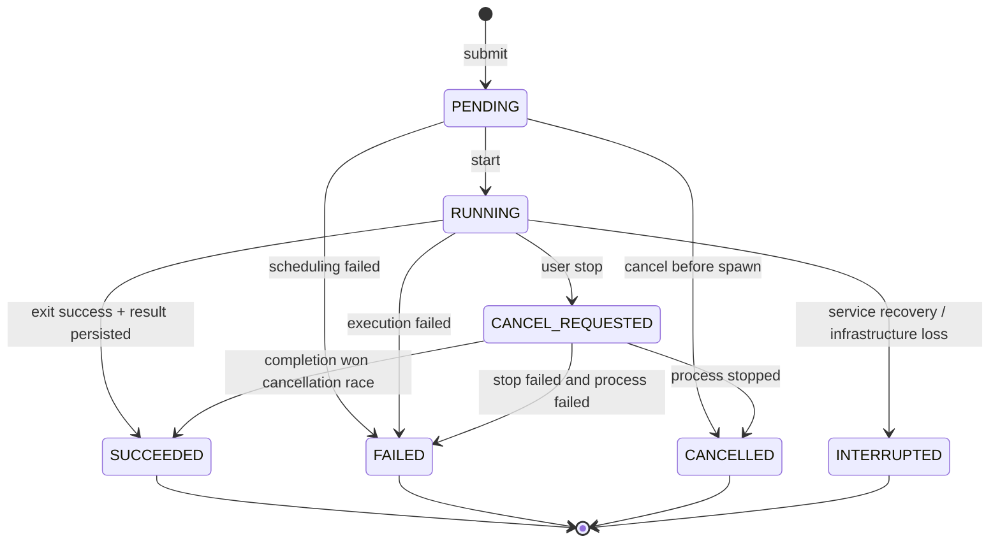
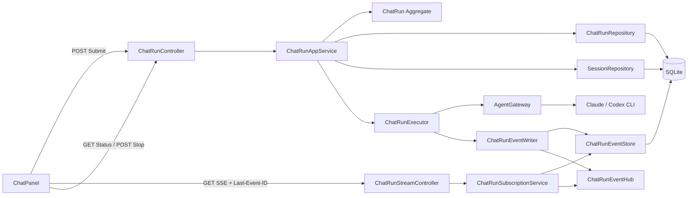
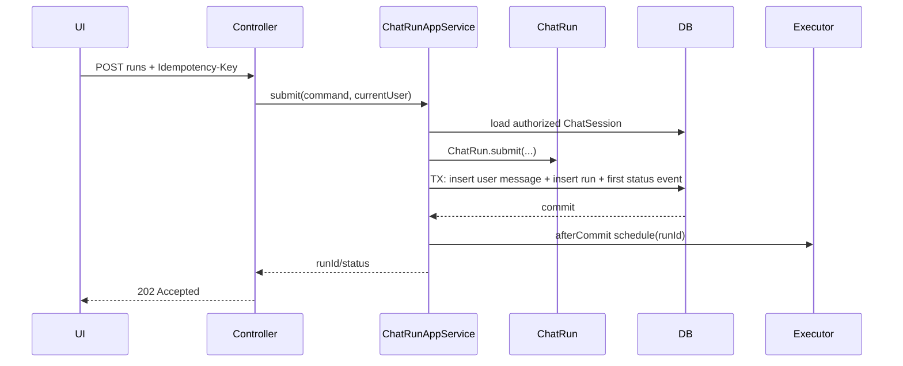
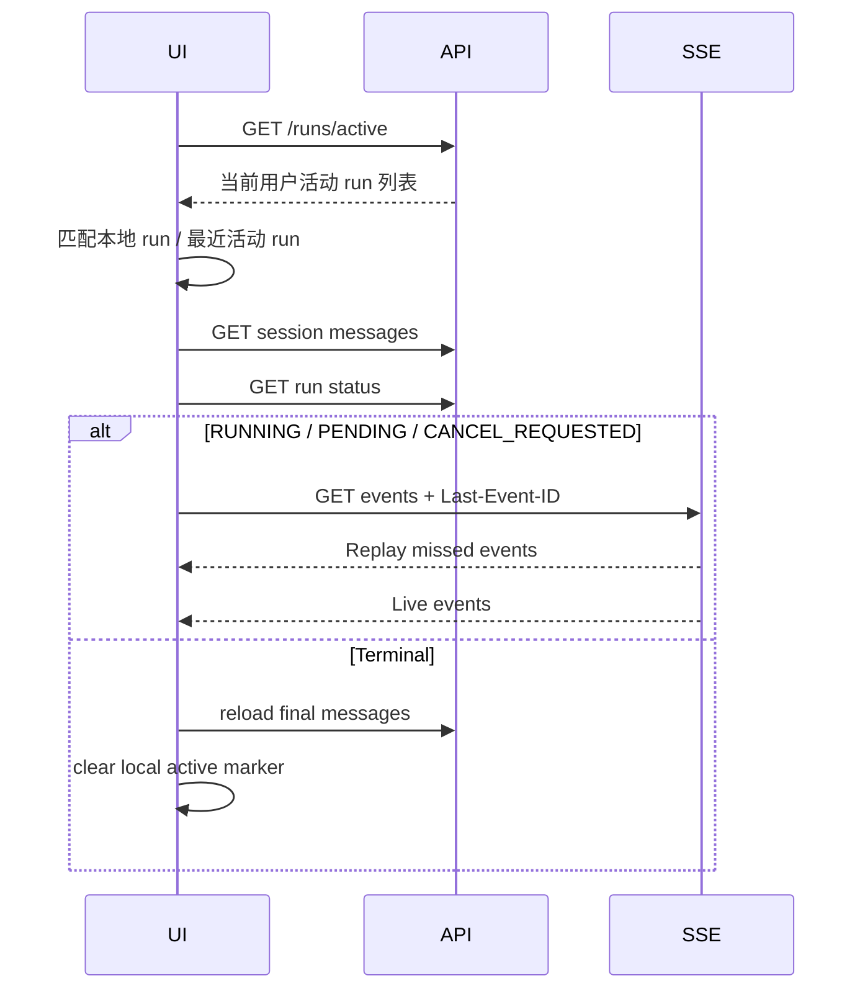

# 可恢复聊天流设计方案

> 状态：实施中；P0 / P1 主链路已编码，待生产灰度与公网长时验证
> 日期：2026-07-22
> 适用范围：浏览器刷新、页面跳转、临时断网、SSE 断开后的聊天任务恢复
> 不包含：Spring Boot 进程重启后继续接管原 CLI 子进程、多节点任务漂移

## 1. 摘要

当前聊天实现把“提交问题、启动 CLI、消费输出、向浏览器推送 SSE”绑定在一个 HTTP 请求上。浏览器刷新后，原 SSE 连接不可恢复，前端也丢失当前会话和发送状态；虽然后台 CLI 通常会继续执行，并在退出时保存最终回答，但用户无法重新看到实时输出，只能等待任务结束后手动打开历史记录。

本方案把一次 Agent 执行建模为独立的 `ChatRun` 聚合，并把“提交任务”与“订阅事件”拆分：

- `POST` 只负责持久化用户消息、创建 run 并返回 `runId`；
- CLI 在与浏览器连接无关的后台任务中执行；
- 每个可见事件按 `runId + seq` 追加到 SQLite；
- `GET SSE` 根据 `Last-Event-ID` 先回放遗漏事件，再订阅实时事件；
- 页面刷新后从服务端查询活动 run，恢复会话并重新订阅；
- 同一 run 永远只执行一次，重连不得重新提交问题。

核心交付目标是“恢复逻辑流”，不是恢复已经断开的 TCP 连接。

### 1.1 当前落地状态（2026-07-22）

已经完成：

- `ChatRun` 聚合、状态机、Repository、SQLite `chat_run / chat_run_event`；
- 幂等 Submit、每会话单活动 run 约束、status / active / stop / events API；
- CLI 后台执行与浏览器 SSE 生命周期解耦；
- Event Store、Replay → Live 无缝切换、`Last-Event-ID`、多订阅者有界队列；
- 前端 submit / subscribe / 自动重连 / 刷新恢复 / cursor 去重；
- orphan recovery、event / run retention、活动 run 期间拒绝 delete / truncate；
- after-commit 后台投递被线程池拒绝时立即进入 `FAILED`，避免遗留永久 `PENDING` run；
- 灰度期新旧入口双向活动检查：旧入口不能绕过活动 `ChatRun`，新 Submit 也不能越过仍在运行的旧进程；
- CLI 流式超时改为“空闲期限可续期 + 绝对运行上限”，并以结构化终止原因记录
  `IDLE_TIMEOUT / MAX_RUNTIME_TIMEOUT / HARD_TIMEOUT / OUTPUT_LIMIT`。

尚未完成：

- Caddy 公网 30 分钟以上连续运行验证；
- Spring Flow 级 Replay → Live、断连不取消、terminal 恰好一次测试；

补充完成（2026-07-22）：

- ChatRun 只读指标 / 管理诊断视图：`ChatRunMetricsQueryService`（SQLite 聚合 + 内存 gauge）
  + `/api/metrics/chat-run/{overview,runs,runs/{id}}` 管理端点，复用 `AdminAuthFilter` 口令；
  覆盖 §19.3 六问与 §19.2 中 SQL 可派生指标 + 实时订阅者 / 慢消费者 gauge。运行时直方图
  （reconnect / replay lag / flush 耗时）待接入独立 metrics backend 后再补。

页面已统一切换为 ChatRun Submit + GET SSE，旧 POST SSE、session status/stop 入口和 feature flag 已删除。本文档对应代码尚未部署或重启生产服务。

## 2. 目标与非目标

### 2.1 目标

1. 浏览器刷新后自动恢复正在运行的对话，不要求用户手动点击历史记录。
2. 页面离开后返回，能够继续显示离开期间产生的增量输出。
3. 临时断网或代理断开后，能够从最后确认的事件序号继续接收。
4. 同一 run 在任何重连场景下都不能重复启动 CLI、重复写文件或重复消耗 Token。
5. 最终 assistant 消息最多落库一次。
6. 同一 run 支持多个页面同时只读订阅，慢订阅者不能阻塞 CLI 读取线程。
7. 运行状态、停止和订阅接口必须执行与聊天会话一致的用户归属校验。
8. 保持现有 Claude / Codex 方言、RAG recall 卡片、工具块和最终消息格式兼容。
9. 支持灰度启用和快速回退到现有 POST SSE 链路。

### 2.2 非目标

1. 不尝试恢复已经断开的原 TCP/SSE 连接。
2. 第一阶段不承诺 Spring Boot 重启后继续接管原 CLI 子进程；服务重启时把遗留活动 run 标记为 `INTERRUPTED`。
3. 第一阶段不支持多实例竞争执行同一个 run；当前部署是单实例 systemd 服务。
4. 不把 SQLite 改造成通用消息队列。
5. 不改变 Claude / Codex CLI 的 resume 语义；`resumeId` 仍属于聊天会话上下文。
6. 不允许一个聊天会话同时执行两个问题；不同会话可以并行运行。

## 3. 改造前实现审计

### 3.1 当前时序



### 3.2 已具备的基础

- 用户消息在启动 CLI 前持久化。
- CLI 进程按 `sessionId` 注册，可查询 `running`、可停止。
- 浏览器连接断开时，SSE 发送异常被吞掉，通常不会终止 CLI。
- CLI 正常退出后，完整 assistant 输出会持久化。
- 前端已有“同一页面内断流后查询 status、等待结束、重载消息”的兜底逻辑。
- 后端已有会话归属隔离、resumeId 持久化、输出归一化和 SSE ping。

### 3.3 关键缺口

| 缺口 | 当前表现 | 后果 |
| --- | --- | --- |
| HTTP 请求拥有执行流 | `SseEmitter` 在提交接口内创建 | 连接断开后没有可重新订阅的逻辑对象 |
| 没有 run 标识 | 只有 sessionId 和进程 Map | 无法区分同一会话的不同回合，也无法表达终态 |
| 活动状态仅在内存 | `runningProcesses<sessionId, Process>` | 服务重启后状态丢失，无法审计失败原因 |
| chunk 仅内存累积 | 退出时才保存 assistant 消息 | 刷新期间看不到中间输出，异常退出可能丢部分输出 |
| SSE 无事件 ID | 只发送 `event/data` | 客户端无法声明已消费位置 |
| POST SSE 客户端不支持回放 | 不解析 `id`、不发送 `Last-Event-ID` | 网络恢复后只能重新发起业务请求，存在重复执行风险 |
| 页面不记活动 run | 刷新后 `activeSessionId/sending/currentES` 清空 | 新页面不知道需要恢复哪个任务 |
| 历史恢复不检查 running | 只加载已落库消息 | 活动任务被误显示为已结束 |
| status / stop 未统一鉴权 | 最终直接访问进程注册表 | 接入重连后会扩大越权查询或停止风险 |

### 3.4 当前模型评分

评分范围为 0～3，3 为目标状态。

| 维度 | 当前分数 | 判断依据 |
| --- | ---: | --- |
| 聚合边界是否清晰 | 1 | 会话、一次执行、HTTP 连接和进程生命周期混在同一流程中 |
| 变化是否被收敛 | 1 | 断流、刷新、退出和恢复分别散落在 Controller、App、Gateway、前端组件 |
| 不变量是否可被模型守护 | 1 | “每会话最多一个活动任务”“终态不可变”等只靠进程 Map 和过程约定 |
| 行为是否与模型一致 | 1 | 系统实际上存在长生命周期 run，但模型里没有 run |
| 是否支持下一轮变化 | 1 | 无法自然支持回放、多订阅者、活动任务列表和终态审计 |

## 4. 通用语言

| 名词 / 动作 | 定义 |
| --- | --- |
| ChatSession | 一段可续聊的对话历史，拥有工作目录、Agent 类型、resumeId 和消息集合 |
| ChatRun | ChatSession 中一次“用户消息 → Agent 执行 → assistant 结果”的后台执行生命周期 |
| Run Event | 为浏览器展示而记录的有序流事件，包含状态、recall、chunk 和终态 |
| Cursor | 客户端最后确认消费的事件序号，即 SSE `Last-Event-ID` |
| Replay | 订阅建立时，从持久化事件流补发 `seq > cursor` 的事件 |
| Live Subscribe | Replay 完成后继续接收新事件 |
| Active Run | 状态属于 `PENDING / RUNNING / CANCEL_REQUESTED` 的 run |
| Terminal Run | 状态属于 `SUCCEEDED / FAILED / CANCELLED / INTERRUPTED` 的 run |
| Submission | 创建 run 的幂等命令，不等同于建立 SSE 连接 |
| Subscriber | 订阅某个 run 事件的一个浏览器连接；一个 run 可以有多个 Subscriber |
| Idempotency Key | 客户端生成的本次提交唯一键，用于应对 POST 响应丢失和网络重试 |
| Orphan Run | 服务启动时数据库仍为活动态、但本机已无对应进程的 run |

## 5. 命令与事件

### 5.1 命令

| 命令 | 发起者 | 负责人 | 结果 |
| --- | --- | --- | --- |
| SubmitChatRun | 登录用户 | ChatRunAppService | 用户消息和 `PENDING` run 原子落库，返回 runId |
| StartChatRun | 后台调度器 | ChatRunExecutor | run 进入 `RUNNING`，启动唯一 CLI 进程 |
| AppendRunEvents | CLI 输出适配器 | ChatRunEventWriter | 批量追加有序事件并发布给订阅者 |
| SubscribeRun | 登录用户 | ChatRunSubscriptionService | 权限校验后 Replay + Live Subscribe |
| RequestRunCancellation | 登录用户 | ChatRunAppService | 幂等进入 `CANCEL_REQUESTED` 并请求终止进程 |
| CompleteRun | CLI 执行器 | ChatRunAppService | assistant 消息和 `SUCCEEDED` 终态原子落库 |
| FailRun | CLI 执行器 | ChatRunAppService | 保存可公开错误摘要并进入 `FAILED` |
| InterruptOrphanRuns | 服务启动恢复器 | ChatRunRecoveryService | 把无法接管的活动 run 标记为 `INTERRUPTED` |
| PurgeExpiredRunEvents | 清理调度器 | ChatRunEventRetentionService | 删除超过保留期的流事件，不删除最终聊天消息 |

### 5.2 领域事件

领域事件表达 `ChatRun` 生命周期，不直接携带大块 CLI 输出：

- `ChatRunSubmitted`
- `ChatRunStarted`
- `ChatRunCancellationRequested`
- `ChatRunSucceeded`
- `ChatRunFailed`
- `ChatRunCancelled`
- `ChatRunInterrupted`

### 5.3 流事件

流事件是技术投影，不是聚合内部事件集合：

| SSE event | 是否持久化 | 说明 |
| --- | --- | --- |
| `run_status` | 是 | `PENDING/RUNNING/CANCEL_REQUESTED` 状态变化 |
| `recall` | 是 | 当前回合 RAG recall 公共投影 |
| `chunk` | 是 | 归一化后的 Claude / Codex 输出事件 |
| `terminal` | 是 | 成功、失败、取消、中断及可公开错误摘要 |
| `ping` | 否 | 保活事件，不占用 seq，不参与 Replay |

领域事件与流事件必须区分：领域事件用于业务状态变化，流事件用于断线回放和 UI 展示。

## 6. 领域模型

### 6.1 ChatRun 聚合根

建议新增：

```text
domain/chatrun/
├── ChatRun.java
├── ChatRunId.java
├── ChatRunStatus.java
├── ChatRunRepository.java
├── ActiveChatRunExistsException.java
├── IllegalChatRunTransitionException.java
└── ChatRunNotFoundException.java
```

`ChatRun` 主要属性：

```text
ChatRunId id
String sessionId
long userMessageId
Long assistantMessageId
String idempotencyKey
ChatRunStatus status
long lastEventSeq
Integer exitCode
String failureCode
String errorMessage
Instant createdAt
Instant startedAt
Instant cancelRequestedAt
Instant finishedAt
long version
```

聚合行为：

```java
ChatRun.submit(...)
run.start(now)
run.requestCancellation(now)
run.succeed(assistantMessageId, exitCode, now)
run.fail(failureCode, publicMessage, exitCode, now)
run.cancel(exitCode, now)
run.interrupt(publicMessage, now)
run.allocateEventSequence(batchSize)
```

### 6.2 状态机



`CANCEL_REQUESTED -> SUCCEEDED` 必须允许：用户发出停止请求与 CLI 正常结束可能同时发生，若完整结果已经先落库，不能把成功结果反向覆盖为取消。

### 6.3 为什么不把 ChatRun 塞进 ChatSession

`ChatSession` 与 `ChatRun` 是两个聚合：

- ChatSession 是长生命周期对话历史；
- ChatRun 是短到中等生命周期执行状态；
- 一个 Session 会积累多个历史 run；
- 流事件数量远大于普通领域属性；
- run 高频更新不应导致整个 Session 聚合反复重建和持久化；
- CLI 运行不能持有跨分钟甚至跨小时的数据库事务。

聚合之间只通过 `sessionId` 和消息 ID 引用。Application 在短事务中协调二者，不让任何聚合注入 Repository。

### 6.4 为什么 Run Event 不属于聚合集合

`chat_run_event` 是 append-only 流日志：

- 不参与 ChatRun 状态不变量计算；
- 不随聚合加载；
- 可独立按保留策略删除；
- 允许高频批量追加；
- 只通过 `runId` 关联。

因此它应由应用层端口 `ChatRunEventStore` 管理，Infrastructure 提供 SQLite 实现；不能让 `ChatRunRepository.findById` 返回携带几万条 chunk 的聚合。

## 7. 不变量

### 7.1 聚合内不变量

1. `ChatRun.id/sessionId/userMessageId/idempotencyKey/status/createdAt` 必填。
2. `idempotencyKey` trim 后长度为 1～128，不保存敏感正文。
3. 终态不可再次迁移。
4. `startedAt` 只能在首次进入 `RUNNING` 时写入。
5. `finishedAt` 仅终态有值，并且不得早于 `createdAt/startedAt`。
6. `SUCCEEDED` 必须存在 `assistantMessageId`。
7. `FAILED/INTERRUPTED` 必须存在公开、已脱敏的错误摘要。
8. `lastEventSeq` 单调递增，批量分配序号必须在同一事务内完成。
9. cancel 是幂等命令；对 `CANCEL_REQUESTED/CANCELLED` 再次 cancel 不产生第二次状态迁移。
10. 完成命令是幂等的；同一 assistant 消息不能重复关联。

### 7.2 跨聚合不变量

1. 同一 ChatSession 最多一个 Active Run。
2. `userMessageId` 必须属于同一 `sessionId`。
3. `assistantMessageId` 必须属于同一 `sessionId`，且最多被一个 run 作为结果引用。
4. run 的 Agent 类型、workingDir、env 和 owner 以提交时 ChatSession 快照为准，运行中不可被浏览器覆盖。
5. 只有可访问 ChatSession 的用户才能查询、订阅或停止对应 run。
6. 重连只允许订阅已有 run，不能隐式重新执行原问题。

跨聚合规则由 Application 短事务协调，并由数据库唯一索引作为最终并发闸门。

### 7.3 数据库硬约束

- Active Run 唯一部分索引；
- `(session_id, idempotency_key)` 唯一；
- `(run_id, seq)` 主键；
- `assistant_message_id` 非空时唯一；
- `last_event_seq >= 0`；
- `status` 只允许已知枚举值。

## 8. 聚合边界与一致性

| 操作 | 一致性边界 | 说明 |
| --- | --- | --- |
| 提交问题 | user message + ChatRun | 同一短事务，避免有消息无 run 或有 run 无消息 |
| 启动 run | ChatRun 状态 | 先提交 `RUNNING`，事务提交后启动 CLI |
| 追加流事件 | seq 分配 + event batch | 同一短事务，提交后发布到内存订阅总线 |
| 成功完成 | assistant message + ChatRun `SUCCEEDED` + terminal event | 同一事务，确保最终消息恰好一次 |
| 取消请求 | ChatRun `CANCEL_REQUESTED` | 提交后再调用 Gateway 停进程 |
| 取消完成 | ChatRun `CANCELLED` + terminal event | 进程退出回调完成 |
| 浏览器订阅 | 只读 Replay + 内存 Live Subscribe | 不持有数据库事务 |

禁止行为：

- 在数据库事务中等待 CLI 进程；
- 在 ChatRun 聚合中调用 Gateway 或 Repository；
- 让 Controller 直接查询进程 Map；
- 以浏览器连接断开作为取消 run 的业务命令；
- 用重新 POST 原问题模拟重连。

## 9. 目标架构



### 9.1 分层归属

| 层 | 新增职责 |
| --- | --- |
| Interface | Submit / status / active / stop / SSE replay 接口和 DTO |
| Application | run 编排、事务边界、after-commit 调度、订阅编排、恢复和清理 |
| Domain | ChatRun 状态机、生命周期不变量、Repository 端口 |
| Adapter | AgentGateway 继续作为 CLI 出站端口 |
| Infrastructure | SQLite ChatRunRepo、事件批量存储、内存 EventHub、进程注册表适配 |

## 10. API 设计

统一保持消息正文在 JSON body 中，不放 URL。

### 10.1 提交 run

```http
POST /api/chat/session/{sessionId}/runs
Content-Type: application/json
Idempotency-Key: 0190d0a8-...
```

请求：

```json
{
  "message": "请定位这个问题",
  "resumeId": "optional-cli-thread-id",
  "recall": true
}
```

成功响应：

```http
HTTP/1.1 202 Accepted
Location: /api/chat/runs/01J...
```

```json
{
  "runId": "01J...",
  "sessionId": "...",
  "status": "PENDING",
  "lastEventSeq": 1,
  "duplicated": false
}
```

相同 `sessionId + Idempotency-Key` 重试时返回同一个 run，`duplicated=true`，不得再次新增用户消息或启动 CLI。

错误：

| HTTP | code | 场景 |
| ---: | --- | --- |
| 400 | `INVALID_IDEMPOTENCY_KEY` | key 缺失、空白或超长 |
| 404 | `SESSION_NOT_FOUND` | 会话不存在或当前用户无权访问 |
| 409 | `CHAT_RUN_ALREADY_ACTIVE` | 同一会话已有活动 run |
| 409 | `SESSION_STATE_CHANGED` | 会话在提交并发窗口内被删除或回退 |
| 429 | `RUN_CAPACITY_EXCEEDED` | 全局执行器容量达到上限 |

### 10.2 查询 run

```http
GET /api/chat/runs/{runId}
```

```json
{
  "runId": "01J...",
  "sessionId": "...",
  "status": "RUNNING",
  "lastEventSeq": 128,
  "earliestRetainedSeq": 1,
  "startedAt": 1784700000000,
  "finishedAt": null,
  "assistantMessageId": null,
  "failureCode": null,
  "errorMessage": null
}
```

### 10.3 查询当前用户活动 run

```http
GET /api/chat/runs/active
```

返回当前用户可见的所有活动 run。一个用户可以在不同 ChatSession 中并行执行，因此返回数组而不是单值。

```json
[
  {
    "runId": "01J...",
    "sessionId": "...",
    "status": "RUNNING",
    "agentType": "CODEX",
    "workingDir": "/workspace/project-a",
    "lastEventSeq": 128,
    "startedAt": 1784700000000
  }
]
```

该接口属于 CQRS 读模型：接口定义在 Application，Infrastructure 用 `chat_run JOIN chat_session` 返回 DTO，不返回半截聚合。

### 10.4 订阅事件

```http
GET /api/chat/runs/{runId}/events
Accept: text/event-stream
Last-Event-ID: 128
```

也允许 `?after=128` 作为不支持自定义 header 客户端的兼容入口；header 与 query 同时存在时 header 优先。

响应：

```text
retry: 3000

id: 129
event: chunk
data: {"type":"stream_event",...}

id: 130
event: run_status
data: {"status":"RUNNING"}
```

游标已经早于保留窗口时：

```http
HTTP/1.1 410 Gone
Content-Type: application/json
```

```json
{
  "code": "EVENT_CURSOR_EXPIRED",
  "runId": "01J...",
  "earliestRetainedSeq": 500,
  "lastEventSeq": 900,
  "message": "事件回放窗口已过期，请重新加载会话消息"
}
```

前端收到 410 后不重跑任务，而是重新加载已持久化消息；run 仍在运行时，再以 `after=lastEventSeq` 订阅新事件，并显示“早期流式片段已过期”。

### 10.5 停止 run

```http
POST /api/chat/runs/{runId}/stop
```

成功或重复停止都返回 202：

```json
{
  "runId": "01J...",
  "status": "CANCEL_REQUESTED"
}
```

终态 run 再次 stop 返回当前终态，不报 500。

## 11. SSE 续传协议

### 11.1 交付语义

采用“至少一次传输、客户端按 seq 去重”：

- 服务器可能在重连边界重复发送最后一条事件；
- 服务器不得跳过已经持久化且仍在保留窗口内的事件；
- 前端只应用 `seq > lastAppliedSeq` 的事件；
- 同一 `(runId, seq)` 的 payload 永久不变。

不追求网络层 exactly-once；最终 assistant 消息通过数据库事务保证最多一次。

### 11.2 Replay 与 Live Subscribe 竞态

建立订阅时必须避免“查完历史、挂实时订阅之前”漏事件。推荐算法：

1. 校验用户对 run 所属 ChatSession 的访问权。
2. 在 `ChatRunEventHub` 注册一个暂不向 HTTP 输出、只排队的 subscriber。
3. 查询数据库当前 high watermark 和 `cursor < seq <= highWatermark` 的事件。
4. 按 seq 回放数据库事件。
5. 激活 subscriber，只发送其队列中 `seq > highWatermark` 的事件。
6. 后续转为 Live Subscribe。
7. 所有输出端仍按 `lastSentSeq` 去重。

发布顺序必须是：

```text
SQLite event transaction commit
    -> afterCommit EventHub.publish(event)
```

如果进程在 commit 后、publish 前崩溃，事件仍在 SQLite；当前连接可能暂时收不到，但重连或周期性 gap check 会补回，不会永久丢失。

### 11.3 心跳

- 每 15 秒发送一次无 seq 的 `ping`；
- ping 不持久化，不改变 Last-Event-ID；
- 前端 35 秒未收到任何帧时主动断开并重连；
- 重连使用指数退避：1s、2s、4s、8s，封顶 15s，并叠加随机抖动；
- 终态事件收到后停止重连并重新加载消息。

### 11.4 慢消费者

每个 subscriber 使用有界队列，例如：

- 最大 1024 个事件；或
- 最大 2MB 未发送 payload。

队列满时：

1. 关闭该 subscriber；
2. 记录 `SLOW_CONSUMER`；
3. 不阻塞 CLI stdout 读取线程；
4. 浏览器按最后确认 seq 重连，从 SQLite Replay。

## 12. SQLite 设计

### 12.1 chat_run

```sql
CREATE TABLE IF NOT EXISTS chat_run (
    id                    TEXT PRIMARY KEY,
    session_id            TEXT    NOT NULL,
    user_message_id       INTEGER NOT NULL,
    assistant_message_id  INTEGER,
    idempotency_key       TEXT    NOT NULL,
    status                TEXT    NOT NULL,
    last_event_seq        INTEGER NOT NULL DEFAULT 0,
    exit_code             INTEGER,
    failure_code          TEXT,
    error_message         TEXT,
    created_at            INTEGER NOT NULL,
    started_at            INTEGER,
    cancel_requested_at   INTEGER,
    finished_at           INTEGER,
    updated_at            INTEGER NOT NULL,
    version               INTEGER NOT NULL DEFAULT 0,
    UNIQUE (session_id, idempotency_key),
    UNIQUE (assistant_message_id),
    CHECK (last_event_seq >= 0),
    CHECK (status IN (
        'PENDING', 'RUNNING', 'CANCEL_REQUESTED',
        'SUCCEEDED', 'FAILED', 'CANCELLED', 'INTERRUPTED'
    ))
);

CREATE INDEX IF NOT EXISTS idx_chat_run_session_created
    ON chat_run(session_id, created_at DESC);

CREATE INDEX IF NOT EXISTS idx_chat_run_status_updated
    ON chat_run(status, updated_at);

CREATE UNIQUE INDEX IF NOT EXISTS uk_chat_run_active_session
    ON chat_run(session_id)
    WHERE status IN ('PENDING', 'RUNNING', 'CANCEL_REQUESTED');
```

SQLite 部分索引是并发闸门，不能只靠 Java 的“先查再插”。

### 12.2 chat_run_event

```sql
CREATE TABLE IF NOT EXISTS chat_run_event (
    run_id       TEXT    NOT NULL,
    seq          INTEGER NOT NULL,
    event_type   TEXT    NOT NULL,
    payload      TEXT    NOT NULL,
    payload_size INTEGER NOT NULL,
    created_at   INTEGER NOT NULL,
    PRIMARY KEY (run_id, seq),
    CHECK (seq > 0),
    CHECK (payload_size >= 0)
);

CREATE INDEX IF NOT EXISTS idx_chat_run_event_created
    ON chat_run_event(created_at);
```

事件表不使用自增全局 ID，游标只在单个 run 内有意义。

### 12.3 序号批量分配

使用 SQLite 3.45 的 `RETURNING`，在同一事务内为一个 batch 分配连续区间：

```sql
UPDATE chat_run
SET last_event_seq = last_event_seq + :batchSize,
    updated_at = :now,
    version = version + 1
WHERE id = :runId
RETURNING last_event_seq;
```

返回值为区间末尾：

```text
endSeq = returned last_event_seq
startSeq = endSeq - batchSize + 1
```

随后批量 INSERT `chat_run_event`，分配和写入必须在同一事务内；事务回滚时不得留下游标空洞。

### 12.4 写入批次

默认建议：

- 最长等待 100ms；
- 或累计 32 个事件；
- 或累计 64KB payload；
- 任一条件先满足就 flush；
- terminal 事件立即 flush；
- 单 run 事件总 payload 上限沿用 CLI 输出上限，默认 10MB。

`ChatRunEventWriter` 应有单 run 顺序队列；不同 run 可并行 flush，同一 run 不允许两个 flush 并发分配 seq。

## 13. 后端详细流程

### 13.1 提交流程



执行器只能在事务提交后启动，避免 CLI 已经产生副作用但 run 记录回滚。

### 13.2 执行流程

1. Executor 按 runId 加载聚合。
2. `run.start(now)`，保存 `RUNNING`，追加 `run_status`。
3. 加载 ChatSession 快照，确定 AgentType、workingDir、resumeId、env、owner。
4. 执行 recall；公共 recall 投影写入 run event。
5. 调用 `AgentGateway.runStream`。
6. 原始 chunk 先走方言归一化和工具输出截断。
7. 同一个 normalized event 同时进入：

   - 最终 assistant accumulator；
   - `ChatRunEventWriter` 批量持久化；
   - commit 后 EventHub 发布。

8. 正常退出时，在一个事务中：

   - flush 剩余事件；
   - 保存 assistant message；
   - 保存 recall 关联；
   - `run.succeed(assistantMessageId, exitCode, now)`；
   - 追加 terminal event。

9. 失败时保留已写流事件，聚合进入 `FAILED`，terminal payload 只包含脱敏后的公共错误。

### 13.3 取消流程

1. Controller 先通过 session 归属验证 run 可访问。
2. App 加载聚合，调用 `requestCancellation`。
3. 提交 `CANCEL_REQUESTED` 和 status event。
4. afterCommit 调用 `AgentGateway.stopStream(runId)`。
5. 进程退出回调根据聚合当前状态决定：

   - `CANCEL_REQUESTED` 且没有完整成功结果 → `CANCELLED`；
   - 成功结果已先落库 → 保持 `SUCCEEDED`；
   - stop 失败且进程异常 → `FAILED`。

进程注册表必须从 `sessionId -> Process` 改为 `runId -> RunningProcess`，否则历史 run 和当前 run 无法明确对应。可在 `RunningProcess` 中保留 sessionId 作为日志维度。

### 13.4 服务启动恢复

单实例第一阶段采用 fail-safe 恢复：

1. Spring 启动完成数据库迁移后，查询 `PENDING/RUNNING/CANCEL_REQUESTED`。
2. 这些 run 不存在可重新接管的本机进程，统一进入 `INTERRUPTED`。
3. 追加 terminal event：`SERVER_RESTARTED`。
4. 保留已持久化 chunk，供页面回放或故障分析。
5. 不自动重跑原问题，避免重复副作用。

如果未来要支持服务重启后继续执行，应引入独立 worker、任务 lease 和 fencing token，不能仅靠当前 JVM 进程 Map 扩展。

## 14. 前端设计

### 14.1 状态模型

ChatPanel 新增：

```text
activeRunId
runStatus
lastAppliedEventSeq
reconnecting
reconnectAttempt
streamClient
```

浏览器缓存只保存定位信息，不作为运行状态事实源：

```json
{
  "userId": "admin",
  "runId": "01J...",
  "sessionId": "...",
  "workingDir": "/workspace/project-a",
  "lastAppliedEventSeq": 128,
  "startedAt": 1784700000000
}
```

建议 key：

```text
agent_web_active_runs:<userId>
```

值为按 runId 索引的对象，支持同一用户多标签页、多会话并行。服务端权限校验仍是唯一安全边界。

### 14.2 首次提交

1. 前端生成 UUID `Idempotency-Key`。
2. POST submit，收到 runId。
3. 立即保存 runId 和 cursor=0。
4. 创建一个空 assistant 气泡，状态显示“正在执行”。
5. GET SSE `after=0`。
6. 每应用一个持久化事件，更新 `lastAppliedEventSeq`。
7. terminal 后重新加载数据库消息，删除本地 active 标记。

### 14.3 页面刷新恢复



恢复规则：

- 本地有 run 且服务端仍可见：优先恢复；
- 本地无记录但服务端只有一个活动 run：自动恢复；
- 服务端存在多个活动 run：历史列表显示运行徽标，默认打开当前工作目录下最近一个，其余由用户选择；
- 本地 run 已终态：重载消息并清理缓存；
- 返回 404：视为不可见或已删除，清理缓存；
- 返回 410：重载消息，以服务端当前 lastEventSeq 重新挂实时流。

### 14.4 多标签页

- 多个标签页可以订阅同一个 run；
- 每个标签页独立维护 cursor；
- stop 是幂等的；
- submit 由数据库 Active Run 唯一索引防重复；
- localStorage 的 `storage` 事件可同步 run 终态，但不是正确性的依赖。

### 14.5 GET SSE 客户端

`AgentResumableSse` 已实现以下恢复契约：

- 解析 `id/event/data/retry`；
- 暴露 `readyState` 或明确的 `state`；
- 保存 `lastEventId`；
- 支持 GET + `Last-Event-ID`；
- 指数退避重连；
- 支持 AbortController 主动关闭；
- 对重复 seq 去重；
- 401 跳登录页；
- 410 触发 snapshot reload；
- terminal 后永久关闭。

不应继续用“重新 POST 原 message”作为网络重试。

## 15. 并发、幂等与故障处理

### 15.1 重复提交

| 场景 | 处理 |
| --- | --- |
| POST 已落库但响应丢失 | 相同 Idempotency-Key 返回原 run |
| 用户双击发送 | 前端禁用 + 数据库 Active Run 唯一索引双保险 |
| 两个标签页同时发送同一会话 | 一个成功，另一个 409 |
| run 终态后客户端误重试旧 key | 返回原终态 run，不创建新消息 |

### 15.2 事件重复

前端按 `(runId, seq)` 去重。重复事件不能重复追加工具块、正文或系统提示。

### 15.3 事件写入失败

- 不允许因为浏览器订阅失败而停止 CLI；
- SQLite 事件写入失败属于 run 基础设施失败，默认终止 CLI 并进入 `FAILED`，因为继续运行将无法满足可恢复承诺；
- 失败前已经提交的事件保留；
- terminal 事件无法写入时至少更新 ChatRun 终态并记录 ERROR 日志，启动恢复器负责补偿缺失 terminal 投影。

### 15.4 assistant 落库失败

- 不得先标记 `SUCCEEDED` 再保存 assistant；
- assistant message 和 `SUCCEEDED` 必须同事务；
- 事务失败则 run 进入可重试的内部收尾流程，不能重新调用 CLI；
- 超过收尾重试次数后进入 `FAILED`，保留流事件，允许管理员人工恢复最终文本。

### 15.5 输出上限

继续沿用 AgentCliProperties 的最大输出字节数。达到上限时：

- 追加 `OUTPUT_LIMIT_REACHED` chunk / terminal 信息；
- 终止进程树；
- run 进入 `FAILED`，failureCode=`OUTPUT_LIMIT`；
- 已接收输出仍可 Replay。

### 15.6 流式执行超时

改造前 `agent.cli.*.timeout-seconds=1800` 被实现为从进程启动起计算的一次性 watchdog。它不是空闲超时：即使 CLI 持续输出，第 1800 秒仍会被强制终止。这正是长对话运行中反复在约 30 分钟断开的直接原因。

流式执行采用两类互不混淆的期限：

1. 普通聊天未显式传入 per-call timeout 时：
   - `stream-idle-timeout-seconds`：每次收到 stdout 活动后重新计时；
   - `stream-max-runtime-seconds`：从进程启动起固定计时，stdout 活动不能续期；
   - 任一值小于等于 0 时只禁用对应期限。
2. Diagnose / Workflow 等调用方显式传入 `timeoutSeconds > 0` 时：
   - 继续使用不可续期的 per-call 硬总时长；
   - 本次不再叠加普通聊天的 idle / max-runtime，避免改变既有 SLA 语义。
3. watchdog 只负责 Infrastructure 技术策略；`ChatRun` 聚合不依赖定时器或进程对象。
4. Gateway 返回结构化 `AgentStreamResult`，Application 只把技术终止原因翻译为公开 failureCode；不再从 normalized output 中搜索 `[timeout]` 或 `[output-limit]`。
5. timeout / output-limit 终止时保留已经提交的 run events，terminal 事件给出公共错误，不保存内部堆栈。

## 16. 安全设计

1. Submit、status、active、events、stop 均先按当前用户加载 ChatSession；不可见统一返回 404，避免枚举。
2. runId 使用 JDK 自带的随机 UUID（UUIDv4），但随机 ID 不能替代权限校验。
3. status / stop 不再直接按 ID 访问 `AgentGateway` 进程 Map。
4. 用户消息只放 JSON body；日志只记录长度、runId、sessionId，不记录正文。
5. 事件 payload 使用现有归一化和工具结果截断逻辑，禁止输出未脱敏的进程环境变量。
6. failure/error 只保存公共摘要；完整堆栈只进服务日志。
7. Idempotency-Key 不得包含用户正文或凭据。
8. Active Run 查询只返回当前用户可见会话；ADMIN 是否跨用户查看由独立管理接口决定，不复用普通用户接口隐式放开。
9. stop、delete session、truncate messages 存在竞态时：活动 run 期间默认拒绝 delete/truncate，返回 409；用户必须先 stop 并等待终态。
10. 分享页永远不能订阅 run；只读分享只读取已经持久化的最终消息。

## 17. Caddy 与网络配置

SSE 重连正确性在应用层完成，Caddy 只负责可靠转发：

- 上游仍指向 `127.0.0.1:18092`；
- 保持 HTTP/1.1 或 HTTP/2 到浏览器均可；
- 避免响应缓冲，必要时为 SSE 路径配置 `flush_interval -1`；
- 不对 SSE 设置短 read timeout；
- Caddy 的 upstream retry 只处理建连阶段，不能代替应用事件回放；
- 保留 `Cache-Control: no-cache, no-transform`；
- SSE 响应建议增加 `X-Accel-Buffering: no`，即使 Caddy 不使用该头，也便于未来更换代理；
- ping 间隔小于任何中间网络的 idle timeout。

## 18. 配置建议

```yaml
agent:
  cli:
    codex:
      # runOnce 的同步硬上限；不再作为普通聊天固定总时长
      timeout-seconds: 1800
      # 普通流式聊天：15 分钟无 stdout 才终止，最长允许 2 小时
      stream-idle-timeout-seconds: 900
      stream-max-runtime-seconds: 7200
    claude:
      timeout-seconds: 1800
      stream-idle-timeout-seconds: 900
      stream-max-runtime-seconds: 7200
  chat:
    resumable-stream:
      heartbeat-seconds: 15
      reconnect-timeout-seconds: 35
      event-retention-hours: 24
      run-retention-days: 30
      flush-interval-ms: 100
      flush-max-events: 32
      flush-max-bytes: 65536
      subscriber-max-events: 1024
      subscriber-max-bytes: 2097152
      max-active-runs: 8
```

配置绑定类只表达技术上限，不承载状态迁移业务规则。`enabled=false` 时保留现有链路用于回退。

## 19. 可观测性

### 19.1 日志字段

所有 run 日志统一包含：

```text
traceId
userId
sessionId
runId
status
eventSeq
agentType
processId
subscriberId
```

禁止记录 message、token、进程环境和完整工具结果。

### 19.2 指标

| 指标 | 类型 | 说明 |
| --- | --- | --- |
| `chat_run_active` | Gauge | 当前活动 run 数，按 AgentType 分组 |
| `chat_run_duration_seconds` | Histogram | run 总耗时 |
| `chat_run_terminal_total` | Counter | 按终态 / failureCode 分组 |
| `chat_run_reconnect_total` | Counter | 重连次数 |
| `chat_run_replay_events_total` | Counter | 回放事件数 |
| `chat_run_replay_lag` | Histogram | lastSeq - client cursor |
| `chat_run_event_flush_seconds` | Histogram | SQLite batch 写耗时 |
| `chat_run_event_payload_bytes` | Counter | 事件持久化字节数 |
| `chat_run_subscribers` | Gauge | 当前 SSE subscriber 数 |
| `chat_run_slow_consumer_total` | Counter | 慢消费者断开次数 |
| `chat_run_orphan_recovered_total` | Counter | 启动时标记 INTERRUPTED 数 |

### 19.3 管理诊断

第一阶段不必新增管理页面，但应提供日志和只读 Query Service，能回答：

- run 是否还在执行；
- 当前最后 seq；
- 订阅者数量；
- 最近一次 flush 时间；
- 终态和失败码；
- assistant 是否已经落库。

## 20. 清理与保留策略

1. terminal run 的流事件默认保留 24 小时。
2. ChatRun 元数据默认保留 30 天，最终 ChatSession 消息按原策略保留。
3. 活动 run 事件绝不能被清理。
4. 清理按小批次执行，例如每次 5000 行，避免长写锁。
5. 先删 event，再按策略删无审计价值的 terminal run 元数据。
6. run 元数据删除不级联删除 chat_message。
7. 清理过程使用 SQLite busy timeout 和有限重试，不阻断聊天主链。

## 21. 兼容与迁移方案

### 21.1 阶段 0：回归围栏

先补现有行为测试：

- 浏览器断开不会停止 CLI；
- CLI 完成后 assistant 仍落库；
- 同一 session 并发启动被拒绝；
- status / stop 必须校验 session owner；
- ChatRun Submit + GET SSE 正常完成。

### 21.2 阶段 1：模型与存储

- 新增 ChatRun domain、Repository 和 SQLite 表；
- 新增状态机单测和真实 SQLite 集成测试；
- 启动恢复器只处理新表；
- 尚不切换前端。

### 21.3 阶段 2：后台执行与事件流

- 新增 Submit / status / active / stop / events API；
- `ChatRunExecutor` 复用现有 AgentGateway、normalizer、recall 和 final-answer instruction；
- 新增 EventWriter / EventHub；
- 首期通过 `agent.chat.resumable-stream.enabled` 灰度验证。

### 21.4 阶段 3：前端切换

- ChatPanel 改为 submit 后 GET subscribe；
- 新增 cursor、本地 active run 和自动恢复；
- history 列表显示运行状态；
- 先在 e2e profile 打开新链路；
- 生产灰度后观察指标。

### 21.5 阶段 4：收口旧链路

- 稳定一个发布周期后移除旧 POST SSE 执行入口；
- 保留兼容响应一段时间时，旧入口只能作为新 Submit + Subscribe 的薄适配，不能维护第二套执行逻辑；
- 删除旧前端 heartbeat/recover 分支和重复状态判断；
- 更新 README、CLAUDE、AGENTS 和公网部署文档。

### 21.6 回滚

- 数据库只新增表，不破坏原 chat_session / chat_message；
- 关闭 feature flag 即回到旧前端和旧接口；
- 新表数据可保留，不需要回滚 schema；
- 已由新链路启动的活动 run 在关闭功能前应先等待终态或停止。

## 22. 测试方案

### 22.1 Domain 单测

不使用 Mock，Given-When-Then 覆盖：

- submit 初态和构造不变量；
- 全部合法状态迁移；
- 非法跃迁；
- terminal 不可变；
- cancel 幂等；
- cancel / success 竞态决议；
- success 必须有 assistantMessageId；
- event seq 单调分配。

### 22.2 Application 单测

Mockito Mock Repository / Gateway / EventStore，使用真实 ChatRun：

- Submit 编排顺序和 after-commit 执行；
- 相同 Idempotency-Key 返回原 run；
- Active Run 冲突映射；
- 执行成功、失败、取消；
- 事件 flush 后发布；
- assistant 落库失败不重跑 CLI；
- status / stop / subscribe 权限检查；
- startup orphan recovery。

Application 测试只验证编排，不复制状态机业务断言。

### 22.3 Infrastructure 集成测试

使用 `@TempDir + 真实 SQLite`，不起 Spring：

- ChatRun round-trip；
- 部分唯一索引阻止同 session 双活动 run；
- Idempotency 唯一；
- batch seq 分配和顺序；
- 并发 append 不重复、不乱序；
- event retention；
- busy timeout / 重试；
- terminal + assistant 原子提交。

### 22.4 Interface 测试

使用 `@WebMvcTest`：

- Submit 202、Location、DTO 和参数校验；
- 409 active conflict；
- 不可见资源统一 404；
- `Last-Event-ID` 解析优先级；
- 410 cursor expired；
- stop 幂等；
- 管理员和普通用户权限边界。

### 22.5 Spring Flow 测试

只保留必须启动 Spring 的跨切测试：

1. Submit 事务提交后才启动 executor；
2. SSE 先 Replay 再 Live，不存在挂订阅竞态；
3. 连接断开不取消 run；
4. reconnect 从 Last-Event-ID 补齐事件；
5. terminal assistant 恰好一次；
6. scheduler 启动恢复和 retention 装配。

### 22.6 前端 Vitest

- SSE frame 解析支持 `id/event/data/retry`；
- cursor 去重；
- 指数退避；
- terminal 停止重连；
- 401 / 410 分支；
- active run 本地存储按 userId 隔离；
- 多 run 选择策略。

### 22.7 Playwright

CLI stub 必须能按固定间隔输出多个 chunk：

1. 发送问题，收到前两个 chunk 后刷新，页面自动恢复并收到剩余 chunk；
2. 离开首页后返回，恢复同一 run；
3. 断开 SSE 但不刷新，重连后无缺失、无重复文本；
4. 两个标签页订阅同一 run，CLI 只启动一次；
5. 刷新后停止 run，终态为 CANCELLED；
6. cursor 过期返回 410 后加载最终消息；
7. 普通用户不能订阅或停止他人的 run；
8. 服务端返回终态后本地 active 标记被清理。

## 23. 验收标准

1. 运行中刷新页面，2 秒内自动识别活动 run 并展示恢复状态。
2. 保留窗口内重连时，最终显示内容与未断线时完全一致。
3. 同一 `(runId, seq)` 最多应用一次，不出现重复正文或重复工具块。
4. 网络重试、刷新和多标签页都不会让 CLI 对同一 run 启动第二次。
5. run 成功后只有一条对应 assistant 消息。
6. 浏览器断开不会自动取消 run；显式 stop 才会取消。
7. 不可见 run 的 status/events/stop 全部返回 404。
8. 服务重启后遗留活动 run 在启动完成后进入 INTERRUPTED，不保持假 RUNNING。
9. 慢客户端不会阻塞 CLI stdout 读取或其他订阅者。
10. 事件表开启后，默认聊天吞吐下 SQLite 无持续锁等待，event flush P95 小于 100ms。
11. Caddy 公网入口下连续运行 30 分钟，ping、断开和重连行为符合协议。
12. feature flag 关闭后旧聊天链路仍可正常工作。

## 24. 预计代码影响

### 24.1 新增

```text
src/main/java/com/example/agentweb/domain/chatrun/
src/main/java/com/example/agentweb/app/chatrun/
src/main/java/com/example/agentweb/infra/chatrun/
src/main/java/com/example/agentweb/interfaces/ChatRunController.java
src/main/resources/static/js/lib/resumable-sse-client.js
src/main/resources/static/js/lib/chat-run-state.js
```

所有新 Java 类必须使用：

```java
@author zhourui(V33215020)
```

并补 `@since`。

### 24.2 修改

```text
ChatAppServiceImpl / ChatController          旧入口兼容和权限收口
AgentGateway / AgentCliGateway              进程注册键从 sessionId 演进为 runId
StreamChunkHandler                          accumulator 与事件写入解耦
schema.sql / SqliteInitializer              新表和迁移
static/js/components/chat-panel.js          submit / subscribe / restore
static/js/app.js                            活动 run 初始化与历史运行徽标
application.yml / application-e2e.yml       feature flag 和技术参数
Caddyfile / docs/public-deployment.md        SSE flush 与验证项
```

### 24.3 不应修改

- ChatSession 的 CLI resume 语义；
- Claude / Codex 归一化契约；
- 普通分享页的只读边界；
- 用户 Git 身份注入；
- 定时任务和 Workflow 的执行协议，除非后续明确复用 ChatRun 基础设施。

## 25. 变化点收敛

| 变化来源 | 当前分散位置 | 推荐收敛点 |
| --- | --- | --- |
| Run 状态变化 | App 分支、进程 Map、前端 sending | `ChatRun` 状态机 |
| CLI 方言差异 | AgentCliGateway / normalizer | 保持 `CliDialect` 策略 |
| 事件批量策略 | 尚不存在 | `ChatRunEventFlushPolicy` 技术策略 |
| 重连退避 | 前端 heartbeat 分支 | `SseReconnectPolicy` 纯 JS 模块 |
| 事件保留期 | 尚不存在 | `ChatRunRetentionProperties` + 清理服务 |
| 订阅队列上限 | 尚不存在 | EventHub subscriber policy |
| 失败公开文案 | Exception message 直推 | `ChatRunFailureMapper`，内部异常 → 公共失败码 |
| 多实例执行 | 当前不支持 | 未来 `RunLeasePolicy + fencing token`，本期不提前实现 |

## 26. 反模式与重构信号

1. `streamMessage` 同时承担提交、执行、持久化和传输，职责过载。
2. `runningProcesses<sessionId, Process>` 用技术对象代替业务运行模型。
3. `boolean running` 无法表达 pending、取消中、失败和中断。
4. `StringBuilder fullResponse` 是唯一中间输出事实源，无法跨连接恢复。
5. 前端 `sending/currentES` 被当成服务器状态，刷新后必然失真。
6. 自定义 POST SSE 客户端模拟 EventSource，却不实现 `id/Last-Event-ID/readyState` 契约。
7. status / stop 直接访问 Gateway，跳过与聊天一致的归属校验。
8. 如果只给现有 App Service 增加更多 `if (refresh) / if (reconnect)`，会继续扩大过程式分支；应先引入 ChatRun 模型。

## 27. 目标模型评分

| 维度 | 目标分数 | 判断依据 |
| --- | ---: | --- |
| 聚合边界是否清晰 | 3 | ChatSession 管历史，ChatRun 管执行，Event Store 管高频投影 |
| 变化是否被收敛 | 3 | 状态机、事件写策略、重连策略、方言策略各有单一入口 |
| 不变量是否可被模型守护 | 3 | 状态迁移在聚合，活动唯一和幂等有数据库硬约束 |
| 行为是否与模型一致 | 3 | 系统真实存在的后台 run 成为显式领域概念 |
| 是否支持下一轮变化 | 3 | 可自然扩展多订阅者、管理观测、保留策略和未来 worker lease |

## 28. 实施优先级

### P0：正确性和安全

- [x] ChatRun 状态机与 Repository。
- [x] Submit 幂等和 Active Run 唯一约束。
- [x] status / stop / subscribe 用户归属校验。
- [x] 后台执行与浏览器连接解耦。
- [x] terminal assistant 与成功终态同事务，并由 `assistant_message_id` 唯一约束兜底。
- [x] 普通聊天空闲超时可续期，保留独立绝对运行上限；显式 per-call 硬超时语义不变。
- [x] 页面只保留 ChatRun 执行链路，旧 POST SSE 和 session status/stop API 已删除。

### P1：完整恢复体验

- [x] Event Store + EventHub。
- [x] SSE id / Last-Event-ID Replay。
- [x] 前端刷新自动恢复和 cursor 去重。
- [x] 多标签页只读订阅与慢消费者隔离。

### P2：运维能力

- [x] ChatRun 专用指标与管理查询（只读 `ChatRunMetricsQueryService` + `/api/metrics/chat-run/*`；运行时直方图待 metrics backend）。
- [x] retention。
- [x] orphan recovery。
- [ ] Caddy 长时间公网验证。
- [x] 清理旧 POST SSE 实现与 feature flag。

## 29. 评审问题

以下问题不阻塞文档形成，但实施前需要确认，推荐默认值已列在右侧：

| 问题 | 推荐默认值 |
| --- | --- |
| 同一用户多个活动 run 时是否自动切换？ | 自动恢复当前工作目录最近一个，其余在历史列表显示运行徽标 |
| 流事件保留多久？ | terminal 后 24 小时 |
| 服务重启后是否自动重跑？ | 不自动重跑，标记 INTERRUPTED，避免重复副作用 |
| 活动 run 时能否删除 / 回退会话？ | 禁止，先 stop 并等待终态 |
| 是否允许多个浏览器同时订阅？ | 允许，只读多订阅；执行仍唯一 |
| 旧 POST SSE 接口保留多久？ | 新链路稳定一个发布周期后移除 |

## 30. 推荐决策

建议批准以下方案作为实现基线：

1. 采用独立 `ChatRun` 聚合，不在现有 ChatSession 上堆叠运行字段。
2. 采用“POST 提交 + GET SSE 订阅”，不再由一个 POST SSE 请求拥有 CLI 生命周期。
3. 采用 SQLite 持久化有序事件流，支持 Last-Event-ID 回放。
4. 采用至少一次事件传输和前端 seq 去重，不宣称网络 exactly-once。
5. assistant 最终消息与 run 成功终态同事务，保证恰好一次业务结果。
6. 服务重启时标记活动 run 为 INTERRUPTED，不自动重跑。
7. 通过 feature flag 分阶段迁移，旧链路作为短期回退，不长期维护双实现。

该设计比“刷新后只轮询 status、等结束再加载最终消息”多出事件存储和订阅编排，但它真正解决了实时输出恢复、临时断网、多标签页和断线期间事件缺失问题，也为后续运维观测和独立 worker 演进留下稳定边界。
