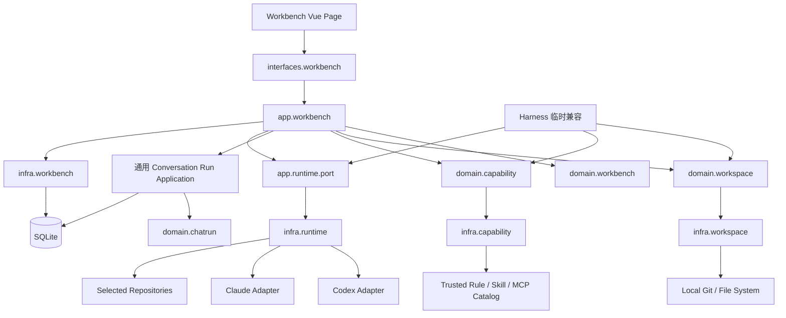

# 本地开发工作台技术设计总览

> 状态：Draft v0.1，待评审
> 日期：2026-08-01
> 产品输入：[本地开发工作台 MVP 产品设计](../local-development-workbench-mvp-design.md)
> 设计范围：TD-01～TD-10 的总体约束、依赖方向、领域边界和落地顺序
> @author alex

## 1. 结论

Workbench 应作为独立限界上下文建设，复用中性化后的 Workspace、Capability 和 Runtime 公共能力，
但不依赖 `domain.harness`、`app.harness`、`infra.harness`、Harness API 或 Harness 表。现有 `ChatRun`
生命周期和可恢复 SSE 可以保留为通用对话执行底座；提交、Prompt、能力和工作区准备必须改造成按执行来源选择的
策略，不能在 `ChatRunAppServiceImpl` 中增加 Workbench/Harness 条件链。

首个工程动作不是创建 Workbench Controller，而是完成 Phase 0 解耦：

1. 把已经实现于 `domain.harness` 的多仓库模型迁到中性 `domain.workspace`；
2. 把 Prompt/Skill/MCP Catalog 定义和文件适配器迁到中性 Capability 包；
3. 从 `CodexHarnessRuntimeGateway` 提取进程、命令、沙箱、事件、脱敏和取消内核；
4. 建立架构测试，保证公共能力不反向依赖 Harness，Workbench 不依赖任何 Harness 包；
5. 再按 Repository Scope → 四阶段 → 对话运行 → Handoff → Document Viewer 的顺序实现产品能力。

## 2. 关键技术决策

| 编号 | 决策 | 理由 |
| --- | --- | --- |
| ADR-WB-001 | Workbench 建立独立 `domain.workbench` 限界上下文 | 阶段是人工工作状态，不是 Harness Gate/Approval 状态机 |
| ADR-WB-002 | 多仓库模型迁入 `domain.workspace`，Harness 暂时单向依赖公共模型 | 当前新模型位于 `domain.harness`，直接复用会锁死退役路径 |
| ADR-WB-003 | Catalog 定义迁入 `domain.capability`，阶段默认策略仍由 Workbench Domain 表达 | Catalog 是公共事实，四阶段策略是 Workbench 业务语义 |
| ADR-WB-004 | 保留 `ChatRun` 的执行生命周期和事件存储，引入不可变 Execution Plan Provider | 复用停止、恢复、SSE 和事件保留，避免复制第二套运行生命周期 |
| ADR-WB-005 | 每次运行先固化 `WorkbenchRunSnapshot`，提交事务成功后再启动外部进程 | 保证能力、仓库范围、Handoff 和 Prompt 在一次运行内不变化 |
| ADR-WB-006 | Workbench 持有全局写运行租约；会话仍保持每阶段单活跃 Run | 强一致地守护“同一 Workbench 同时最多一个写任务” |
| ADR-WB-007 | 文件 API 只接受 `repositoryKey + relativePath` | 浏览器和 API 不以绝对路径作为授权凭据，防止越权与路径歧义 |
| ADR-WB-008 | Review 阶段默认只读，执行重构必须提交显式 `MODIFY` 运行意图 | 人工确认不能从自然语言推断，符合“人工 Review 后才重构” |
| ADR-WB-009 | commit、push、deploy、生产写使用类型化操作提案与独立授权 | 阶段切换、普通消息和 Agent 文本都不产生高影响授权 |
| ADR-WB-010 | Harness 不双写 Workbench；试点后先禁新建、保留只读，再独立清表 | 两种产品语义不同，自动迁移或双写会制造错误状态映射 |

## 3. 当前代码基线与差距

### 3.1 可复用能力

| 当前能力 | 代码位置 | Workbench 用法 |
| --- | --- | --- |
| `ChatRun` 生命周期、幂等、停止、恢复 | `domain.chatrun`、`app.chatrun` | 保留执行状态机与事件序列 |
| 可恢复 SSE、`Last-Event-ID`、410 游标过期 | `ChatRunController`、`ChatRunSubscriptionService` | 复用协议和前端 SSE Client |
| Tool Invocation 结构化旁路 | `chat_tool_invocation`、`ToolInvocation*` | 增加仓库标签、工作目录和命令分类 |
| Agent Runtime Registry | `app.agentrun.port`、`infra.agentrun` | 保留 Agent 可用性；执行计划需扩展多目录与能力绑定 |
| Harness Codex Runtime 的沙箱、进程、取消、脱敏 | `CodexHarnessRuntimeGateway` | 提取中性 Runtime Kernel 后由 Workbench Adapter 组合 |
| Prompt/Skill/MCP Catalog 与信任策略 | `domain.harness`、`infra.harness` | 迁入中性 Capability Context，禁止 Workbench 反向引用 |
| 多仓库值对象与快照 | `domain.harness` | 行为保留，包迁入 `domain.workspace`，去掉 Harness purpose 常量 |
| Workspace 白名单与真实路径策略 | `domain.worktree.WorkspacePathPolicy` | 抽出只读解析能力，Repository Scope 叠加更窄边界 |
| Markdown 净化与可恢复 SSE 前端库 | `frontend/js/lib` | 直接复用底层库，不整体嵌入耦合的 Chat/Harness 页面 |

### 3.2 不能直接复用的部分

- `HarnessRun`、`HarnessStage`、Artifact、Gate、Approval、DeploymentExecution 不进入 Workbench。
- `CapabilitySnapshot` 当前绑定 Harness Run/Stage/Attempt，需要新建中性的 Capability Binding 和
  Workbench 专用 Run Snapshot，不能加 nullable Workbench 字段兼容。
- `ChatRunAppServiceImpl` 当前直接读取 `ChatSession`、拼 Chat 提交语义；Workbench 不能在其中追加
  `if (source == WORKBENCH)`。
- `chat-panel.vue` 同时承担 Feedback、Share、Recall、Slash Command、上传、回退和 Chat 页面状态，
  Workbench 只抽取消息列表、输入器和可恢复运行组合件。
- `/api/fs` 以绝对路径和全局 Workspace Root 为边界，不能作为 Workbench 文档查看授权接口。

## 4. 目标架构



依赖只允许向内：

```text
interfaces.workbench
        ↓
app.workbench ─────→ app.runtime.port / 通用 Conversation Run
        ↓
domain.workbench ──→ domain.workspace / domain.capability

infra.workbench / infra.workspace / infra.capability / infra.runtime
        ↑ 实现内层端口

Harness → 公共能力（迁移期允许）
公共能力 ↛ Harness
Workbench ↛ Harness
```

### 4.1 目标包结构

```text
interfaces/workbench/        Workbench REST/SSE DTO 与边界转换
app/workbench/               创建、阶段、Handoff、运行准备和查询编排
app/workbench/port/          Workspace 检查、文档读取、高影响操作等出站端口
domain/workbench/            Workbench、PhaseHandoff、RunSnapshot、OperationProposal

domain/workspace/            RepositoryScope、WorkspaceTopology、WorkspaceSnapshot
domain/capability/           Rule/Skill/MCP 定义、绑定、信任和选择结果
app/runtime/port/            中性 Agent Execution 合同

infra/workbench/             SQLite Workbench Repository 与读模型
infra/workspace/             Git 扫描、快照和作用域安全解析
infra/capability/            文件 Catalog、Profile Catalog 和 Hash
infra/runtime/               进程内核、Codex/Claude 适配、事件与脱敏
config/workbench/            Feature Flag、Profile、限额和 Spring 装配
```

## 5. 统一语言与领域概念

| 概念 | 类型 | 含义 |
| --- | --- | --- |
| `Workbench` | 聚合根 | 一个用户围绕一个本地开发目标建立的四阶段工作台 |
| `WorkbenchPhase` | 聚合内实体 | 固定阶段、人工状态、会话引用和最近活动 |
| `RepositoryScope` | 不可变值对象 | Workspace Root、主仓库和明确选择的仓库集合 |
| `WorkspaceSnapshot` | 公共不可变聚合 | 某时刻 Repository Scope 的真实 Git 观察事实 |
| `PhaseConversationReference` | 值对象 | Workbench Phase 对通用会话的透明引用 |
| `PhaseCapabilityProfile` | 值对象/版本化配置 | 某阶段默认 Rules、Skills、MCP 请求和降级策略 |
| `PhaseCapabilityConfiguration` | 聚合根 | Workbench 某阶段的可选覆盖与乐观版本 |
| `WorkbenchRunSnapshot` | 不可变聚合根 | 单次 Run 的仓库范围、能力绑定、Handoff 版本和 Prompt Hash |
| `PhaseHandoff` | 聚合根 | 人工维护的阶段结论、决定、问题、文件与运行引用 |
| `HandoffReception` | 值对象/记录 | 下游阶段已预览并接受的上游 Handoff 版本 |
| `WriteRunLease` | Workbench 聚合状态 | 当前唯一写运行引用；终态后释放 |
| `HighImpactOperation` | 聚合根 | commit、push、deploy、production-write 的提案、授权和终态 |
| `DocumentReference` | 值对象 | `repositoryKey + relativePath`，不包含客户端授权的绝对路径 |

## 6. 聚合边界与引用方向

```text
Workbench
├── RepositoryScope（创建后不可变）
├── 4 × WorkbenchPhase
│   ├── PhaseConversationReference
│   └── activeRunReference?
├── activeWriteRunId
└── version

PhaseHandoff
├── workbenchId + sourcePhase
├── Summary / Decisions / OpenQuestions
├── PinnedFiles / ReferencedRuns
└── version + contentHash

WorkbenchRunSnapshot（不可变）
├── workbenchId + phase + runMode
├── repositoryScopeHash / workspaceSnapshotRef
├── capability bindings + snapshotHash
├── handoff source version/hash
└── prompt parts hash / final prompt hash

HighImpactOperation
├── workbenchId + sourceRunId
├── type / target / requested payload hash
├── proposal → decision → execution status
└── real actor / timestamps / version
```

引用方向：

- Workbench 只保存会话、Snapshot、Handoff 和运行的 ID/Reference，不加载其他聚合内部对象。
- Handoff 校验 Pinned File 和 Referenced Run 时，由 Application 加载 Repository Scope/Run Metadata 后作为
  参数传给领域工厂；Handoff 聚合不调用 Repository。
- ChatRun 不持有 Workbench 聚合，只保存中性的 Run Origin/Execution Context Reference。
- Runtime Adapter 只接收已固化的 Execution Plan，不回查并重组 Workbench 业务规则。

## 7. 核心不变量

### 7.1 Workbench

1. 创建时必须且只能生成四个固定阶段：`REQUIREMENT_ANALYSIS`、`SOLUTION_DESIGN`、
   `IMPLEMENT_TEST`、`REVIEW_REFACTOR`。
2. Repository Scope 至少一个仓库，主仓库必须在集合中，创建后不可变。
3. Phase 可任意导航；`HUMAN_COMPLETED` 只表示人工状态，不产生 Gate/PASS 语义。
4. 第一次成功提交消息时 Phase 从 `NOT_STARTED` 进入 `IN_PROGRESS`。
5. Phase 持有自己的活动 Run 引用；只有无活动 Run 的 Phase 才能人工完成，完成后可显式重新打开。
6. 同一 Workbench 同时最多一个 `MODIFY` Run；只读 Run 仍受每会话单活跃和全局容量限制。
7. 只有 Owner 可以发送消息、修改 Handoff/Override、启动写运行或决定高影响操作。
8. Workbench 归档后不能启动新 Run 或修改配置。

### 7.2 Run Snapshot 与 Capability

1. 外部进程启动前必须存在不可变 `WorkbenchRunSnapshot`。
2. Snapshot 必须绑定当前 Workbench、Phase、Repository Scope Hash 和 Run ID。
3. 一次运行中的 Rules、Skills、MCP、Runtime、写根和 Handoff 版本不得原地变化。
4. 平台强制安全规则、环境限制和仓库边界不能被 Capability Override 放宽。
5. 必需能力不可用时不创建可启动的 Run；可选能力只能按 Profile 的确定性降级策略处理。
6. Analysis/Design 固定只读；Review 默认只读，只有显式 `MODIFY` 意图才能获得写权限。
7. Runtime 写根必须恰好等于已选仓库集合；Workspace 父目录和未选 sibling 不得进入可写参数。

### 7.3 Handoff 与文档

1. Pinned File 必须属于 Repository Scope，使用结构化 Document Reference。
2. Referenced Run 必须属于同一 Workbench；不能引用未知或其他用户运行。
3. 下游只消费明确记录的 Handoff 版本；上游新版本只产生 stale 提示，不自动覆盖。
4. Handoff 更新使用 expected version，冲突返回 409，不静默 last-write-wins。
5. 文档 API 不接受绝对路径；解析后的真实路径必须留在对应 Repository Root 内。
6. 文件变化只标记 stale，不强制替换已加载正文。

### 7.4 高影响操作

1. Agent 文本、阶段名称、Run 成功或普通聊天消息都不能产生授权。
2. 每次授权只绑定一个类型化 Operation、目标仓库/分支/环境和 payload Hash。
3. commit、push、deploy、production-write 分别授权，不能用一个通用“允许全部”。
4. 授权后目标状态变化时原授权失效；未知终态不得自动重放。

## 8. 命令、事件与主要流程

### 8.1 业务命令

- `InspectWorkspace`
- `CreateWorkbench`
- `SubmitPhaseMessage`
- `StopPhaseRun`
- `RestartPhaseConversation`
- `CompletePhase`
- `ReopenPhase`
- `SavePhaseHandoff`
- `AcceptHandoffVersion`
- `SaveCapabilityOverride`
- `RestoreDefaultCapability`
- `ProposeHighImpactOperation`
- `DecideHighImpactOperation`
- `ArchiveWorkbench`

### 8.2 领域事件

- `WorkbenchCreated`
- `PhaseConversationBound`
- `PhaseStarted`
- `PhaseHumanCompleted`
- `PhaseReopened`
- `PhaseHandoffUpdated`
- `UpstreamHandoffChanged`
- `HandoffVersionAccepted`
- `CapabilityOverrideChanged`
- `WorkbenchRunPrepared`
- `WriteRunLeaseAcquired`
- `WriteRunLeaseReleased`
- `HighImpactOperationProposed`
- `HighImpactOperationDecided`
- `WorkbenchArchived`

事件只承担跨聚合通知和读模型更新；单聚合强不变量仍在同一事务内直接完成。

### 8.3 创建 Workbench

```text
Interface 校验 DTO
→ WorkspaceInspectionQueryService 返回候选 DTO
→ 用户明确提交 Repository Selection
→ WorkspaceSnapshotGateway 重新解析真实路径并捕获创建快照
→ RepositoryScope.create(...) 守护集合与主仓库不变量
→ Workbench.create(...) 生成四阶段
→ 同一事务保存 WorkspaceSnapshot + Workbench + 四阶段行
→ 提交后发布 WorkbenchCreated
```

Application 不遍历 repository getter 判断重复、越界或主仓库，规则由 Repository Scope/Topology 负责。

### 8.4 提交阶段消息

```text
检查 Owner、Workbench 状态与幂等键
→ 读取已接受的 Handoff 版本
→ 解析有效 Phase Capability Profile
→ Runtime Preflight + Repository Scope 再校验
→ 生成不可变 WorkbenchRunSnapshot Candidate
→ 事务内：Workbench.prepareRun(...) + 保存 Snapshot + 创建 ChatRun
→ 若为 MODIFY，事务内获取 WriteRunLease
→ afterCommit 启动 Runtime
→ Runtime 事件追加到 ChatRunEvent 并投影 Tool/File/Test 事件
→ 终态事务内更新 ChatRun 并释放 WriteRunLease
```

任何进程启动失败都进入明确 FAILED；事务未提交不得启动进程。

### 8.5 恢复与取消

- SSE 使用每 Run 单调序列、`Last-Event-ID` 和保留窗口；过期返回 410 与最早序列。
- 浏览器关闭只关闭订阅，不取消后台运行。
- Stop 先持久化 `CANCEL_REQUESTED`，提交后终止进程树。
- 服务启动时活动 Run 进入对账；无法证明仍在运行的任务标记 `INTERRUPTED/RECONCILIATION_REQUIRED`，
  不自动重放任何写操作。

## 9. 一致性与并发

| 用例 | 强一致范围 | 外部副作用边界 |
| --- | --- | --- |
| 创建 Workbench | Workspace Snapshot Reference、Workbench、四阶段 | Git 采集先完成；DB 提交后发事件 |
| 提交只读 Run | Workbench Phase 状态、Run Snapshot、ChatRun | DB 提交后启动 Runtime |
| 提交写 Run | 上述内容 + Workbench activeWriteRunId | DB 提交后启动；唯一租约拒绝第二个写 Run |
| 保存 Handoff | 单个 PhaseHandoff 聚合与 version | 无外部副作用 |
| 修改 Override | 单个 PhaseCapabilityConfiguration 与 version | 下一轮解析时生效 |
| Run 终态 | ChatRun 终态、事件、WriteRunLease 释放 | 进程退出事实已观察，不重启 |
| 高影响动作 | Operation 决策与 payload Hash | 授权提交后由独立 Launcher 执行 |

SQLite 使用乐观版本和唯一/检查约束作第二道防线。Controller 传 `If-Match` 或 `expectedVersion`，冲突统一
返回 `409 WORKBENCH_VERSION_CONFLICT`。

## 10. API 总览

```text
POST   /api/workbench/workspaces/inspect
POST   /api/workbenches
GET    /api/workbenches
GET    /api/workbenches/{workbenchId}
POST   /api/workbenches/{workbenchId}/archive

GET    /api/workbenches/{workbenchId}/phases/{phase}/messages
POST   /api/workbenches/{workbenchId}/phases/{phase}/conversation/restart
POST   /api/workbenches/{workbenchId}/phases/{phase}/runs
GET    /api/workbenches/{workbenchId}/runs/{runId}
GET    /api/workbenches/{workbenchId}/runs/{runId}/events
POST   /api/workbenches/{workbenchId}/runs/{runId}/stop
POST   /api/workbenches/{workbenchId}/phases/{phase}/complete
POST   /api/workbenches/{workbenchId}/phases/{phase}/reopen

GET    /api/workbenches/{workbenchId}/phases/{phase}/handoff
PUT    /api/workbenches/{workbenchId}/phases/{phase}/handoff
GET    /api/workbenches/{workbenchId}/phases/{phase}/handoff-source
POST   /api/workbenches/{workbenchId}/phases/{phase}/handoff-receptions

GET    /api/workbenches/{workbenchId}/phases/{phase}/capability-profile
PUT    /api/workbenches/{workbenchId}/phases/{phase}/capability-override
DELETE /api/workbenches/{workbenchId}/phases/{phase}/capability-override
GET    /api/workbenches/{workbenchId}/runs/{runId}/snapshot

GET    /api/workbenches/{workbenchId}/repositories/{repositoryKey}/tree
GET    /api/workbenches/{workbenchId}/repositories/{repositoryKey}/documents

GET    /api/workbenches/{workbenchId}/operations
POST   /api/workbenches/{workbenchId}/operations/{operationId}/decision
```

Workbench API 负责 Owner 和 Repository Scope 授权；内部可以复用 ChatRun 服务，但不把裸
`/api/chat/runs/{id}` 作为 Workbench 的授权入口。

## 11. SSE 公共事件合同

| event | 关键字段 | 说明 |
| --- | --- | --- |
| `run_status` | `runId/status/phase/runMode` | 生命周期变化 |
| `agent_chunk` | `content` | Agent 可展示文本，不含私有思维链 |
| `tool_started` / `tool_finished` | `tool/callId/status/durationMs` | 工具过程 |
| `command_started` / `command_finished` | `repositoryKey/commandClass/exitCode` | 命令摘要，输出已脱敏和截断 |
| `file_changed` | `repositoryKey/path/changeType/contentVersion` | 驱动 Document Viewer stale 提示 |
| `test_progress` | `repositoryKey/suite/status/summary` | 测试、构建、验证进度 |
| `operation_proposed` | `operationId/type/target/summary` | 类型化高影响操作卡片 |
| `terminal` | `status/failureCode/publicMessage` | 明确终态 |
| `ping` | 无业务负载 | 保活 |

所有 payload 带 `schemaVersion`。前端以 Event ID 幂等应用；未知事件保留为通用折叠块，不阻断流。

## 12. 数据模型总览

新增表使用 `workbench_` 前缀；公共 Workspace Snapshot 使用 `workspace_` 前缀；不向 Harness 表建外键。

```text
workbench
workbench_repository_scope
workbench_phase
workbench_phase_handoff
workbench_handoff_reception
workbench_phase_capability_config
workbench_run_snapshot
workbench_high_impact_operation

workspace_snapshot
workspace_repository_baseline
workspace_changed_file
```

通用 ChatRun 表增量增加 `run_origin`、`origin_reference`、`execution_context_id`，历史行默认 `CHAT`。
消息、Run Event 和 Tool Invocation 继续复用现有表；必要的新字段采用 additive migration，不做破坏性重建。

## 13. 前端结构

Workbench 是普通登录用户页面，不放在 Harness 管理页内部：

```text
frontend/workbench.html
frontend/js/pages/Workbench.vue
frontend/js/workbench/components/
  WorkbenchHeader.vue
  PhaseNavigation.vue
  PhaseConversation.vue
  ConversationTimeline.vue
  ConversationComposer.vue
  DocumentPane.vue
  SplitPane.vue
  HandoffDrawer.vue
  CapabilityDrawer.vue
  RepositoryScopeDrawer.vue
  HighImpactOperationCard.vue
frontend/js/workbench/composables/
  useWorkbenchApi.ts
  useWorkbenchRun.ts
  useWorkbenchDocuments.ts
  useWorkbenchHandoff.ts
  useWorkbenchCapability.ts
  useSplitPane.ts
```

复用 `formatters.ts`、`resumable-sse-client.ts`、消息/工具的纯展示组件；不复用 Harness 页面状态，也不把
现有 `chat-panel.vue` 整体嵌入。布局宽度、收起状态、当前/最近文档按 `user/workbench/phase` 保存到
`localStorage`，服务端不把浏览器布局写入业务表。

## 14. 安全基线

- Workspace Root 先过运行时配置白名单，再对 Repository Scope 做 `toRealPath` 与 no-symlink 校验。
- Runtime 的 `-C` 只指向主仓库，附加可写目录只来自已选仓库；不得加入 Workspace 父目录。
- Document API 拒绝绝对路径、`..`、符号链接、超限文件、未知编码和越界真实路径。
- Markdown 继续使用 `marked + DOMPurify`；语法高亮使用成熟库，不手写 Parser。
- Rule/Skill/MCP 只来自可信 Catalog；Snapshot 只保存 Secret Reference 或不可逆 Hash，不保存 Secret 明文。
- 子进程使用最小环境、输出上限、命令超时、进程树取消和统一 Redaction。
- 管理员可查看和停止异常运行，但所有动作记录管理员真实身份；管理员不能代 Owner 发送消息或批准高影响操作。

## 15. 分阶段落地

### Phase 0：公共能力解耦

- 迁移 Workspace Domain、Capability Catalog 和 Runtime Kernel。
- Harness Adapter 改为组合公共能力，保持行为和现有测试绿色。
- 增加 Workbench/Harness 依赖 ArchUnit 规则。

### Phase 1：Workbench 与 Repository Scope

- 建表、聚合、创建/列表/详情、Workspace Inspect。
- 四阶段骨架、Owner、乐观锁和人工状态。

### Phase 2：阶段会话与能力

- 通用 Conversation Run 准备策略、四会话、Run Snapshot。
- 默认 Profile、Override、Runtime 启动、SSE、停止和恢复。

### Phase 3：Handoff 与 Document Viewer

- Handoff 版本、接收记录和 stale 提示。
- 安全文档 API、Split Pane、文件变化提示和最近文档。

### Phase 4：真实试点

- 单仓库和 sibling 多仓库各跑一个真实需求。
- 验证 Review 显式写意图、回归、断线和重启恢复。

### Phase 5：Harness 退役

- 禁止新建 → 历史只读/导出 → 删除写 API/UI → 删除代码 → 显式确认后清表。

## 16. 变化点收敛

| 变化来源 | 当前分散位置 | 推荐收敛点 |
| --- | --- | --- |
| 四阶段默认能力 | Harness Stage Policy、资源目录 | `PhaseCapabilityProfileCatalog` + Workbench Domain Policy |
| Chat/Workbench Prompt 差异 | ChatRun Executor 与调用方 | `ExecutionPlanProvider` 多态 |
| Codex/Claude 命令差异 | 各 Gateway | `AgentRuntimeAdapter` + 公共 Process Kernel |
| 单仓/多仓 | Gateway、页面、路径字符串 | `RepositoryScope` + `WorkspaceTopology` |
| Read/Modify 权限 | 页面按钮、Prompt、CLI 参数 | `RunMode` + `PhaseRunPolicy` + Runtime Layout |
| Handoff 上游更新 | UI 临时状态 | `HandoffReception` 版本引用 |
| 文档格式 | Controller/前端条件分支 | `DocumentKind` + Renderer Registry |
| 高影响操作种类 | 自然语言和命令名 | `OperationType` + Policy/Executor Strategy |
| Harness/Workbench 生命周期 | 迁移脚本和 feature flag | `HarnessRetirementCoordinator` 运维步骤，不做状态映射 |

## 17. 重构信号

- `CodexHarnessRuntimeGateway` 体量过大且包含多类变化原因，应拆出 Process Kernel、Command Factory、
  Workspace Layout、Event Decoder、Evidence/Redaction 和 Credential Resolver。
- `PromptPackCatalog`、`SkillCatalog`、`McpServerCatalog` 名称已是公共语义，但包仍在 Harness，应迁包而非复制。
- `RepositorySelection`、`WorkspaceTopology`、`WorkspaceSnapshot` 已经是公共工作区模型，继续留在
  `domain.harness` 会让 Workbench 形成错误依赖。
- `ChatRunAppServiceImpl` 同时负责 Chat 会话校验、容量、幂等、消息追加和执行启动，应抽出通用 Run
  Submission Coordinator；来源差异交给 Provider，不增加 source 条件链。
- `chat-panel.vue` 是页面级组合组件，Workbench 应提取纯展示组件和 composable，不再叠加更多产品状态。
- `FsController` 返回 `Map` 且使用绝对路径，Workbench 新接口应使用强类型 DTO 和 Repository Scope 授权。

## 18. 领域建模审计评分

### 18.1 当前可实施基线

| 维度 | 评分 | 依据 |
| --- | ---: | --- |
| 聚合边界是否清晰 | 2/3 | 产品概念清晰，ChatRun 和新 Workspace 模型可用；公共模型仍位于 Harness |
| 变化是否被收敛 | 1/3 | Runtime/Catalog/前端组合件仍带 Harness 或 Chat 入口语义 |
| 不变量是否可被模型守护 | 2/3 | 多仓库与 ChatRun 状态已有领域模型；Workbench 写租约/Handoff/Override 尚无模型 |
| 行为是否与模型一致 | 1/3 | Harness 四阶段与 Workbench 四阶段名称相似但语义不同，直接复用会错位 |
| 是否支持下一轮变化 | 1/3 | 当前 Harness 包归属会阻碍退役和 requirement-flow 接入 |

### 18.2 目标设计

| 维度 | 目标 | 依据 |
| --- | ---: | --- |
| 聚合边界是否清晰 | 3/3 | Workbench、Handoff、Run Snapshot、Operation 分开，使用不可变引用协作 |
| 变化是否被收敛 | 3/3 | Profile、Runtime Adapter、Document Renderer、Operation Strategy 均有单点 |
| 不变量是否可被模型守护 | 3/3 | Scope、人工状态、写租约、Snapshot、版本接收和授权均有领域校验点 |
| 行为是否与模型一致 | 3/3 | 人工阶段不冒充 Gate，Review 写操作要求显式意图 |
| 是否支持下一轮变化 | 2/3 | 支持多 Runtime、多仓库和 requirement-flow 接入；多人协作/在线编辑仍明确延后 |

## 19. 待产品确认的问题

以下问题不阻塞本设计，文档采用推荐默认值：

1. 首个真实试点是否只开放 Codex：推荐是；Claude 达到相同 Runtime Contract 后再出现在 Workbench Agent 列表。
2. MVP 是否实际执行 commit/push/deploy：推荐只实现类型化提案与显式授权框架，执行器按独立需求逐项开放。
3. Workbench 是否支持只读分享：推荐 MVP 不开放；后续必须使用专用脱敏投影，不能复用 Owner API。
4. Phase Profile 是否提供管理台编辑：推荐 MVP 使用版本化只读资源，先不建设在线配置管理。
5. Run/Event 保留期：推荐沿用 ChatRun 24 小时可恢复事件窗口，消息与终态长期保存；上线前按磁盘指标校准。

## 20. 专题技术设计索引

- [TD-01 公共 Runtime 与 Capability 解耦](td-01-runtime-capability-decoupling.md)
- [TD-02 Workbench Domain 与持久化](td-02-workbench-domain-persistence.md)
- [TD-03 阶段 ChatRun 与 SSE](td-03-phase-chatrun-sse.md)
- [TD-04 多仓库工作区](td-04-multi-repository-workspace.md)
- [TD-05 Rules、Skills 与 MCP](td-05-rules-skills-mcp.md)
- [TD-06 文档查看器](td-06-document-viewer.md)
- [TD-07 阶段上下文包](td-07-phase-handoff.md)
- [TD-08 高影响操作与 workspace 接入](td-08-high-impact-operations.md)
- [TD-09 Harness 退役](td-09-harness-retirement.md)
- [TD-10 测试与发布](td-10-test-release.md)
